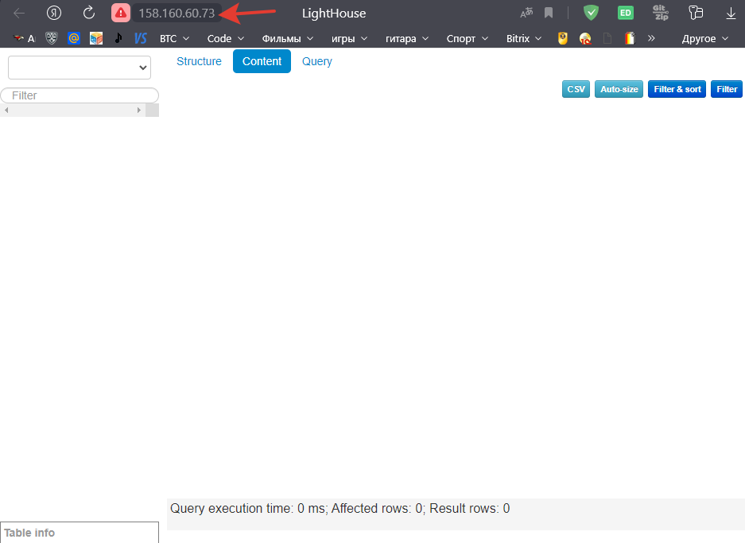

# Домашнее задание к занятию "3. Использование Yandex Cloud"

## Подготовка к выполнению

1. Подготовьте в Yandex Cloud три хоста: для `clickhouse`, для `vector` и для `lighthouse`.

Используя `terraform `развернем в YandexCloud 3 хоста, внесем полученные IP d инвентори-файл` prod.yml`
Содержание terraform-файлов опустим, так как разбирались ранее,
например [тут](https://github.com/nikolay480/devops-netology/tree/main/terraform).

```bash
$ terraform apply
```

```bash
..........................
..........................
..........................
$ Apply complete! Resources: 5 added, 0 changed, 0 destroyed.

Outputs:

external_ip_address_clickhouse_yandex_cloud = "158.160.55.44"
external_ip_address_lighthouse_yandex_cloud = "158.160.60.73"
external_ip_address_vector_yandex_cloud =  "158.160.39.40"

```

Ссылка на репозиторий LightHouse: https://github.com/VKCOM/lighthouse

## Основная часть

1. Допишите playbook: нужно сделать ещё один play, который устанавливает и настраивает lighthouse.
2. При создании tasks рекомендую использовать модули: `get_url`, `template`, `yum`, `apt`.
3. Tasks должны: скачать статику lighthouse, установить nginx или любой другой webserver, настроить его конфиг для
   открытия lighthouse, запустить webserver.

```yaml

- name: Install NGINX
  hosts: lighthouse
  remote_user: centos
  tags: nginx
  handlers:
    - name: start_nginx
      become: true
      ansible.builtin.command: nginx
    - name: restart_nginx
      become: true
      ansible.builtin.command: "nginx -s reload"
  tasks:
    # Установка nginx
    - name: INSTALL NGINX | install repo epel-release    # Установка репозитория epel
      become: true
      ansible.builtin.yum:
        name: epel-release
        state: present

    - name: INSTALL NGINX | nginx            # Установка nginx из репозитория epel
      become: true
      ansible.builtin.yum:
        name: nginx
        state: present
      notify: start_nginx                   # вызов handler для запуска nginx

    - name: INSTALL NGINX | config            # Настройка nginx путем использования шаблона nginx.conf.j2
      become: true                            # и замена конфига /etc/nginx/nginx.conf на целевом хосте
      ansible.builtin.template:
        src: ./templates/nginx.conf.j2
        dest: /etc/nginx/nginx.conf
        mode: 0644
      notify: restart_nginx                  # вызов handler для перезапуска nginx

  # Установка lighthouse  
- name: Install lighthouse
  hosts: lighthouse
  remote_user: centos
  tags: lighthouse
  handlers:
    - name: restart_nginx
      become: true
      ansible.builtin.command: "nginx -s reload"
  pre_tasks:
    - name: LIGHTHOUSE | git      # Для установки lighthouse потребуется git, установим его с помощью модуля yum
      become: true
      ansible.builtin.yum:
        name: git
        state: present
  tasks:
    - name: LIGHTHOUSE |  Download from git       # Скопируем репозиторий по заданному в переменной {{ lighthouse_dir }} пути на хост
      become: true
      ansible.builtin.git:
        repo: "https://github.com/VKCOM/lighthouse.git"
        dest: "{{ lighthouse_dir }}"
        version: master
    - name: LIGHTHOUSE | config          # Выполним донастройку nginx и перезапустим его, вызвав handler - restart_nginx
      become: true
      ansible.builtin.template:
        src: ./templates/lighthouse.conf.j2
        dest: /etc/nginx/conf.d/default.conf
        mode: 0664
      notify: restart_nginx
 ```

4. Приготовьте свой собственный inventory файл `prod.yml`:
   [prod.yml](./playbook/inventory/prod.yml)

5. Запустите `ansible-lint site.yml` и исправьте ошибки, если они есть.

```yaml
nik@ubuntuVM:~/netology/ansible/lesson_08_03/playbook$ ansible-lint site.yml

  [ 201 ] Trailing whitespace
  site1.yml:131
ansible.builtin.git:

  [ 201 ] Trailing whitespace
    site1.yml:141
notify: restart_nginx

```

6. Попробуйте запустить playbook на этом окружении с флагом `--check`.

```bash
nik@ubuntuVM:~/netology/ansible/lesson_08_03/playbook$ ansible-playbook -i inventory/prod.yml site1.yml --check

  PLAY [Install Clickhouse] **********************************************************************************

  TASK [Gathering Facts] *************************************************************************************
ok: [ clickhouse-1 ]

  TASK [Get clickhouse distrib] ******************************************************************************
ok: [ clickhouse-1 ] => (item=clickhouse-client)
ok: [ clickhouse-1 ] => (item=clickhouse-server)
failed: [ clickhouse-1 ] (item=clickhouse-common-static) => {"ansible_loop_var": "item", "changed":
false, "dest": "./clickhouse-common-static-22.3.3.44.rpm", "elapsed":
  0, "gid":
    1000, "group": "centos", "item": "clickhouse-common-static", "mode": "0664", "msg": "Request failed", "owner": "centos", "response": "HTTP Error 404: Not Found", "secontext": "unconfined_u:object_r:user_home_t:s0", "size":
        246310036, "state": "file", "status_code":
          404, "uid":
             1000, "url": "https://packages.clickhouse.com/rpm/stable/clickhouse-common-static-22.3.3.44.noarch.rpm" }

  TASK [Get clickhouse distrib] ******************************************************************************
ok: [ clickhouse-1 ]

  TASK [Install clickhouse packages] *************************************************************************
ok: [ clickhouse-1 ]

  TASK [Flush handler] ***************************************************************************************

  TASK [Create database] *************************************************************************************
skipping: [ clickhouse-1 ]

  TASK [Create table] ****************************************************************************************
skipping: [ clickhouse-1 ]

  PLAY [Install Vector] **************************************************************************************

  TASK [Gathering Facts] *************************************************************************************
ok: [ vector-1 ]

  TASK [Creates directory tmp/vector/] ***********************************************************************
ok: [ vector-1 ]

  TASK [Get vector] ******************************************************************************************
ok: [ vector-1 ]

  TASK [install vector] **************************************************************************************
ok: [ vector-1 ]

  TASK [Copy config] *****************************************************************************************
ok: [ vector-1 ]

  TASK [Restart vector service] ******************************************************************************
changed: [ vector-1 ]

  PLAY [Install NGINX] ***************************************************************************************

  TASK [Gathering Facts] *************************************************************************************
ok: [ lighthouse-1 ]

  TASK [INSTALL NGINX | install repo epel-release] ***********************************************************
ok: [ lighthouse-1 ]

  TASK [INSTALL NGINX | nginx] *******************************************************************************
ok: [ lighthouse-1 ]

  TASK [INSTALL NGINX | config] ******************************************************************************
ok: [ lighthouse-1 ]

  PLAY [Install lighthouse] **********************************************************************************

  TASK [Gathering Facts] *************************************************************************************
ok: [ lighthouse-1 ]

  TASK [LIGHTHOUSE | git] ************************************************************************************
ok: [ lighthouse-1 ]

  TASK [LIGHTHOUSE |  Download from git] *********************************************************************
ok: [ lighthouse-1 ]

  TASK [LIGHTHOUSE | config] *********************************************************************************
ok: [ lighthouse-1 ]

  PLAY RECAP *************************************************************************************************
clickhouse-1: ok=3    changed=0    unreachable=0    failed=0    skipped=2    rescued=1    ignored=0
lighthouse-1: ok=8    changed=0    unreachable=0    failed=0    skipped=0    rescued=0    ignored=0
vector-1: ok=6    changed=1    unreachable=0    failed=0    skipped=0    rescued=0    ignored=0   
```

7. Запустите playbook на `prod.yml` окружении с флагом `--diff`. Убедитесь, что изменения на системе произведены.

```yaml
nik@ubuntuVM:~/netology/ansible/lesson_08_03/playbook$ ansible-playbook -i inventory/prod.yml site1.yml --diff

  PLAY [Install Clickhouse] **********************************************************************************

  TASK [Gathering Facts] *************************************************************************************
ok: [ clickhouse-1 ]

      TASK [Get clickhouse distrib] ******************************************************************************
ok: [ clickhouse-1 ] => (item=clickhouse-client)
ok: [ clickhouse-1 ] => (item=clickhouse-server)
failed: [ clickhouse-1 ] (item=clickhouse-common-static) => {"ansible_loop_var": "item", "changed":
                                                                                           false, "dest": "./clickhouse-common-static-22.3.3.44.rpm", "elapsed":
                                                                                                                                                        0, "gid":
                                                                                                                                                          1000, "group": "centos", "item": "clickhouse-common-static", "mode": "0664", "msg": "Request failed", "owner": "centos", "response": "HTTP Error 404: Not Found", "secontext": "unconfined_u:object_r:user_home_t:s0", "size":
                                                                                                                                                                                                                                                                                                                                                                                   246310036, "state": "file", "status_code":
                                                                                                                                                                                                                                                                                                                                                                                                                 404, "uid":
                                                                                                                                                                                                                                                                                                                                                                                                                   1000, "url": "https://packages.clickhouse.com/rpm/stable/clickhouse-common-static-22.3.3.44.noarch.rpm" }

                                                                                   TASK [Get clickhouse distrib] ******************************************************************************
ok: [ clickhouse-1 ]

      TASK [Install clickhouse packages] *************************************************************************
ok: [ clickhouse-1 ]

      TASK [Flush handler] ***************************************************************************************

      TASK [Create database] *************************************************************************************
ok: [ clickhouse-1 ]

      TASK [Create table] ****************************************************************************************
changed: [ clickhouse-1 ]

           PLAY [Install Vector] **************************************************************************************

           TASK [Gathering Facts] *************************************************************************************
ok: [ vector-1 ]

      TASK [Creates directory tmp/vector/] ***********************************************************************
ok: [ vector-1 ]

      TASK [Get vector] ******************************************************************************************
ok: [ vector-1 ]

      TASK [install vector] **************************************************************************************
ok: [ vector-1 ]

      TASK [Copy config] *****************************************************************************************
ok: [ vector-1 ]

      TASK [Restart vector service] ******************************************************************************
changed: [ vector-1 ]

           PLAY [Install NGINX] ***************************************************************************************

           TASK [Gathering Facts] *************************************************************************************
ok: [ lighthouse-1 ]

      TASK [INSTALL NGINX | install repo epel-release] ***********************************************************
ok: [ lighthouse-1 ]

      TASK [INSTALL NGINX | nginx] *******************************************************************************
ok: [ lighthouse-1 ]

      TASK [INSTALL NGINX | config] ******************************************************************************
ok: [ lighthouse-1 ]

      PLAY [Install lighthouse] **********************************************************************************

      TASK [Gathering Facts] *************************************************************************************
ok: [ lighthouse-1 ]

      TASK [LIGHTHOUSE | git] ************************************************************************************
ok: [ lighthouse-1 ]

      TASK [LIGHTHOUSE |  Download from git] *********************************************************************
ok: [ lighthouse-1 ]

      TASK [LIGHTHOUSE | config] *********************************************************************************
ok: [ lighthouse-1 ]

      PLAY RECAP *************************************************************************************************
clickhouse-1: ok=5    changed=1    unreachable=0    failed=0    skipped=0    rescued=1    ignored=0
lighthouse-1: ok=8    changed=0    unreachable=0    failed=0    skipped=0    rescued=0    ignored=0
vector-1: ok=6    changed=1    unreachable=0    failed=0    skipped=0    rescued=0    ignored=0   
```

8. Повторно запустите playbook с флагом `--diff` и убедитесь, что playbook идемпотентен.
   Повторный результат дает аналогичный вывод.

9. Подготовьте README.md файл по своему playbook. В нём должно быть описано: что делает playbook, какие у него есть
   параметры и теги.
10. Готовый playbook выложите в свой репозиторий, поставьте тег `08-ansible-03-yandex` на фиксирующий коммит, в ответ
    предоставьте ссылку на него.

Осталось проверить работоспособность установленного ПО:

```bash
nik@ubuntuVM:~/netology/ansible/lesson_08_03/terraform$ ssh centos@158.160.55.44[centos@fhmmhcrbfcrs0unb3t0e ~]$ 
[centos@fhmmhcrbfcrs0unb3t0e ~]$ clickhouse-client
ClickHouse client version 22.3.3.44 (official build).
Connecting to localhost:9000 as user default.
Connected to ClickHouse server version 22.3.3 revision 54455.

fhmmhcrbfcrs0unb3t0e.auto.internal :) USE logs

USE logs

Query id: 0406028b-3ef5-450b-8060-ba8f4f707a0c

Ok.

0 rows in set. Elapsed: 0.001 sec. 
```

```bash
nik@ubuntuVM:~/netology/ansible/lesson_08_03/terraform$ ssh centos@158.160.39.40
[centos@fhm9q2g21svtsjbnjj70 ~]$ sudo su
[root@fhm9q2g21svtsjbnjj70 centos]# vector --config /etc/vector/vector.yaml
2023-02-06T18:44:00.972019Z  INFO vector::app: Internal log rate limit configured. internal_log_rate_secs=10
2023-02-06T18:44:00.972267Z  INFO vector::app: Log level is enabled. level="vector=info,codec=info,vrl=info,file_source=info,tower_limit=trace,rdkafka=info,buffers=info,lapin=info,kube=info"
2023-02-06T18:44:00.972394Z  INFO vector::app: Loading configs. paths=["/etc/vector/vector.yaml"]
2023-02-06T18:44:00.999602Z  INFO vector::topology::running: Running healthchecks.
2023-02-06T18:44:00.999930Z  INFO vector: Vector has started. debug="false" version="0.27.0" arch="x86_64" revision="5623d1e 2023-01-18"
2023-02-06T18:44:00.999960Z  INFO vector::app: API is disabled, enable by setting `api.enabled` to `true` and use commands like `vector top`.
2023-02-06T18:44:01.000370Z  INFO source{component_kind="source" component_id=my_source component_type=file component_name=my_source}: vector::sources::file: Starting file server. include=["/var/log/yum.log"] exclude=[]
2023-02-06T18:44:01.004413Z  INFO source{component_kind="source" component_id=my_source component_type=file component_name=my_source}:file_server: file_source::checkpointer: Attempting to read legacy checkpoint files.
2023-02-06T18:44:01.017205Z  INFO source{component_kind="source" component_id=my_source component_type=file component_name=my_source}:file_server: vector::internal_events::file::source: Found new file to watch. file=/var/log/yum.log

```

И, наконец, перейдя в браузере по ip-адресу хоста с lighthouse, откроется следующий web-интерфейс:

