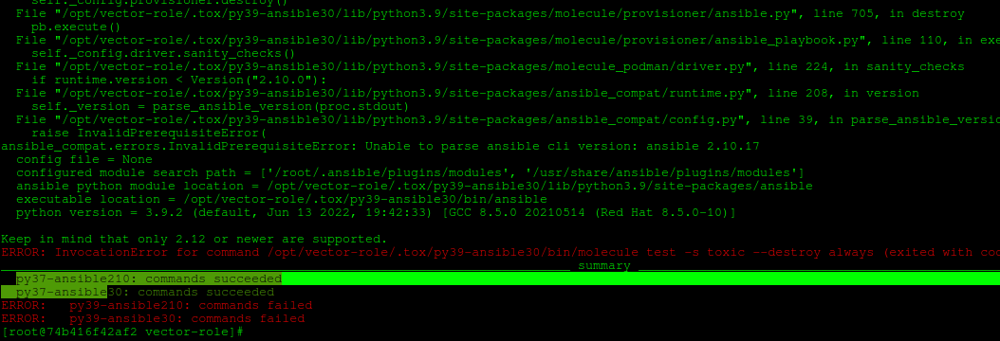

# Домашнее задание к занятию "5. Тестирование roles"

## Подготовка к выполнению
1. Установите molecule: `pip3 install "molecule==3.5.2"`
2. Выполните `docker pull aragast/netology:latest` -  это образ с podman, tox и несколькими пайтонами (3.7 и 3.9) внутри

## Основная часть

Наша основная цель - настроить тестирование наших ролей. Задача: сделать сценарии тестирования для vector. Ожидаемый результат: все сценарии успешно проходят тестирование ролей.

### Molecule

1. Запустите  `molecule test -s centos7` внутри корневой директории clickhouse-role, посмотрите на вывод команды.

<details>

```bash
nik@nik-Ubuntu:~/devops-netology/CI_monitoring_config/08-ansible-05-test/playbook/roles/clickhouse$ molecule test -s centos_7
INFO     centos_7 scenario test matrix: dependency, lint, cleanup, destroy, syntax, create, prepare, converge, idempotence, side_effect, verify, cleanup, destroy
INFO     Performing prerun...
INFO     Set ANSIBLE_LIBRARY=/home/nik/.cache/ansible-compat/7e099f/modules:/home/nik/.ansible/plugins/modules:/usr/share/ansible/plugins/modules
INFO     Set ANSIBLE_COLLECTIONS_PATH=/home/nik/.cache/ansible-compat/7e099f/collections:/home/nik/.ansible/collections:/usr/share/ansible/collections
INFO     Set ANSIBLE_ROLES_PATH=/home/nik/.cache/ansible-compat/7e099f/roles:/home/nik/.ansible/roles:/usr/share/ansible/roles:/etc/ansible/roles
INFO     Inventory /home/nik/devops-netology/CI_monitoring_config/08-ansible-05-test/playbook/roles/clickhouse/molecule/centos_7/../resources/inventory/hosts.yml linked to /home/nik/.cache/molecule/clickhouse/centos_7/inventory/hosts
INFO     Inventory /home/nik/devops-netology/CI_monitoring_config/08-ansible-05-test/playbook/roles/clickhouse/molecule/centos_7/../resources/inventory/group_vars/ linked to /home/nik/.cache/molecule/clickhouse/centos_7/inventory/group_vars
INFO     Inventory /home/nik/devops-netology/CI_monitoring_config/08-ansible-05-test/playbook/roles/clickhouse/molecule/centos_7/../resources/inventory/host_vars/ linked to /home/nik/.cache/molecule/clickhouse/centos_7/inventory/host_vars
INFO     Running centos_7 > dependency
INFO     Running from /home/nik/devops-netology/CI_monitoring_config/08-ansible-05-test/playbook/roles/clickhouse : ansible-galaxy collection install -vvv community.docker:>=1.9.1
WARNING  Skipping, missing the requirements file.
WARNING  Skipping, missing the requirements file.
INFO     Inventory /home/nik/devops-netology/CI_monitoring_config/08-ansible-05-test/playbook/roles/clickhouse/molecule/centos_7/../resources/inventory/hosts.yml linked to /home/nik/.cache/molecule/clickhouse/centos_7/inventory/hosts
INFO     Inventory /home/nik/devops-netology/CI_monitoring_config/08-ansible-05-test/playbook/roles/clickhouse/molecule/centos_7/../resources/inventory/group_vars/ linked to /home/nik/.cache/molecule/clickhouse/centos_7/inventory/group_vars
INFO     Inventory /home/nik/devops-netology/CI_monitoring_config/08-ansible-05-test/playbook/roles/clickhouse/molecule/centos_7/../resources/inventory/host_vars/ linked to /home/nik/.cache/molecule/clickhouse/centos_7/inventory/host_vars
INFO     Running centos_7 > lint
COMMAND: yamllint .
ansible-lint
flake8

WARNING  Listing 79 violation(s) that are fatal
fqcn[action-core]: Use FQCN for builtin module actions (set_fact).
handlers/main.yml:3 Use `ansible.builtin.set_fact` or `ansible.legacy.set_fact` instead.

schema[meta]: 2.8 is not of type 'string'
meta/main.yml:1  Returned errors will not include exact line numbers, but they will mention
the schema name being used as a tag, like ``schema[playbook]``,
``schema[tasks]``.

This rule is not skippable and stops further processing of the file.

If incorrect schema was picked, you might want to either:

* move the file to standard location, so its file is detected correctly.
* use ``kinds:`` option in linter config to help it pick correct file type.


fqcn[action-core]: Use FQCN for builtin module actions (include_role).
molecule/centos_7/converge.yml:5 Use `ansible.builtin.include_role` or `ansible.legacy.include_role` instead.

fqcn[action-core]: Use FQCN for builtin module actions (assert).
molecule/centos_7/verify.yml:8 Use `ansible.builtin.assert` or `ansible.legacy.assert` instead.

fqcn[action-core]: Use FQCN for builtin module actions (include_role).
molecule/centos_8/converge.yml:5 Use `ansible.builtin.include_role` or `ansible.legacy.include_role` instead.

fqcn[action-core]: Use FQCN for builtin module actions (assert).
molecule/centos_8/verify.yml:8 Use `ansible.builtin.assert` or `ansible.legacy.assert` instead.

schema[inventory]: None is not of type 'object'
molecule/resources/inventory/hosts.yml:1  Returned errors will not include exact line numbers, but they will mention
the schema name being used as a tag, like ``schema[playbook]``,
``schema[tasks]``.

This rule is not skippable and stops further processing of the file.

If incorrect schema was picked, you might want to either:

* move the file to standard location, so its file is detected correctly.
* use ``kinds:`` option in linter config to help it pick correct file type.


fqcn[action-core]: Use FQCN for builtin module actions (include_role).
molecule/resources/playbooks/converge.yml:5 Use `ansible.builtin.include_role` or `ansible.legacy.include_role` instead.

fqcn[action-core]: Use FQCN for builtin module actions (include_role).
molecule/ubuntu_focal/converge.yml:5 Use `ansible.builtin.include_role` or `ansible.legacy.include_role` instead.

fqcn[action-core]: Use FQCN for builtin module actions (assert).
molecule/ubuntu_focal/verify.yml:8 Use `ansible.builtin.assert` or `ansible.legacy.assert` instead.

fqcn[action-core]: Use FQCN for builtin module actions (set_fact).
tasks/configure/db.yml:2 Use `ansible.builtin.set_fact` or `ansible.legacy.set_fact` instead.

jinja[spacing]: Jinja2 spacing could be improved: clickhouse-client -h 127.0.0.1 --port {{ clickhouse_tcp_secure_port | default(clickhouse_tcp_port) }}{{' --secure' if clickhouse_tcp_secure_port is defined else '' }} -> clickhouse-client -h 127.0.0.1 --port {{ clickhouse_tcp_secure_port | default(clickhouse_tcp_port) }}{{ ' --secure' if clickhouse_tcp_secure_port is defined else '' }} (warning)
tasks/configure/db.yml:2 Jinja2 template rewrite recommendation: `clickhouse-client -h 127.0.0.1 --port {{ clickhouse_tcp_secure_port | default(clickhouse_tcp_port) }}{{ ' --secure' if clickhouse_tcp_secure_port is defined else '' }}`.

no-free-form: Avoid using free-form when calling module actions. (set_fact)
tasks/configure/db.yml:2 Task/Handler: Set ClickHose Connection String

fqcn[action-core]: Use FQCN for builtin module actions (command).
tasks/configure/db.yml:5 Use `ansible.builtin.command` or `ansible.legacy.command` instead.

fqcn[action-core]: Use FQCN for builtin module actions (command).
tasks/configure/db.yml:11 Use `ansible.builtin.command` or `ansible.legacy.command` instead.

fqcn[action-core]: Use FQCN for builtin module actions (command).
tasks/configure/db.yml:20 Use `ansible.builtin.command` or `ansible.legacy.command` instead.

fqcn[action-core]: Use FQCN for builtin module actions (template).
tasks/configure/dict.yml:2 Use `ansible.builtin.template` or `ansible.legacy.template` instead.

fqcn[action-core]: Use FQCN for builtin module actions (file).
tasks/configure/sys.yml:2 Use `ansible.builtin.file` or `ansible.legacy.file` instead.

fqcn[action-core]: Use FQCN for builtin module actions (file).
tasks/configure/sys.yml:17 Use `ansible.builtin.file` or `ansible.legacy.file` instead.

fqcn[action-core]: Use FQCN for builtin module actions (file).
tasks/configure/sys.yml:26 Use `ansible.builtin.file` or `ansible.legacy.file` instead.

fqcn[action-core]: Use FQCN for builtin module actions (template).
tasks/configure/sys.yml:35 Use `ansible.builtin.template` or `ansible.legacy.template` instead.

fqcn[action-core]: Use FQCN for builtin module actions (template).
tasks/configure/sys.yml:45 Use `ansible.builtin.template` or `ansible.legacy.template` instead.

fqcn[action-core]: Use FQCN for builtin module actions (template).
tasks/configure/sys.yml:54 Use `ansible.builtin.template` or `ansible.legacy.template` instead.

fqcn[action-core]: Use FQCN for builtin module actions (template).
tasks/configure/sys.yml:65 Use `ansible.builtin.template` or `ansible.legacy.template` instead.

fqcn[action-core]: Use FQCN for builtin module actions (template).
tasks/configure/sys.yml:76 Use `ansible.builtin.template` or `ansible.legacy.template` instead.

fqcn[action-core]: Use FQCN for builtin module actions (lineinfile).
tasks/configure/sys.yml:87 Use `ansible.builtin.lineinfile` or `ansible.legacy.lineinfile` instead.

fqcn[action-core]: Use FQCN for builtin module actions (apt_key).
tasks/install/apt.yml:5 Use `ansible.builtin.apt_key` or `ansible.legacy.apt_key` instead.

fqcn[action-core]: Use FQCN for builtin module actions (apt_repository).
tasks/install/apt.yml:12 Use `ansible.builtin.apt_repository` or `ansible.legacy.apt_repository` instead.

fqcn[action-core]: Use FQCN for builtin module actions (apt_repository).
tasks/install/apt.yml:20 Use `ansible.builtin.apt_repository` or `ansible.legacy.apt_repository` instead.

fqcn[action-core]: Use FQCN for builtin module actions (apt).
tasks/install/apt.yml:27 Use `ansible.builtin.apt` or `ansible.legacy.apt` instead.

fqcn[action-core]: Use FQCN for builtin module actions (apt).
tasks/install/apt.yml:36 Use `ansible.builtin.apt` or `ansible.legacy.apt` instead.

fqcn[action-core]: Use FQCN for builtin module actions (copy).
tasks/install/apt.yml:45 Use `ansible.builtin.copy` or `ansible.legacy.copy` instead.

risky-file-permissions: File permissions unset or incorrect.
tasks/install/apt.yml:45 Task/Handler: Hold specified version during APT upgrade | Package installation

fqcn[action-core]: Use FQCN for builtin module actions (rpm_key).
tasks/install/dnf.yml:5 Use `ansible.builtin.rpm_key` or `ansible.legacy.rpm_key` instead.

fqcn[action-core]: Use FQCN for builtin module actions (yum_repository).
tasks/install/dnf.yml:12 Use `ansible.builtin.yum_repository` or `ansible.legacy.yum_repository` instead.

fqcn[action-core]: Use FQCN for builtin module actions (dnf).
tasks/install/dnf.yml:24 Use `ansible.builtin.dnf` or `ansible.legacy.dnf` instead.

fqcn[action-core]: Use FQCN for builtin module actions (dnf).
tasks/install/dnf.yml:32 Use `ansible.builtin.dnf` or `ansible.legacy.dnf` instead.

fqcn[action-core]: Use FQCN for builtin module actions (rpm_key).
tasks/install/yum.yml:5 Use `ansible.builtin.rpm_key` or `ansible.legacy.rpm_key` instead.

fqcn[action-core]: Use FQCN for builtin module actions (yum_repository).
tasks/install/yum.yml:12 Use `ansible.builtin.yum_repository` or `ansible.legacy.yum_repository` instead.

fqcn[action-core]: Use FQCN for builtin module actions (yum).
tasks/install/yum.yml:24 Use `ansible.builtin.yum` or `ansible.legacy.yum` instead.

fqcn[action-core]: Use FQCN for builtin module actions (yum).
tasks/install/yum.yml:32 Use `ansible.builtin.yum` or `ansible.legacy.yum` instead.

fqcn[action-core]: Use FQCN for builtin module actions (include_vars).
tasks/main.yml:3 Use `ansible.builtin.include_vars` or `ansible.legacy.include_vars` instead.

fqcn[action-core]: Use FQCN for builtin module actions (include_tasks).
tasks/main.yml:14 Use `ansible.builtin.include_tasks` or `ansible.legacy.include_tasks` instead.

name[missing]: All tasks should be named.
tasks/main.yml:14 Task/Handler: include_tasks precheck.yml

fqcn[action-core]: Use FQCN for builtin module actions (include_tasks).
tasks/main.yml:17 Use `ansible.builtin.include_tasks` or `ansible.legacy.include_tasks` instead.

name[missing]: All tasks should be named.
tasks/main.yml:17 Task/Handler: include_tasks params.yml

fqcn[action-core]: Use FQCN for builtin module actions (include_tasks).
tasks/main.yml:20 Use `ansible.builtin.include_tasks` or `ansible.legacy.include_tasks` instead.

name[missing]: All tasks should be named.
tasks/main.yml:20 Task/Handler: include_tasks file={{ lookup('first_found', params) }} apply={'tags': ['install'], '__line__': 23, '__file__': PosixPath('tasks/main.yml')}

fqcn[action-core]: Use FQCN for builtin module actions (include_tasks).
tasks/main.yml:32 Use `ansible.builtin.include_tasks` or `ansible.legacy.include_tasks` instead.

name[missing]: All tasks should be named.
tasks/main.yml:32 Task/Handler: include_tasks file=configure/sys.yml apply={'tags': ['config', 'config_sys'], '__line__': 35, '__file__': PosixPath('tasks/main.yml')}

fqcn[action-core]: Use FQCN for builtin module actions (meta).
tasks/main.yml:39 Use `ansible.builtin.meta` or `ansible.legacy.meta` instead.

fqcn[action-core]: Use FQCN for builtin module actions (include_tasks).
tasks/main.yml:42 Use `ansible.builtin.include_tasks` or `ansible.legacy.include_tasks` instead.

name[missing]: All tasks should be named.
tasks/main.yml:42 Task/Handler: include_tasks service.yml

fqcn[action-core]: Use FQCN for builtin module actions (wait_for).
tasks/main.yml:45 Use `ansible.builtin.wait_for` or `ansible.legacy.wait_for` instead.

fqcn[action-core]: Use FQCN for builtin module actions (include_tasks).
tasks/main.yml:51 Use `ansible.builtin.include_tasks` or `ansible.legacy.include_tasks` instead.

name[missing]: All tasks should be named.
tasks/main.yml:51 Task/Handler: include_tasks file=configure/db.yml apply={'tags': ['config', 'config_db'], '__line__': 54, '__file__': PosixPath('tasks/main.yml')}

fqcn[action-core]: Use FQCN for builtin module actions (include_tasks).
tasks/main.yml:58 Use `ansible.builtin.include_tasks` or `ansible.legacy.include_tasks` instead.

name[missing]: All tasks should be named.
tasks/main.yml:58 Task/Handler: include_tasks file=configure/dict.yml apply={'tags': ['config', 'config_dict'], '__line__': 61, '__file__': PosixPath('tasks/main.yml')}

fqcn[action-core]: Use FQCN for builtin module actions (include_tasks).
tasks/main.yml:65 Use `ansible.builtin.include_tasks` or `ansible.legacy.include_tasks` instead.

name[missing]: All tasks should be named.
tasks/main.yml:65 Task/Handler: include_tasks file=remove.yml apply={'tags': ['remove'], '__line__': 68, '__file__': PosixPath('tasks/main.yml')}

fqcn[action-core]: Use FQCN for builtin module actions (set_fact).
tasks/params.yml:3 Use `ansible.builtin.set_fact` or `ansible.legacy.set_fact` instead.

fqcn[action-core]: Use FQCN for builtin module actions (set_fact).
tasks/params.yml:7 Use `ansible.builtin.set_fact` or `ansible.legacy.set_fact` instead.

fqcn[action-core]: Use FQCN for builtin module actions (command).
tasks/precheck.yml:1 Use `ansible.builtin.command` or `ansible.legacy.command` instead.

fqcn[action-core]: Use FQCN for builtin module actions (fail).
tasks/precheck.yml:5 Use `ansible.builtin.fail` or `ansible.legacy.fail` instead.

fqcn[action-core]: Use FQCN for builtin module actions (file).
tasks/remove.yml:3 Use `ansible.builtin.file` or `ansible.legacy.file` instead.

fqcn[action-core]: Use FQCN for builtin module actions (include_tasks).
tasks/remove.yml:15 Use `ansible.builtin.include_tasks` or `ansible.legacy.include_tasks` instead.

name[missing]: All tasks should be named.
tasks/remove.yml:15 Task/Handler: include_tasks remove/{{ ansible_pkg_mgr }}.yml

fqcn[action-core]: Use FQCN for builtin module actions (apt).
tasks/remove/apt.yml:5 Use `ansible.builtin.apt` or `ansible.legacy.apt` instead.

fqcn[action-core]: Use FQCN for builtin module actions (apt_repository).
tasks/remove/apt.yml:12 Use `ansible.builtin.apt_repository` or `ansible.legacy.apt_repository` instead.

fqcn[action-core]: Use FQCN for builtin module actions (apt_key).
tasks/remove/apt.yml:18 Use `ansible.builtin.apt_key` or `ansible.legacy.apt_key` instead.

fqcn[action-core]: Use FQCN for builtin module actions (dnf).
tasks/remove/dnf.yml:5 Use `ansible.builtin.dnf` or `ansible.legacy.dnf` instead.

fqcn[action-core]: Use FQCN for builtin module actions (yum_repository).
tasks/remove/dnf.yml:12 Use `ansible.builtin.yum_repository` or `ansible.legacy.yum_repository` instead.

fqcn[action-core]: Use FQCN for builtin module actions (rpm_key).
tasks/remove/dnf.yml:19 Use `ansible.builtin.rpm_key` or `ansible.legacy.rpm_key` instead.

fqcn[action-core]: Use FQCN for builtin module actions (yum).
tasks/remove/yum.yml:5 Use `ansible.builtin.yum` or `ansible.legacy.yum` instead.

fqcn[action-core]: Use FQCN for builtin module actions (yum_repository).
tasks/remove/yum.yml:12 Use `ansible.builtin.yum_repository` or `ansible.legacy.yum_repository` instead.

fqcn[action-core]: Use FQCN for builtin module actions (rpm_key).
tasks/remove/yum.yml:19 Use `ansible.builtin.rpm_key` or `ansible.legacy.rpm_key` instead.

fqcn[action-core]: Use FQCN for builtin module actions (service).
tasks/service.yml:3 Use `ansible.builtin.service` or `ansible.legacy.service` instead.

name[template]: Jinja templates should only be at the end of 'name'
tasks/service.yml:3 Task/Handler: Ensure {{ clickhouse_service }} is enabled: {{ clickhouse_service_enable }} and state: {{ clickhouse_service_ensure }}

jinja[spacing]: Jinja2 spacing could be improved: deb http://repo.yandex.ru/clickhouse/{{ansible_distribution_release}} stable main -> deb http://repo.yandex.ru/clickhouse/{{ ansible_distribution_release }} stable main (warning)
vars/debian.yml:4 Jinja2 template rewrite recommendation: `deb http://repo.yandex.ru/clickhouse/{{ ansible_distribution_release }} stable main`.

Read documentation for instructions on how to ignore specific rule violations.

                    Rule Violation Summary                    
 count tag                    profile    rule associated tags 
     2 jinja[spacing]         basic      formatting (warning) 
     1 schema[inventory]      basic      core                 
     1 schema[meta]           basic      core                 
     9 name[missing]          basic      idiom                
     1 name[template]         moderate   idiom                
     1 no-free-form           moderate   syntax, risk         
     1 risky-file-permissions safety     unpredictability     
    63 fqcn[action-core]      production formatting           

Failed after min profile: 77 failure(s), 2 warning(s) on 57 files.
/bin/bash: line 3: flake8: command not found
CRITICAL Lint failed with error code 127
WARNING  An error occurred during the test sequence action: 'lint'. Cleaning up.
INFO     Inventory /home/nik/devops-netology/CI_monitoring_config/08-ansible-05-test/playbook/roles/clickhouse/molecule/centos_7/../resources/inventory/hosts.yml linked to /home/nik/.cache/molecule/clickhouse/centos_7/inventory/hosts
INFO     Inventory /home/nik/devops-netology/CI_monitoring_config/08-ansible-05-test/playbook/roles/clickhouse/molecule/centos_7/../resources/inventory/group_vars/ linked to /home/nik/.cache/molecule/clickhouse/centos_7/inventory/group_vars
INFO     Inventory /home/nik/devops-netology/CI_monitoring_config/08-ansible-05-test/playbook/roles/clickhouse/molecule/centos_7/../resources/inventory/host_vars/ linked to /home/nik/.cache/molecule/clickhouse/centos_7/inventory/host_vars
INFO     Running centos_7 > cleanup
WARNING  Skipping, cleanup playbook not configured.
INFO     Inventory /home/nik/devops-netology/CI_monitoring_config/08-ansible-05-test/playbook/roles/clickhouse/molecule/centos_7/../resources/inventory/hosts.yml linked to /home/nik/.cache/molecule/clickhouse/centos_7/inventory/hosts
INFO     Inventory /home/nik/devops-netology/CI_monitoring_config/08-ansible-05-test/playbook/roles/clickhouse/molecule/centos_7/../resources/inventory/group_vars/ linked to /home/nik/.cache/molecule/clickhouse/centos_7/inventory/group_vars
INFO     Inventory /home/nik/devops-netology/CI_monitoring_config/08-ansible-05-test/playbook/roles/clickhouse/molecule/centos_7/../resources/inventory/host_vars/ linked to /home/nik/.cache/molecule/clickhouse/centos_7/inventory/host_vars
INFO     Running centos_7 > destroy
INFO     Sanity checks: 'docker'

PLAY [Destroy] *****************************************************************

TASK [Destroy molecule instance(s)] ********************************************
changed: [localhost] => (item=centos_7)

TASK [Wait for instance(s) deletion to complete] *******************************
ok: [localhost] => (item=centos_7)

TASK [Delete docker networks(s)] ***********************************************
skipping: [localhost]

PLAY RECAP *********************************************************************
localhost                  : ok=2    changed=1    unreachable=0    failed=0    skipped=1    rescued=0    ignored=0

INFO     Pruning extra files from scenario ephemeral directory

```

</details>


2. Перейдите в каталог с ролью vector-role и создайте сценарий тестирования по умолчанию при помощи `molecule init scenario --driver-name docker`.
    ```bash
    nik@nik-Ubuntu:~/vector-role$ molecule init scenario --driver-name docker
    INFO     Initializing new scenario default...
    INFO     Initialized scenario in /home/nik/vector-role/molecule/default successfully.

    ```
3. Добавьте несколько разных дистрибутивов (centos:8, ubuntu:latest) для инстансов и протестируйте роль, исправьте найденные ошибки, если они есть.
4. Добавьте несколько assert'ов в verify.yml файл для  проверки работоспособности vector-role (проверка, что конфиг валидный, проверка успешности запуска, etc). Запустите тестирование роли повторно и проверьте, что оно прошло успешно.

<details>

```bash
nik@nik-Ubuntu:~/vector-role$ molecule test
INFO     default scenario test matrix: create, converge, lint, idempotence, verify, destroy, cleanup, destroy
INFO     Performing prerun...
INFO     Set ANSIBLE_LIBRARY=/home/nik/.cache/ansible-compat/f5bcd7/modules:/home/nik/.ansible/plugins/modules:/usr/share/ansible/plugins/modules
INFO     Set ANSIBLE_COLLECTIONS_PATH=/home/nik/.cache/ansible-compat/f5bcd7/collections:/home/nik/.ansible/collections:/usr/share/ansible/collections
INFO     Set ANSIBLE_ROLES_PATH=/home/nik/.cache/ansible-compat/f5bcd7/roles:/home/nik/.ansible/roles:/usr/share/ansible/roles:/etc/ansible/roles
INFO     Running default > create
INFO     Sanity checks: 'docker'

PLAY [Create] ******************************************************************

TASK [Log into a Docker registry] **********************************************
skipping: [localhost] => (item=None) 
skipping: [localhost] => (item=None) 
skipping: [localhost] => (item=None) 
skipping: [localhost]

TASK [Check presence of custom Dockerfiles] ************************************
ok: [localhost] => (item={'capabilities': ['SYS_ADMIN'], 'command': '/usr/sbin/init', 'image': 'geerlingguy/docker-centos7-ansible:latest', 'name': 'centos7', 'pre_build_image': True, 'privileged': True, 'tmpfs': ['/run', '/tmp'], 'volumes': ['/sys/fs/cgroup:/sys/fs/cgroup']})
ok: [localhost] => (item={'command': '/sbin/init', 'image': 'geerlingguy/docker-centos8-ansible:latest', 'name': 'centos8', 'pre_build_image': True, 'tmpfs': ['/run', '/tmp'], 'volumes': ['/sys/fs/cgroup:/sys/fs/cgroup:ro']})
ok: [localhost] => (item={'command': '/sbin/init', 'image': 'geerlingguy/docker-ubuntu2004-ansible:latest', 'name': 'ubuntu', 'pre_build_image': True, 'tmpfs': ['/run', '/tmp'], 'volumes': ['/sys/fs/cgroup:/sys/fs/cgroup:ro']})

TASK [Create Dockerfiles from image names] *************************************
skipping: [localhost] => (item={'capabilities': ['SYS_ADMIN'], 'command': '/usr/sbin/init', 'image': 'geerlingguy/docker-centos7-ansible:latest', 'name': 'centos7', 'pre_build_image': True, 'privileged': True, 'tmpfs': ['/run', '/tmp'], 'volumes': ['/sys/fs/cgroup:/sys/fs/cgroup']})
skipping: [localhost] => (item={'command': '/sbin/init', 'image': 'geerlingguy/docker-centos8-ansible:latest', 'name': 'centos8', 'pre_build_image': True, 'tmpfs': ['/run', '/tmp'], 'volumes': ['/sys/fs/cgroup:/sys/fs/cgroup:ro']})
skipping: [localhost] => (item={'command': '/sbin/init', 'image': 'geerlingguy/docker-ubuntu2004-ansible:latest', 'name': 'ubuntu', 'pre_build_image': True, 'tmpfs': ['/run', '/tmp'], 'volumes': ['/sys/fs/cgroup:/sys/fs/cgroup:ro']})
skipping: [localhost]

TASK [Discover local Docker images] ********************************************
ok: [localhost] => (item={'changed': False, 'skipped': True, 'skip_reason': 'Conditional result was False', 'item': {'capabilities': ['SYS_ADMIN'], 'command': '/usr/sbin/init', 'image': 'geerlingguy/docker-centos7-ansible:latest', 'name': 'centos7', 'pre_build_image': True, 'privileged': True, 'tmpfs': ['/run', '/tmp'], 'volumes': ['/sys/fs/cgroup:/sys/fs/cgroup']}, 'ansible_loop_var': 'item', 'i': 0, 'ansible_index_var': 'i'})
ok: [localhost] => (item={'changed': False, 'skipped': True, 'skip_reason': 'Conditional result was False', 'item': {'command': '/sbin/init', 'image': 'geerlingguy/docker-centos8-ansible:latest', 'name': 'centos8', 'pre_build_image': True, 'tmpfs': ['/run', '/tmp'], 'volumes': ['/sys/fs/cgroup:/sys/fs/cgroup:ro']}, 'ansible_loop_var': 'item', 'i': 1, 'ansible_index_var': 'i'})
ok: [localhost] => (item={'changed': False, 'skipped': True, 'skip_reason': 'Conditional result was False', 'item': {'command': '/sbin/init', 'image': 'geerlingguy/docker-ubuntu2004-ansible:latest', 'name': 'ubuntu', 'pre_build_image': True, 'tmpfs': ['/run', '/tmp'], 'volumes': ['/sys/fs/cgroup:/sys/fs/cgroup:ro']}, 'ansible_loop_var': 'item', 'i': 2, 'ansible_index_var': 'i'})

TASK [Build an Ansible compatible image (new)] *********************************
skipping: [localhost] => (item=molecule_local/geerlingguy/docker-centos7-ansible:latest) 
skipping: [localhost] => (item=molecule_local/geerlingguy/docker-centos8-ansible:latest) 
skipping: [localhost] => (item=molecule_local/geerlingguy/docker-ubuntu2004-ansible:latest) 
skipping: [localhost]

TASK [Create docker network(s)] ************************************************
skipping: [localhost]

TASK [Determine the CMD directives] ********************************************
ok: [localhost] => (item={'capabilities': ['SYS_ADMIN'], 'command': '/usr/sbin/init', 'image': 'geerlingguy/docker-centos7-ansible:latest', 'name': 'centos7', 'pre_build_image': True, 'privileged': True, 'tmpfs': ['/run', '/tmp'], 'volumes': ['/sys/fs/cgroup:/sys/fs/cgroup']})
ok: [localhost] => (item={'command': '/sbin/init', 'image': 'geerlingguy/docker-centos8-ansible:latest', 'name': 'centos8', 'pre_build_image': True, 'tmpfs': ['/run', '/tmp'], 'volumes': ['/sys/fs/cgroup:/sys/fs/cgroup:ro']})
ok: [localhost] => (item={'command': '/sbin/init', 'image': 'geerlingguy/docker-ubuntu2004-ansible:latest', 'name': 'ubuntu', 'pre_build_image': True, 'tmpfs': ['/run', '/tmp'], 'volumes': ['/sys/fs/cgroup:/sys/fs/cgroup:ro']})

TASK [Create molecule instance(s)] *********************************************
changed: [localhost] => (item=centos7)
changed: [localhost] => (item=centos8)
changed: [localhost] => (item=ubuntu)

TASK [Wait for instance(s) creation to complete] *******************************
changed: [localhost] => (item={'failed': 0, 'started': 1, 'finished': 0, 'ansible_job_id': '624120459074.171803', 'results_file': '/home/nik/.ansible_async/624120459074.171803', 'changed': True, 'item': {'capabilities': ['SYS_ADMIN'], 'command': '/usr/sbin/init', 'image': 'geerlingguy/docker-centos7-ansible:latest', 'name': 'centos7', 'pre_build_image': True, 'privileged': True, 'tmpfs': ['/run', '/tmp'], 'volumes': ['/sys/fs/cgroup:/sys/fs/cgroup']}, 'ansible_loop_var': 'item'})
changed: [localhost] => (item={'failed': 0, 'started': 1, 'finished': 0, 'ansible_job_id': '802185918927.171837', 'results_file': '/home/nik/.ansible_async/802185918927.171837', 'changed': True, 'item': {'command': '/sbin/init', 'image': 'geerlingguy/docker-centos8-ansible:latest', 'name': 'centos8', 'pre_build_image': True, 'tmpfs': ['/run', '/tmp'], 'volumes': ['/sys/fs/cgroup:/sys/fs/cgroup:ro']}, 'ansible_loop_var': 'item'})
changed: [localhost] => (item={'failed': 0, 'started': 1, 'finished': 0, 'ansible_job_id': '756755593551.171964', 'results_file': '/home/nik/.ansible_async/756755593551.171964', 'changed': True, 'item': {'command': '/sbin/init', 'image': 'geerlingguy/docker-ubuntu2004-ansible:latest', 'name': 'ubuntu', 'pre_build_image': True, 'tmpfs': ['/run', '/tmp'], 'volumes': ['/sys/fs/cgroup:/sys/fs/cgroup:ro']}, 'ansible_loop_var': 'item'})

PLAY RECAP *********************************************************************
localhost                  : ok=5    changed=2    unreachable=0    failed=0    skipped=4    rescued=0    ignored=0

INFO     Running default > converge

PLAY [Converge] ****************************************************************

TASK [Gathering Facts] *********************************************************
ok: [centos8]
ok: [ubuntu]
ok: [centos7]

TASK [Include vector-role] *****************************************************

TASK [vector-role : Creates directory /tmp/vector/] ****************************
changed: [centos7]
changed: [centos8]
changed: [ubuntu]

TASK [vector-role : Get vector | EL] *******************************************
skipping: [ubuntu]
changed: [centos7]
changed: [centos8]

TASK [vector-role : Get vector | Ubuntu] ***************************************
skipping: [centos7]
skipping: [centos8]
changed: [ubuntu]

TASK [vector-role : Install vector | EL] ***************************************
skipping: [ubuntu]
changed: [centos7]
changed: [centos8]

TASK [vector-role : Install vector | Ubuntu] ***********************************
skipping: [centos7]
skipping: [centos8]
changed: [ubuntu]

TASK [vector-role : Copy vector-config] ****************************************
changed: [ubuntu]
changed: [centos8]
changed: [centos7]

TASK [vector-role : Create systemd unit Vector] ********************************
changed: [centos7]
changed: [centos8]
changed: [ubuntu]

PLAY RECAP *********************************************************************
centos7                    : ok=6    changed=5    unreachable=0    failed=0    skipped=2    rescued=0    ignored=0
centos8                    : ok=6    changed=5    unreachable=0    failed=0    skipped=2    rescued=0    ignored=0
ubuntu                     : ok=6    changed=5    unreachable=0    failed=0    skipped=2    rescued=0    ignored=0

INFO     Running default > lint
COMMAND: set -e
yamllint .
ansible-lint .


Passed with production profile: 0 failure(s), 0 warning(s) on 8 files.
A new release of ansible-lint is available: 6.13.1 → 6.14.0a0 Upgrade by running: pip3 install --user --upgrade ansible-lint
INFO     Running default > idempotence

PLAY [Converge] ****************************************************************

TASK [Gathering Facts] *********************************************************
ok: [centos8]
ok: [ubuntu]
ok: [centos7]

TASK [Include vector-role] *****************************************************

TASK [vector-role : Creates directory /tmp/vector/] ****************************
ok: [centos7]
ok: [ubuntu]
ok: [centos8]

TASK [vector-role : Get vector | EL] *******************************************
skipping: [ubuntu]
ok: [centos7]
ok: [centos8]

TASK [vector-role : Get vector | Ubuntu] ***************************************
skipping: [centos7]
skipping: [centos8]
ok: [ubuntu]

TASK [vector-role : Install vector | EL] ***************************************
skipping: [ubuntu]
ok: [centos7]
ok: [centos8]

TASK [vector-role : Install vector | Ubuntu] ***********************************
skipping: [centos7]
skipping: [centos8]
ok: [ubuntu]

TASK [vector-role : Copy vector-config] ****************************************
ok: [centos7]
ok: [ubuntu]
ok: [centos8]

TASK [vector-role : Create systemd unit Vector] ********************************
ok: [centos7]
ok: [ubuntu]
ok: [centos8]

PLAY RECAP *********************************************************************
centos7                    : ok=6    changed=0    unreachable=0    failed=0    skipped=2    rescued=0    ignored=0
centos8                    : ok=6    changed=0    unreachable=0    failed=0    skipped=2    rescued=0    ignored=0
ubuntu                     : ok=6    changed=0    unreachable=0    failed=0    skipped=2    rescued=0    ignored=0

INFO     Idempotence completed successfully.
INFO     Running default > verify
INFO     Running Ansible Verifier

PLAY [Verify] ******************************************************************

TASK [Validate  vector-config] *************************************************
changed: [ubuntu]
changed: [centos8]
changed: [centos7]

TASK [Assert Validate  vector-config] ******************************************
ok: [centos7] => {
    "changed": false,
    "msg": "All assertions passed"
}
ok: [centos8] => {
    "changed": false,
    "msg": "All assertions passed"
}
ok: [ubuntu] => {
    "changed": false,
    "msg": "All assertions passed"
}

TASK [Validate  installed Vector] **********************************************
changed: [ubuntu]
changed: [centos8]
changed: [centos7]

TASK [Assert installed Vector | verify version] ********************************
ok: [centos7] => {
    "changed": false,
    "msg": "All assertions passed"
}
ok: [centos8] => {
    "changed": false,
    "msg": "All assertions passed"
}
ok: [ubuntu] => {
    "changed": false,
    "msg": "All assertions passed"
}

PLAY RECAP *********************************************************************
centos7                    : ok=4    changed=2    unreachable=0    failed=0    skipped=0    rescued=0    ignored=0
centos8                    : ok=4    changed=2    unreachable=0    failed=0    skipped=0    rescued=0    ignored=0
ubuntu                     : ok=4    changed=2    unreachable=0    failed=0    skipped=0    rescued=0    ignored=0

INFO     Verifier completed successfully.
INFO     Running default > destroy

PLAY [Destroy] *****************************************************************

TASK [Destroy molecule instance(s)] ********************************************
changed: [localhost] => (item=centos7)
changed: [localhost] => (item=centos8)
changed: [localhost] => (item=ubuntu)

TASK [Wait for instance(s) deletion to complete] *******************************
changed: [localhost] => (item=centos7)
changed: [localhost] => (item=centos8)
changed: [localhost] => (item=ubuntu)

TASK [Delete docker networks(s)] ***********************************************
skipping: [localhost]

PLAY RECAP *********************************************************************
localhost                  : ok=2    changed=2    unreachable=0    failed=0    skipped=1    rescued=0    ignored=0

INFO     Running default > cleanup
WARNING  Skipping, cleanup playbook not configured.
INFO     Running default > destroy

PLAY [Destroy] *****************************************************************

TASK [Destroy molecule instance(s)] ********************************************
changed: [localhost] => (item=centos7)
changed: [localhost] => (item=centos8)
changed: [localhost] => (item=ubuntu)

TASK [Wait for instance(s) deletion to complete] *******************************
ok: [localhost] => (item=centos7)
ok: [localhost] => (item=centos8)
ok: [localhost] => (item=ubuntu)

TASK [Delete docker networks(s)] ***********************************************
skipping: [localhost]

PLAY RECAP *********************************************************************
localhost                  : ok=2    changed=1    unreachable=0    failed=0    skipped=1    rescued=0    ignored=0

INFO     Pruning extra files from scenario ephemeral directory

```

</details>
5. Добавьте новый тег на коммит с рабочим сценарием в соответствии с семантическим версионированием.

[vector-role 1.1.0](https://github.com/nikolay480/vector-role/tree/1.1.0)

### Tox

1. Добавьте в директорию с vector-role файлы из [директории](./example)
2. Запустите `docker run --privileged=True -v <path_to_repo>:/opt/vector-role -w /opt/vector-role -it aragast/netology:latest /bin/bash`, где path_to_repo - путь до корня репозитория с vector-role на вашей файловой системе.
3. Внутри контейнера выполните команду `tox`, посмотрите на вывод.
5. Создайте облегчённый сценарий для `molecule` с драйвером `molecule_podman`. Проверьте его на исполнимость.
6. Пропишите правильную команду в `tox.ini` для того чтобы запускался облегчённый сценарий.
8. Запустите команду `tox`. Убедитесь, что всё отработало успешно.
9. Добавьте новый тег на коммит с рабочим сценарием в соответствии с семантическим версионированием.

После выполнения у вас должно получится два сценария molecule и один tox.ini файл в репозитории. Не забудьте указать в ответе теги решений Tox и Molecule заданий. В качестве решения пришлите ссылку на  ваш репозиторий и скриншоты этапов выполнения задания. 


### Запуск контейнера

[Vector 1.3.0 ](https://github.com/nikolay480/vector-role/tree/1.3.0)

```bash
nik@nik-Ubuntu:~/vector-role$ docker run --privileged=True -v /home/nik/vector-role:/opt/vector-role -v /var/run/docker.sock:/var/run/docker.sock -w /opt/vector-role -it aragast/netology:latest /bin/bash
```
### driver: podman
```bash
cat /etc/containers/containers.conf
[containers]
userns="host"
ipcns="host"
cgroupns="host"
cgroups="disabled"
log_driver = "k8s-file"
[engine]
cgroup_manager = "cgroupfs"
events_logger="file"
runtime="crun"
```

```bash
nano /etc/containers/storage.conf 
driver ="vfs"

```
### Результат выполнения команды:

<details>

```bash
[root@74b416f42af2 vector-role]# tox
py37-ansible210 installed: ansible==2.10.7,ansible-base==2.10.17,ansible-compat==1.0.0,ansible-lint==5.1.3,arrow==1.2.3,bcrypt==4.0.1,binaryornot==0.4.4,bracex==2.3.post1,cached-property==1.5.2,Cerberus==1.3.2,certifi==2022.12.7,cffi==1.15.1,chardet==5.1.0,charset-normalizer==3.0.1,click==8.1.3,click-help-colors==0.9.1,cookiecutter==2.1.1,cryptography==39.0.1,distro==1.8.0,enrich==1.2.7,idna==3.4,importlib-metadata==6.0.0,Jinja2==3.1.2,jinja2-time==0.2.0,jmespath==1.0.1,lxml==4.9.2,markdown-it-py==2.1.0,MarkupSafe==2.1.2,mdurl==0.1.2,molecule==3.5.2,molecule-podman==1.1.0,packaging==23.0,paramiko==2.12.0,pathspec==0.11.0,pluggy==1.0.0,pycparser==2.21,Pygments==2.14.0,PyNaCl==1.5.0,python-dateutil==2.8.2,python-slugify==8.0.0,PyYAML==5.4.1,requests==2.28.2,rich==13.3.1,ruamel.yaml==0.17.21,ruamel.yaml.clib==0.2.7,selinux==0.2.1,six==1.16.0,subprocess-tee==0.3.5,tenacity==8.2.1,text-unidecode==1.3,typing_extensions==4.5.0,urllib3==1.26.14,wcmatch==8.4.1,yamllint==1.26.3,zipp==3.14.0
py37-ansible210 run-test-pre: PYTHONHASHSEED='1681887477'
py37-ansible210 run-test: commands[0] | molecule test -s toxic --destroy always
INFO     toxic scenario test matrix: destroy, create, converge, idempotence, destroy
INFO     Performing prerun...
INFO     Set ANSIBLE_LIBRARY=/root/.cache/ansible-compat/b984a4/modules:/root/.ansible/plugins/modules:/usr/share/ansible/plugins/modules
INFO     Set ANSIBLE_COLLECTIONS_PATH=/root/.cache/ansible-compat/b984a4/collections:/root/.ansible/collections:/usr/share/ansible/collections
INFO     Set ANSIBLE_ROLES_PATH=/root/.cache/ansible-compat/b984a4/roles:/root/.ansible/roles:/usr/share/ansible/roles:/etc/ansible/roles
INFO     Running toxic > destroy
INFO     Sanity checks: 'podman'

PLAY [Destroy] *****************************************************************

TASK [Destroy molecule instance(s)] ********************************************
changed: [localhost] => (item={'image': 'geerlingguy/docker-ubuntu2004-ansible', 'name': 'ubuntu', 'pre_build_image': True})

TASK [Wait for instance(s) deletion to complete] *******************************
FAILED - RETRYING: Wait for instance(s) deletion to complete (300 retries left).
FAILED - RETRYING: Wait for instance(s) deletion to complete (299 retries left).
FAILED - RETRYING: Wait for instance(s) deletion to complete (298 retries left).
changed: [localhost] => (item={'started': 1, 'finished': 0, 'ansible_job_id': '303219109931.26908', 'results_file': '/root/.ansible_async/303219109931.26908', 'changed': True, 'failed': False, 'item': {'image': 'geerlingguy/docker-ubuntu2004-ansible', 'name': 'ubuntu', 'pre_build_image': True}, 'ansible_loop_var': 'item'})

PLAY RECAP *********************************************************************
localhost                  : ok=2    changed=2    unreachable=0    failed=0    skipped=0    rescued=0    ignored=0

INFO     Running toxic > create

PLAY [Create] ******************************************************************

TASK [get podman executable path] **********************************************
ok: [localhost]

TASK [save path to executable as fact] *****************************************
ok: [localhost]

TASK [Log into a container registry] *******************************************
skipping: [localhost] => (item="ubuntu registry username: None specified") 

TASK [Check presence of custom Dockerfiles] ************************************
ok: [localhost] => (item=Dockerfile: None specified)

TASK [Create Dockerfiles from image names] *************************************
skipping: [localhost] => (item="Dockerfile: None specified; Image: geerlingguy/docker-ubuntu2004-ansible") 

TASK [Discover local Podman images] ********************************************
ok: [localhost] => (item=ubuntu)

TASK [Build an Ansible compatible image] ***************************************
skipping: [localhost] => (item=geerlingguy/docker-ubuntu2004-ansible) 

TASK [Determine the CMD directives] ********************************************
ok: [localhost] => (item="ubuntu command: None specified")

TASK [Remove possible pre-existing containers] *********************************
changed: [localhost]

TASK [Discover local podman networks] ******************************************
skipping: [localhost] => (item=ubuntu: None specified) 

TASK [Create podman network dedicated to this scenario] ************************
skipping: [localhost]

TASK [Create molecule instance(s)] *********************************************
changed: [localhost] => (item=ubuntu)

TASK [Wait for instance(s) creation to complete] *******************************
FAILED - RETRYING: Wait for instance(s) creation to complete (300 retries left).
FAILED - RETRYING: Wait for instance(s) creation to complete (299 retries left).
FAILED - RETRYING: Wait for instance(s) creation to complete (298 retries left).
FAILED - RETRYING: Wait for instance(s) creation to complete (297 retries left).
FAILED - RETRYING: Wait for instance(s) creation to complete (296 retries left).
changed: [localhost] => (item=ubuntu)

PLAY RECAP *********************************************************************
localhost                  : ok=8    changed=3    unreachable=0    failed=0    skipped=5    rescued=0    ignored=0

INFO     Running toxic > converge

PLAY [Converge] ****************************************************************

TASK [Gathering Facts] *********************************************************
ok: [ubuntu]

TASK [Copy something to test use of synchronize module] ************************
skipping: [ubuntu]

TASK [Include vector-role] *****************************************************

TASK [vector-role : Creates directory /tmp/vector/] ****************************
[WARNING]: The value "0" (type int) was converted to "'0'" (type string). If
this does not look like what you expect, quote the entire value to ensure it
does not change.
changed: [ubuntu]

TASK [vector-role : Get vector | EL] *******************************************
skipping: [ubuntu]

TASK [vector-role : Get vector | Ubuntu] ***************************************
changed: [ubuntu]

TASK [vector-role : Install vector | EL] ***************************************
skipping: [ubuntu]

TASK [vector-role : Install vector | Ubuntu] ***********************************
changed: [ubuntu]

TASK [vector-role : Copy vector-config] ****************************************
changed: [ubuntu]

TASK [vector-role : Create systemd unit Vector] ********************************
changed: [ubuntu]

PLAY RECAP *********************************************************************
ubuntu                     : ok=6    changed=5    unreachable=0    failed=0    skipped=3    rescued=0    ignored=0

INFO     Running toxic > idempotence

PLAY [Converge] ****************************************************************

TASK [Gathering Facts] *********************************************************
ok: [ubuntu]

TASK [Copy something to test use of synchronize module] ************************
skipping: [ubuntu]

TASK [Include vector-role] *****************************************************

TASK [vector-role : Creates directory /tmp/vector/] ****************************
[WARNING]: The value "0" (type int) was converted to "'0'" (type string). If
this does not look like what you expect, quote the entire value to ensure it
does not change.
ok: [ubuntu]

TASK [vector-role : Get vector | EL] *******************************************
skipping: [ubuntu]

TASK [vector-role : Get vector | Ubuntu] ***************************************
ok: [ubuntu]

TASK [vector-role : Install vector | EL] ***************************************
skipping: [ubuntu]

TASK [vector-role : Install vector | Ubuntu] ***********************************
ok: [ubuntu]

TASK [vector-role : Copy vector-config] ****************************************
ok: [ubuntu]

TASK [vector-role : Create systemd unit Vector] ********************************
ok: [ubuntu]

PLAY RECAP *********************************************************************
ubuntu                     : ok=6    changed=0    unreachable=0    failed=0    skipped=3    rescued=0    ignored=0

INFO     Idempotence completed successfully.
INFO     Running toxic > destroy

PLAY [Destroy] *****************************************************************

TASK [Destroy molecule instance(s)] ********************************************
changed: [localhost] => (item={'image': 'geerlingguy/docker-ubuntu2004-ansible', 'name': 'ubuntu', 'pre_build_image': True})

TASK [Wait for instance(s) deletion to complete] *******************************
FAILED - RETRYING: Wait for instance(s) deletion to complete (300 retries left).
FAILED - RETRYING: Wait for instance(s) deletion to complete (299 retries left).
FAILED - RETRYING: Wait for instance(s) deletion to complete (298 retries left).
changed: [localhost] => (item={'started': 1, 'finished': 0, 'ansible_job_id': '972141569688.29798', 'results_file': '/root/.ansible_async/972141569688.29798', 'changed': True, 'failed': False, 'item': {'image': 'geerlingguy/docker-ubuntu2004-ansible', 'name': 'ubuntu', 'pre_build_image': True}, 'ansible_loop_var': 'item'})

PLAY RECAP *********************************************************************
localhost                  : ok=2    changed=2    unreachable=0    failed=0    skipped=0    rescued=0    ignored=0

INFO     Pruning extra files from scenario ephemeral directory
py37-ansible30 installed: ansible==3.0.0,ansible-base==2.10.17,ansible-compat==1.0.0,ansible-lint==5.1.3,arrow==1.2.3,bcrypt==4.0.1,binaryornot==0.4.4,bracex==2.3.post1,cached-property==1.5.2,Cerberus==1.3.2,certifi==2022.12.7,cffi==1.15.1,chardet==5.1.0,charset-normalizer==3.0.1,click==8.1.3,click-help-colors==0.9.1,cookiecutter==2.1.1,cryptography==39.0.1,distro==1.8.0,enrich==1.2.7,idna==3.4,importlib-metadata==6.0.0,Jinja2==3.1.2,jinja2-time==0.2.0,jmespath==1.0.1,lxml==4.9.2,markdown-it-py==2.1.0,MarkupSafe==2.1.2,mdurl==0.1.2,molecule==3.5.2,molecule-podman==1.1.0,packaging==23.0,paramiko==2.12.0,pathspec==0.11.0,pluggy==1.0.0,pycparser==2.21,Pygments==2.14.0,PyNaCl==1.5.0,python-dateutil==2.8.2,python-slugify==8.0.0,PyYAML==5.4.1,requests==2.28.2,rich==13.3.1,ruamel.yaml==0.17.21,ruamel.yaml.clib==0.2.7,selinux==0.2.1,six==1.16.0,subprocess-tee==0.3.5,tenacity==8.2.1,text-unidecode==1.3,typing_extensions==4.5.0,urllib3==1.26.14,wcmatch==8.4.1,yamllint==1.26.3,zipp==3.14.0
py37-ansible30 run-test-pre: PYTHONHASHSEED='1681887477'
py37-ansible30 run-test: commands[0] | molecule test -s toxic --destroy always
INFO     toxic scenario test matrix: destroy, create, converge, idempotence, destroy
INFO     Performing prerun...
INFO     Set ANSIBLE_LIBRARY=/root/.cache/ansible-compat/b984a4/modules:/root/.ansible/plugins/modules:/usr/share/ansible/plugins/modules
INFO     Set ANSIBLE_COLLECTIONS_PATH=/root/.cache/ansible-compat/b984a4/collections:/root/.ansible/collections:/usr/share/ansible/collections
INFO     Set ANSIBLE_ROLES_PATH=/root/.cache/ansible-compat/b984a4/roles:/root/.ansible/roles:/usr/share/ansible/roles:/etc/ansible/roles
INFO     Running toxic > destroy
INFO     Sanity checks: 'podman'

PLAY [Destroy] *****************************************************************

TASK [Destroy molecule instance(s)] ********************************************
changed: [localhost] => (item={'image': 'geerlingguy/docker-ubuntu2004-ansible', 'name': 'ubuntu', 'pre_build_image': True})

TASK [Wait for instance(s) deletion to complete] *******************************
changed: [localhost] => (item={'started': 1, 'finished': 0, 'ansible_job_id': '47340204554.29950', 'results_file': '/root/.ansible_async/47340204554.29950', 'changed': True, 'failed': False, 'item': {'image': 'geerlingguy/docker-ubuntu2004-ansible', 'name': 'ubuntu', 'pre_build_image': True}, 'ansible_loop_var': 'item'})

PLAY RECAP *********************************************************************
localhost                  : ok=2    changed=2    unreachable=0    failed=0    skipped=0    rescued=0    ignored=0

INFO     Running toxic > create

PLAY [Create] ******************************************************************

TASK [get podman executable path] **********************************************
ok: [localhost]

TASK [save path to executable as fact] *****************************************
ok: [localhost]

TASK [Log into a container registry] *******************************************
skipping: [localhost] => (item="ubuntu registry username: None specified") 

TASK [Check presence of custom Dockerfiles] ************************************
ok: [localhost] => (item=Dockerfile: None specified)

TASK [Create Dockerfiles from image names] *************************************
skipping: [localhost] => (item="Dockerfile: None specified; Image: geerlingguy/docker-ubuntu2004-ansible") 

TASK [Discover local Podman images] ********************************************
ok: [localhost] => (item=ubuntu)

TASK [Build an Ansible compatible image] ***************************************
skipping: [localhost] => (item=geerlingguy/docker-ubuntu2004-ansible) 

TASK [Determine the CMD directives] ********************************************
ok: [localhost] => (item="ubuntu command: None specified")

TASK [Remove possible pre-existing containers] *********************************
changed: [localhost]

TASK [Discover local podman networks] ******************************************
skipping: [localhost] => (item=ubuntu: None specified) 

TASK [Create podman network dedicated to this scenario] ************************
skipping: [localhost]

TASK [Create molecule instance(s)] *********************************************
changed: [localhost] => (item=ubuntu)

TASK [Wait for instance(s) creation to complete] *******************************
FAILED - RETRYING: Wait for instance(s) creation to complete (300 retries left).
FAILED - RETRYING: Wait for instance(s) creation to complete (299 retries left).
changed: [localhost] => (item=ubuntu)

PLAY RECAP *********************************************************************
localhost                  : ok=8    changed=3    unreachable=0    failed=0    skipped=5    rescued=0    ignored=0

INFO     Running toxic > converge

PLAY [Converge] ****************************************************************

TASK [Gathering Facts] *********************************************************
ok: [ubuntu]

TASK [Copy something to test use of synchronize module] ************************
skipping: [ubuntu]

TASK [Include vector-role] *****************************************************

TASK [vector-role : Creates directory /tmp/vector/] ****************************
[WARNING]: The value "0" (type int) was converted to "'0'" (type string). If
this does not look like what you expect, quote the entire value to ensure it
does not change.
changed: [ubuntu]

TASK [vector-role : Get vector | EL] *******************************************
skipping: [ubuntu]

TASK [vector-role : Get vector | Ubuntu] ***************************************
changed: [ubuntu]

TASK [vector-role : Install vector | EL] ***************************************
skipping: [ubuntu]

TASK [vector-role : Install vector | Ubuntu] ***********************************
changed: [ubuntu]

TASK [vector-role : Copy vector-config] ****************************************
changed: [ubuntu]

TASK [vector-role : Create systemd unit Vector] ********************************
changed: [ubuntu]

PLAY RECAP *********************************************************************
ubuntu                     : ok=6    changed=5    unreachable=0    failed=0    skipped=3    rescued=0    ignored=0

INFO     Running toxic > idempotence

PLAY [Converge] ****************************************************************

TASK [Gathering Facts] *********************************************************
ok: [ubuntu]

TASK [Copy something to test use of synchronize module] ************************
skipping: [ubuntu]

TASK [Include vector-role] *****************************************************

TASK [vector-role : Creates directory /tmp/vector/] ****************************
[WARNING]: The value "0" (type int) was converted to "'0'" (type string). If
this does not look like what you expect, quote the entire value to ensure it
does not change.
ok: [ubuntu]

TASK [vector-role : Get vector | EL] *******************************************
skipping: [ubuntu]

TASK [vector-role : Get vector | Ubuntu] ***************************************
ok: [ubuntu]

TASK [vector-role : Install vector | EL] ***************************************
skipping: [ubuntu]

TASK [vector-role : Install vector | Ubuntu] ***********************************
ok: [ubuntu]

TASK [vector-role : Copy vector-config] ****************************************
ok: [ubuntu]

TASK [vector-role : Create systemd unit Vector] ********************************
ok: [ubuntu]

PLAY RECAP *********************************************************************
ubuntu                     : ok=6    changed=0    unreachable=0    failed=0    skipped=3    rescued=0    ignored=0

INFO     Idempotence completed successfully.
INFO     Running toxic > destroy

PLAY [Destroy] *****************************************************************

TASK [Destroy molecule instance(s)] ********************************************
changed: [localhost] => (item={'image': 'geerlingguy/docker-ubuntu2004-ansible', 'name': 'ubuntu', 'pre_build_image': True})

TASK [Wait for instance(s) deletion to complete] *******************************
FAILED - RETRYING: Wait for instance(s) deletion to complete (300 retries left).
FAILED - RETRYING: Wait for instance(s) deletion to complete (299 retries left).
FAILED - RETRYING: Wait for instance(s) deletion to complete (298 retries left).
changed: [localhost] => (item={'started': 1, 'finished': 0, 'ansible_job_id': '520158102221.32725', 'results_file': '/root/.ansible_async/520158102221.32725', 'changed': True, 'failed': False, 'item': {'image': 'geerlingguy/docker-ubuntu2004-ansible', 'name': 'ubuntu', 'pre_build_image': True}, 'ansible_loop_var': 'item'})

PLAY RECAP *********************************************************************
localhost                  : ok=2    changed=2    unreachable=0    failed=0    skipped=0    rescued=0    ignored=0

INFO     Pruning extra files from scenario ephemeral directory
py39-ansible210 installed: ansible==2.10.7,ansible-base==2.10.17,ansible-compat==3.0.1,ansible-core==2.14.2,ansible-lint==5.1.3,arrow==1.2.3,attrs==22.2.0,bcrypt==4.0.1,binaryornot==0.4.4,bracex==2.3.post1,Cerberus==1.3.2,certifi==2022.12.7,cffi==1.15.1,chardet==5.1.0,charset-normalizer==3.0.1,click==8.1.3,click-help-colors==0.9.1,cookiecutter==2.1.1,cryptography==39.0.1,distro==1.8.0,enrich==1.2.7,idna==3.4,Jinja2==3.1.2,jinja2-time==0.2.0,jmespath==1.0.1,jsonschema==4.17.3,lxml==4.9.2,markdown-it-py==2.1.0,MarkupSafe==2.1.2,mdurl==0.1.2,molecule==3.5.2,molecule-podman==2.0.0,packaging==23.0,paramiko==2.12.0,pathspec==0.11.0,pluggy==1.0.0,pycparser==2.21,Pygments==2.14.0,PyNaCl==1.5.0,pyrsistent==0.19.3,python-dateutil==2.8.2,python-slugify==8.0.0,PyYAML==5.4.1,requests==2.28.2,resolvelib==0.8.1,rich==13.3.1,ruamel.yaml==0.17.21,ruamel.yaml.clib==0.2.7,selinux==0.3.0,six==1.16.0,subprocess-tee==0.4.1,tenacity==8.2.1,text-unidecode==1.3,urllib3==1.26.14,wcmatch==8.4.1,yamllint==1.26.3
py39-ansible210 run-test-pre: PYTHONHASHSEED='1681887477'
py39-ansible210 run-test: commands[0] | molecule test -s toxic --destroy always
INFO     toxic scenario test matrix: destroy, create, converge, idempotence, destroy
INFO     Performing prerun...
INFO     Set ANSIBLE_LIBRARY=/root/.cache/ansible-compat/f5bcd7/modules:/root/.ansible/plugins/modules:/usr/share/ansible/plugins/modules
INFO     Set ANSIBLE_COLLECTIONS_PATH=/root/.cache/ansible-compat/f5bcd7/collections:/root/.ansible/collections:/usr/share/ansible/collections
INFO     Set ANSIBLE_ROLES_PATH=/root/.cache/ansible-compat/f5bcd7/roles:/root/.ansible/roles:/usr/share/ansible/roles:/etc/ansible/roles
INFO     Running toxic > destroy
INFO     Sanity checks: 'podman'
Traceback (most recent call last):
  File "/opt/vector-role/.tox/py39-ansible210/bin/molecule", line 8, in <module>
    sys.exit(main())
  File "/opt/vector-role/.tox/py39-ansible210/lib/python3.9/site-packages/click/core.py", line 1130, in __call__
    return self.main(*args, **kwargs)
  File "/opt/vector-role/.tox/py39-ansible210/lib/python3.9/site-packages/click/core.py", line 1055, in main
    rv = self.invoke(ctx)
  File "/opt/vector-role/.tox/py39-ansible210/lib/python3.9/site-packages/click/core.py", line 1657, in invoke
    return _process_result(sub_ctx.command.invoke(sub_ctx))
  File "/opt/vector-role/.tox/py39-ansible210/lib/python3.9/site-packages/click/core.py", line 1404, in invoke
    return ctx.invoke(self.callback, **ctx.params)
  File "/opt/vector-role/.tox/py39-ansible210/lib/python3.9/site-packages/click/core.py", line 760, in invoke
    return __callback(*args, **kwargs)
  File "/opt/vector-role/.tox/py39-ansible210/lib/python3.9/site-packages/click/decorators.py", line 26, in new_func
    return f(get_current_context(), *args, **kwargs)
  File "/opt/vector-role/.tox/py39-ansible210/lib/python3.9/site-packages/molecule/command/test.py", line 159, in test
    base.execute_cmdline_scenarios(scenario_name, args, command_args, ansible_args)
  File "/opt/vector-role/.tox/py39-ansible210/lib/python3.9/site-packages/molecule/command/base.py", line 118, in execute_cmdline_scenarios
    execute_scenario(scenario)
  File "/opt/vector-role/.tox/py39-ansible210/lib/python3.9/site-packages/molecule/command/base.py", line 160, in execute_scenario
    execute_subcommand(scenario.config, action)
  File "/opt/vector-role/.tox/py39-ansible210/lib/python3.9/site-packages/molecule/command/base.py", line 149, in execute_subcommand
    return command(config).execute()
  File "/opt/vector-role/.tox/py39-ansible210/lib/python3.9/site-packages/molecule/logger.py", line 188, in wrapper
    rt = func(*args, **kwargs)
  File "/opt/vector-role/.tox/py39-ansible210/lib/python3.9/site-packages/molecule/command/destroy.py", line 107, in execute
    self._config.provisioner.destroy()
  File "/opt/vector-role/.tox/py39-ansible210/lib/python3.9/site-packages/molecule/provisioner/ansible.py", line 705, in destroy
    pb.execute()
  File "/opt/vector-role/.tox/py39-ansible210/lib/python3.9/site-packages/molecule/provisioner/ansible_playbook.py", line 110, in execute
    self._config.driver.sanity_checks()
  File "/opt/vector-role/.tox/py39-ansible210/lib/python3.9/site-packages/molecule_podman/driver.py", line 224, in sanity_checks
    if runtime.version < Version("2.10.0"):
  File "/opt/vector-role/.tox/py39-ansible210/lib/python3.9/site-packages/ansible_compat/runtime.py", line 208, in version
    self._version = parse_ansible_version(proc.stdout)
  File "/opt/vector-role/.tox/py39-ansible210/lib/python3.9/site-packages/ansible_compat/config.py", line 39, in parse_ansible_version
    raise InvalidPrerequisiteError(
ansible_compat.errors.InvalidPrerequisiteError: Unable to parse ansible cli version: ansible 2.10.17
  config file = None
  configured module search path = ['/root/.ansible/plugins/modules', '/usr/share/ansible/plugins/modules']
  ansible python module location = /opt/vector-role/.tox/py39-ansible210/lib/python3.9/site-packages/ansible
  executable location = /opt/vector-role/.tox/py39-ansible210/bin/ansible
  python version = 3.9.2 (default, Jun 13 2022, 19:42:33) [GCC 8.5.0 20210514 (Red Hat 8.5.0-10)]

Keep in mind that only 2.12 or newer are supported.
ERROR: InvocationError for command /opt/vector-role/.tox/py39-ansible210/bin/molecule test -s toxic --destroy always (exited with code 1)
py39-ansible30 installed: ansible==3.0.0,ansible-base==2.10.17,ansible-compat==3.0.1,ansible-core==2.14.2,ansible-lint==5.1.3,arrow==1.2.3,attrs==22.2.0,bcrypt==4.0.1,binaryornot==0.4.4,bracex==2.3.post1,Cerberus==1.3.2,certifi==2022.12.7,cffi==1.15.1,chardet==5.1.0,charset-normalizer==3.0.1,click==8.1.3,click-help-colors==0.9.1,cookiecutter==2.1.1,cryptography==39.0.1,distro==1.8.0,enrich==1.2.7,idna==3.4,Jinja2==3.1.2,jinja2-time==0.2.0,jmespath==1.0.1,jsonschema==4.17.3,lxml==4.9.2,markdown-it-py==2.1.0,MarkupSafe==2.1.2,mdurl==0.1.2,molecule==3.5.2,molecule-podman==2.0.0,packaging==23.0,paramiko==2.12.0,pathspec==0.11.0,pluggy==1.0.0,pycparser==2.21,Pygments==2.14.0,PyNaCl==1.5.0,pyrsistent==0.19.3,python-dateutil==2.8.2,python-slugify==8.0.0,PyYAML==5.4.1,requests==2.28.2,resolvelib==0.8.1,rich==13.3.1,ruamel.yaml==0.17.21,ruamel.yaml.clib==0.2.7,selinux==0.3.0,six==1.16.0,subprocess-tee==0.4.1,tenacity==8.2.1,text-unidecode==1.3,urllib3==1.26.14,wcmatch==8.4.1,yamllint==1.26.3
py39-ansible30 run-test-pre: PYTHONHASHSEED='1681887477'
py39-ansible30 run-test: commands[0] | molecule test -s toxic --destroy always
INFO     toxic scenario test matrix: destroy, create, converge, idempotence, destroy
INFO     Performing prerun...
INFO     Set ANSIBLE_LIBRARY=/root/.cache/ansible-compat/f5bcd7/modules:/root/.ansible/plugins/modules:/usr/share/ansible/plugins/modules
INFO     Set ANSIBLE_COLLECTIONS_PATH=/root/.cache/ansible-compat/f5bcd7/collections:/root/.ansible/collections:/usr/share/ansible/collections
INFO     Set ANSIBLE_ROLES_PATH=/root/.cache/ansible-compat/f5bcd7/roles:/root/.ansible/roles:/usr/share/ansible/roles:/etc/ansible/roles
INFO     Running toxic > destroy
INFO     Sanity checks: 'podman'
Traceback (most recent call last):
  File "/opt/vector-role/.tox/py39-ansible30/bin/molecule", line 8, in <module>
    sys.exit(main())
  File "/opt/vector-role/.tox/py39-ansible30/lib/python3.9/site-packages/click/core.py", line 1130, in __call__
    return self.main(*args, **kwargs)
  File "/opt/vector-role/.tox/py39-ansible30/lib/python3.9/site-packages/click/core.py", line 1055, in main
    rv = self.invoke(ctx)
  File "/opt/vector-role/.tox/py39-ansible30/lib/python3.9/site-packages/click/core.py", line 1657, in invoke
    return _process_result(sub_ctx.command.invoke(sub_ctx))
  File "/opt/vector-role/.tox/py39-ansible30/lib/python3.9/site-packages/click/core.py", line 1404, in invoke
    return ctx.invoke(self.callback, **ctx.params)
  File "/opt/vector-role/.tox/py39-ansible30/lib/python3.9/site-packages/click/core.py", line 760, in invoke
    return __callback(*args, **kwargs)
  File "/opt/vector-role/.tox/py39-ansible30/lib/python3.9/site-packages/click/decorators.py", line 26, in new_func
    return f(get_current_context(), *args, **kwargs)
  File "/opt/vector-role/.tox/py39-ansible30/lib/python3.9/site-packages/molecule/command/test.py", line 159, in test
    base.execute_cmdline_scenarios(scenario_name, args, command_args, ansible_args)
  File "/opt/vector-role/.tox/py39-ansible30/lib/python3.9/site-packages/molecule/command/base.py", line 118, in execute_cmdline_scenarios
    execute_scenario(scenario)
  File "/opt/vector-role/.tox/py39-ansible30/lib/python3.9/site-packages/molecule/command/base.py", line 160, in execute_scenario
    execute_subcommand(scenario.config, action)
  File "/opt/vector-role/.tox/py39-ansible30/lib/python3.9/site-packages/molecule/command/base.py", line 149, in execute_subcommand
    return command(config).execute()
  File "/opt/vector-role/.tox/py39-ansible30/lib/python3.9/site-packages/molecule/logger.py", line 188, in wrapper
    rt = func(*args, **kwargs)
  File "/opt/vector-role/.tox/py39-ansible30/lib/python3.9/site-packages/molecule/command/destroy.py", line 107, in execute
    self._config.provisioner.destroy()
  File "/opt/vector-role/.tox/py39-ansible30/lib/python3.9/site-packages/molecule/provisioner/ansible.py", line 705, in destroy
    pb.execute()
  File "/opt/vector-role/.tox/py39-ansible30/lib/python3.9/site-packages/molecule/provisioner/ansible_playbook.py", line 110, in execute
    self._config.driver.sanity_checks()
  File "/opt/vector-role/.tox/py39-ansible30/lib/python3.9/site-packages/molecule_podman/driver.py", line 224, in sanity_checks
    if runtime.version < Version("2.10.0"):
  File "/opt/vector-role/.tox/py39-ansible30/lib/python3.9/site-packages/ansible_compat/runtime.py", line 208, in version
    self._version = parse_ansible_version(proc.stdout)
  File "/opt/vector-role/.tox/py39-ansible30/lib/python3.9/site-packages/ansible_compat/config.py", line 39, in parse_ansible_version
    raise InvalidPrerequisiteError(
ansible_compat.errors.InvalidPrerequisiteError: Unable to parse ansible cli version: ansible 2.10.17
  config file = None
  configured module search path = ['/root/.ansible/plugins/modules', '/usr/share/ansible/plugins/modules']
  ansible python module location = /opt/vector-role/.tox/py39-ansible30/lib/python3.9/site-packages/ansible
  executable location = /opt/vector-role/.tox/py39-ansible30/bin/ansible
  python version = 3.9.2 (default, Jun 13 2022, 19:42:33) [GCC 8.5.0 20210514 (Red Hat 8.5.0-10)]

Keep in mind that only 2.12 or newer are supported.
ERROR: InvocationError for command /opt/vector-role/.tox/py39-ansible30/bin/molecule test -s toxic --destroy always (exited with code 1)
___________________________________________________________________________ summary ___________________________________________________________________________
  py37-ansible210: commands succeeded
  py37-ansible30: commands succeeded
ERROR:   py39-ansible210: commands failed
ERROR:   py39-ansible30: commands failed


```
</details>





---