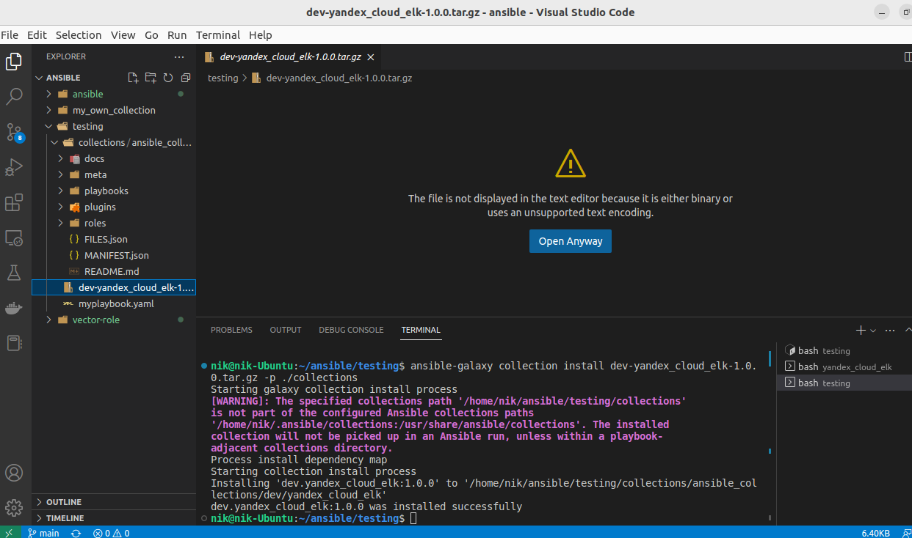
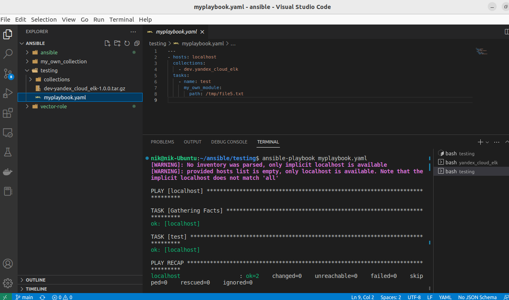

# Домашнее задание к занятию "6.Создание собственных модулей"

## Подготовка к выполнению
1. Создайте пустой публичных репозиторий в любом своём проекте: `my_own_collection`
2. Скачайте репозиторий ansible: `git clone https://github.com/ansible/ansible.git` по любому удобному вам пути
3. Зайдите в директорию ansible: `cd ansible`
4. Создайте виртуальное окружение: `python3 -m venv venv`
5. Активируйте виртуальное окружение: `. venv/bin/activate`. Дальнейшие действия производятся только в виртуальном окружении
6. Установите зависимости `pip install -r requirements.txt`
7. Запустить настройку окружения `. hacking/env-setup`
8. Если все шаги прошли успешно - выйти из виртуального окружения `deactivate`
9. Ваше окружение настроено, для того чтобы запустить его, нужно находиться в директории `ansible` и выполнить конструкцию `. venv/bin/activate && . hacking/env-setup`

## Основная часть

Наша цель - написать собственный module, который мы можем использовать в своей role, через playbook. Всё это должно быть собрано в виде collection и отправлено в наш репозиторий.

1. В виртуальном окружении создать новый `my_own_module.py` файл
2. Наполнить его содержимым:

<details>

```python
#!/usr/bin/python

# Copyright: (c) 2018, Terry Jones <terry.jones@example.org>
# GNU General Public License v3.0+ (see COPYING or https://www.gnu.org/licenses/gpl-3.0.txt)
from __future__ import (absolute_import, division, print_function)
__metaclass__ = type

DOCUMENTATION = r'''
---
module: my_test

short_description: This is my test module

# If this is part of a collection, you need to use semantic versioning,
# i.e. the version is of the form "2.5.0" and not "2.4".
version_added: "1.0.0"

description: This is my longer description explaining my test module.

options:
    name:
        description: This is the message to send to the test module.
        required: true
        type: str
    new:
        description:
            - Control to demo if the result of this module is changed or not.
            - Parameter description can be a list as well.
        required: false
        type: bool
# Specify this value according to your collection
# in format of namespace.collection.doc_fragment_name
extends_documentation_fragment:
    - my_namespace.my_collection.my_doc_fragment_name

author:
    - Your Name (@yourGitHubHandle)
'''

EXAMPLES = r'''
# Pass in a message
- name: Test with a message
  my_namespace.my_collection.my_test:
    name: hello world

# pass in a message and have changed true
- name: Test with a message and changed output
  my_namespace.my_collection.my_test:
    name: hello world
    new: true

# fail the module
- name: Test failure of the module
  my_namespace.my_collection.my_test:
    name: fail me
'''

RETURN = r'''
# These are examples of possible return values, and in general should use other names for return values.
original_message:
    description: The original name param that was passed in.
    type: str
    returned: always
    sample: 'hello world'
message:
    description: The output message that the test module generates.
    type: str
    returned: always
    sample: 'goodbye'
'''

from ansible.module_utils.basic import AnsibleModule


def run_module():
    # define available arguments/parameters a user can pass to the module
    module_args = dict(
        name=dict(type='str', required=True),
        new=dict(type='bool', required=False, default=False)
    )

    # seed the result dict in the object
    # we primarily care about changed and state
    # changed is if this module effectively modified the target
    # state will include any data that you want your module to pass back
    # for consumption, for example, in a subsequent task
    result = dict(
        changed=False,
        original_message='',
        message=''
    )

    # the AnsibleModule object will be our abstraction working with Ansible
    # this includes instantiation, a couple of common attr would be the
    # args/params passed to the execution, as well as if the module
    # supports check mode
    module = AnsibleModule(
        argument_spec=module_args,
        supports_check_mode=True
    )

    # if the user is working with this module in only check mode we do not
    # want to make any changes to the environment, just return the current
    # state with no modifications
    if module.check_mode:
        module.exit_json(**result)

    # manipulate or modify the state as needed (this is going to be the
    # part where your module will do what it needs to do)
    result['original_message'] = module.params['name']
    result['message'] = 'goodbye'

    # use whatever logic you need to determine whether or not this module
    # made any modifications to your target
    if module.params['new']:
        result['changed'] = True

    # during the execution of the module, if there is an exception or a
    # conditional state that effectively causes a failure, run
    # AnsibleModule.fail_json() to pass in the message and the result
    if module.params['name'] == 'fail me':
        module.fail_json(msg='You requested this to fail', **result)

    # in the event of a successful module execution, you will want to
    # simple AnsibleModule.exit_json(), passing the key/value results
    module.exit_json(**result)


def main():
    run_module()


if __name__ == '__main__':
    main()
```

</details>

Или возьмите данное наполнение из [статьи](https://docs.ansible.com/ansible/latest/dev_guide/developing_modules_general.html#creating-a-module).

3. Заполните файл в соответствии с требованиями ansible так, чтобы он выполнял основную задачу: module должен создавать текстовый файл на удалённом хосте по пути, определённом в параметре `path`, с содержимым, определённым в параметре `content`.
[my_own_module](./module/my_own_module.py)

4. Проверьте module на исполняемость локально.

```bash   
(venv) nik@nik-Ubuntu:~/ansible/ansible$ python -m ansible.modules.my_own_module args.json

{"changed": true, "original_message": "/tmp/newfile.txt", "message": "File was created", "invocation": {"module_args": {"path": "/tmp/newfile.txt", "content": "Ansible & Python - FOREVER"}}}
(venv) nik@nik-Ubuntu:~/ansible/ansible$ cat /tmp/newfile.txt
Ansible & Python - FOREVER(venv) nik@nik-Ubuntu:~/ansible/ansible$ python -m ansible.modules.my_own_module args.json

{"changed": false, "original_message": "/tmp/newfile.txt", "message": "File already exist", "invocation": {"module_args": {"path": "/tmp/newfile.txt", "content": "Ansible & Python - FOREVER"}}}
```

5. Напишите single task playbook и используйте module в нём.
   
```yml
---
- name: Check my module
  hosts: localhost
  tasks:
    - Сreate file:
      ansible.modules.my_own_module:
        path: "/tmp/file.txt"
        content: "test text message"
```

6. Проверьте через playbook на идемпотентность.

* Запустим playbook:
  
```bash
(venv) nik@nik-Ubuntu:~/ansible/ansible$ ansible-playbook myplaybook.yaml -v
[WARNING]: You are running the development version of Ansible. You should only run Ansible from "devel" if you are
modifying the Ansible engine, or trying out features under development. This is a rapidly changing source of code and
can become unstable at any point.
No config file found; using defaults
[WARNING]: No inventory was parsed, only implicit localhost is available
[WARNING]: provided hosts list is empty, only localhost is available. Note that the implicit localhost does not match
'all'

PLAY [Check my module] ************************************************************************************************

TASK [Gathering Facts] ************************************************************************************************
ok: [localhost]

TASK [Create file with content] ***************************************************************************************
changed: [localhost] => {"changed": true, "message": "File was created", "original_message": "/tmp/file2.txt"}

PLAY RECAP ************************************************************************************************************
localhost                  : ok=2    changed=1    unreachable=0    failed=0    skipped=0    rescued=0    ignored=0  

```  

* Повторный запуск:

```bash
(venv) nik@nik-Ubuntu:~/ansible/ansible$ ansible-playbook myplaybook.yaml -v
[WARNING]: You are running the development version of Ansible. You should only run Ansible from "devel" if you are
modifying the Ansible engine, or trying out features under development. This is a rapidly changing source of code and
can become unstable at any point.
No config file found; using defaults
[WARNING]: No inventory was parsed, only implicit localhost is available
[WARNING]: provided hosts list is empty, only localhost is available. Note that the implicit localhost does not match
'all'

PLAY [Check my module] ************************************************************************************************

TASK [Gathering Facts] ************************************************************************************************
ok: [localhost]

TASK [Create file with content] ***************************************************************************************
ok: [localhost] => {"changed": false, "message": "File already exist", "original_message": "/tmp/file1.txt"}

PLAY RECAP ************************************************************************************************************
localhost                  : ok=2    changed=0    unreachable=0    failed=0    skipped=0    rescued=0    ignored=0   
```

**Таким образом, выполняется свойство идемпотентности.**

7. Выйдите из виртуального окружения.

`deactivate`

8.  Инициализируйте новую collection: `ansible-galaxy collection init my_own_namespace.yandex_cloud_elk`

`ansible-galaxy collection init dev.yandex_cloud_elk`

9.  В данную collection перенесите свой module в соответствующую директорию.

path: `/dev/yandex_cloud_elk/plugins/modules/my_own_module.py`

10.  Single task playbook преобразуйте в single task role и перенесите в collection. У role должны быть default всех параметров module

11.  Создайте playbook для использования этой role.
12. Заполните всю документацию по collection, выложите в свой репозиторий, поставьте тег `1.0.0` на этот коммит.
    
    [my_own_collection](https://github.com/nikolay480/my_own_collection/tree/1.0.0)

13. Создайте .tar.gz этой collection: `ansible-galaxy collection build` в корневой директории collection.

    [dev-yandex_cloud_elk-1.0.0.tar.gz](./module/dev-yandex_cloud_elk-1.0.0.tar.gz)
14. Создайте ещё одну директорию любого наименования, перенесите туда single task playbook и архив c collection.
15. Установите collection из локального архива: `ansible-galaxy collection install <archivename>.tar.gz`
  

1.   Запустите playbook, убедитесь, что он работает.
    
1.   В ответ необходимо прислать ссылки на collection и tar.gz архив, а также скриншоты выполнения пунктов 4, 6, 15 и 16.

---

