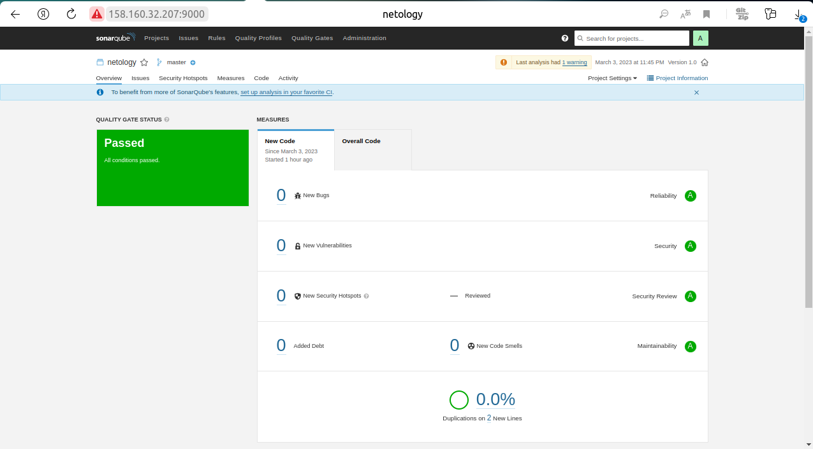
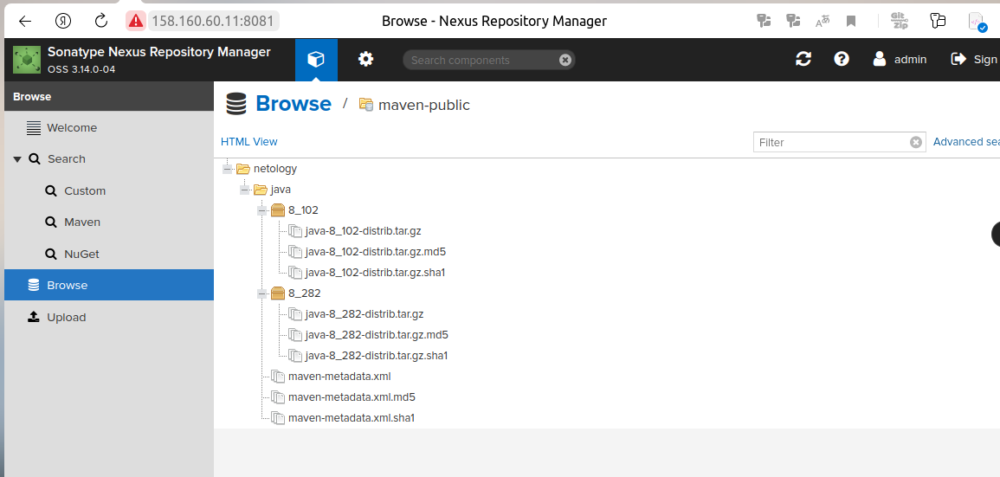

# Домашнее задание к занятию 9 «Процессы CI/CD»

## Подготовка к выполнению
<details>
1. Создайте два VM в Yandex Cloud с параметрами: 2CPU 4RAM Centos7 (остальное по минимальным требованиям).
2. Пропишите в [inventory](./infrastructure/inventory/cicd/hosts.yml) [playbook](./infrastructure/site.yml) созданные хосты.
3. Добавьте в [files](./infrastructure/files/) файл со своим публичным ключом (id_rsa.pub). Если ключ называется иначе — найдите таску в плейбуке, которая использует id_rsa.pub имя, и исправьте на своё.
4. Запустите playbook, ожидайте успешного завершения.
5. Проверьте готовность SonarQube через [браузер](http://localhost:9000).
6. Зайдите под admin\admin, поменяйте пароль на свой.
7.  Проверьте готовность Nexus через [бразуер](http://localhost:8081).
8. Подключитесь под admin\admin123, поменяйте пароль, сохраните анонимный доступ.
</details>

## Знакомство с SonarQube

### Основная часть

1. Создайте новый проект, название произвольное.
2. Скачайте пакет sonar-scanner, который вам предлагает скачать SonarQube.
3. Сделайте так, чтобы binary был доступен через вызов в shell (или поменяйте переменную PATH, или любой другой, удобный вам способ).
4. Проверьте `sonar-scanner --version`.
   ```bash
   nik@nik-Ubuntu:~/devops-netology/CI_monitoring_config/09-ci-03-cicd/sonar$ sonar-scanner --version
   INFO: Scanner configuration file: /opt/sonar/sonar-scanner-4.8.0.2856-linux/conf/sonar-scanner.properties
   INFO: Project root configuration file: /home/nik/devops-netology/CI_monitoring_config/09-ci-03-cicd/sonar/sonar-project.properties
   INFO: SonarScanner 4.8.0.2856
   INFO: Java 11.0.17 Eclipse Adoptium (64-bit)
   INFO: Linux 5.19.0-32-generic amd64
   ```

5. Запустите анализатор против кода из директории [example](./example) с дополнительным ключом `-Dsonar.coverage.exclusions=fail.py`.
   
### Первый запуск:

<details>

```bash

   nik@nik-Ubuntu:~/devops-netology/CI_monitoring_config/09-ci-03-cicd/netology_project$ sonar-scanner -Dsonar.coverage.exclusions=fail.py
   INFO: Scanner configuration file: /opt/sonar/sonar-scanner-4.8.0.2856-linux/conf/sonar-scanner.properties
   INFO: Project root configuration file: /home/nik/devops-netology/CI_monitoring_config/09-ci-03-cicd/netology_project/sonar-project.properties
   INFO: SonarScanner 4.8.0.2856
   INFO: Java 11.0.17 Eclipse Adoptium (64-bit)
   INFO: Linux 5.19.0-32-generic amd64
   INFO: User cache: /home/nik/.sonar/cache
   INFO: Analyzing on SonarQube server 9.1.0
   INFO: Default locale: "en_US", source code encoding: "UTF-8"
   INFO: Load global settings
   INFO: Load global settings (done) | time=367ms
   INFO: Server id: 9CFC3560-AYamZ675-P4-xTGhOG8K
   INFO: User cache: /home/nik/.sonar/cache
   INFO: Load/download plugins
   INFO: Load plugins index
   INFO: Load plugins index (done) | time=192ms
   INFO: Load/download plugins (done) | time=41556ms
   INFO: Process project properties
   INFO: Process project properties (done) | time=22ms
   INFO: Execute project builders
   INFO: Execute project builders (done) | time=3ms
   INFO: Project key: nik:netology
   INFO: Base dir: /home/nik/devops-netology/CI_monitoring_config/09-ci-03-cicd/netology_project
   INFO: Working dir: /home/nik/devops-netology/CI_monitoring_config/09-ci-03-cicd/netology_project/.scannerwork
   INFO: Load project settings for component key: 'nik:netology'
   INFO: Load project settings for component key: 'nik:netology' (done) | time=244ms
   INFO: Load quality profiles
   INFO: Load quality profiles (done) | time=370ms
   INFO: Load active rules
   INFO: Load active rules (done) | time=6755ms
   INFO: Indexing files...
   INFO: Project configuration:
   INFO:   Excluded sources for coverage: fail.py
   INFO: 2 files indexed
   INFO: 0 files ignored because of scm ignore settings
   INFO: Quality profile for py: Sonar way
   INFO: ------------- Run sensors on module netology
   INFO: Load metrics repository
   INFO: Load metrics repository (done) | time=211ms
   INFO: Sensor Python Sensor [python]
   WARN: Your code is analyzed as compatible with python 2 and 3 by default. This will prevent the detection of issues specific to python 2 or python 3. You can get a more precise analysis by setting a python version in your configuration via the parameter "sonar.python.version"
   INFO: Starting global symbols computation
   INFO: 1 source file to be analyzed
   INFO: Load project repositories
   INFO: Load project repositories (done) | time=223ms
   INFO: 1/1 source file has been analyzed
   INFO: Starting rules execution
   INFO: 1 source file to be analyzed
   INFO: 1/1 source file has been analyzed
   INFO: Sensor Python Sensor [python] (done) | time=1370ms
   INFO: Sensor Cobertura Sensor for Python coverage [python]
   INFO: Sensor Cobertura Sensor for Python coverage [python] (done) | time=17ms
   INFO: Sensor PythonXUnitSensor [python]
   INFO: Sensor PythonXUnitSensor [python] (done) | time=2ms
   INFO: Sensor CSS Rules [cssfamily]
   INFO: No CSS, PHP, HTML or VueJS files are found in the project. CSS analysis is skipped.
   INFO: Sensor CSS Rules [cssfamily] (done) | time=4ms
   INFO: Sensor JaCoCo XML Report Importer [jacoco]
   INFO: 'sonar.coverage.jacoco.xmlReportPaths' is not defined. Using default locations: target/site/jacoco/jacoco.xml,target/site/jacoco-it/jacoco.xml,build/reports/jacoco/test/jacocoTestReport.xml
   INFO: No report imported, no coverage information will be imported by JaCoCo XML Report Importer
   INFO: Sensor JaCoCo XML Report Importer [jacoco] (done) | time=5ms
   INFO: Sensor C# Project Type Information [csharp]
   INFO: Sensor C# Project Type Information [csharp] (done) | time=1ms
   INFO: Sensor C# Analysis Log [csharp]
   INFO: Sensor C# Analysis Log [csharp] (done) | time=42ms
   INFO: Sensor C# Properties [csharp]
   INFO: Sensor C# Properties [csharp] (done) | time=0ms
   INFO: Sensor JavaXmlSensor [java]
   INFO: Sensor JavaXmlSensor [java] (done) | time=2ms
   INFO: Sensor HTML [web]
   INFO: Sensor HTML [web] (done) | time=6ms
   INFO: Sensor VB.NET Project Type Information [vbnet]
   INFO: Sensor VB.NET Project Type Information [vbnet] (done) | time=2ms
   INFO: Sensor VB.NET Analysis Log [vbnet]
   INFO: Sensor VB.NET Analysis Log [vbnet] (done) | time=26ms
   INFO: Sensor VB.NET Properties [vbnet]
   INFO: Sensor VB.NET Properties [vbnet] (done) | time=0ms
   INFO: ------------- Run sensors on project
   INFO: Sensor Zero Coverage Sensor
   INFO: Sensor Zero Coverage Sensor (done) | time=1ms
   INFO: SCM Publisher SCM provider for this project is: git
   INFO: SCM Publisher 1 source file to be analyzed
   INFO: SCM Publisher 0/1 source files have been analyzed (done) | time=91ms
   WARN: Missing blame information for the following files:
   WARN:   * fail.py
   WARN: This may lead to missing/broken features in SonarQube
   INFO: CPD Executor Calculating CPD for 1 file
   INFO: CPD Executor CPD calculation finished (done) | time=14ms
   INFO: Analysis report generated in 210ms, dir size=103.4 kB
   INFO: Analysis report compressed in 28ms, zip size=14.3 kB
   INFO: Analysis report uploaded in 243ms
   INFO: ANALYSIS SUCCESSFUL, you can browse http://158.160.32.207:9000/dashboard?id=nik%3Anetology
   INFO: Note that you will be able to access the updated dashboard once the server has processed the submitted analysis report
   INFO: More about the report processing at http://158.160.32.207:9000/api/ce/task?id=AYaog7Kl-P4-xTGhOMBR
   INFO: Analysis total time: 14.132 s
   INFO: ------------------------------------------------------------------------
   INFO: EXECUTION SUCCESS
   INFO: ------------------------------------------------------------------------
   INFO: Total time: 57.751s
   INFO: Final Memory: 8M/27M
   INFO: ------------------------------------------------------------------------
```
</details>

6. Посмотрите результат в интерфейсе.
7. Исправьте ошибки, которые он выявил, включая warnings.
8. Запустите анализатор повторно — проверьте, что QG пройдены успешно.

## Повторный запуск:

<details>

```bash
nik@nik-Ubuntu:~/devops-netology/CI_monitoring_config/09-ci-03-cicd/netology_project$ sonar-scanner -Dsonar.coverage.exclusions=fail.py
INFO: Scanner configuration file: /opt/sonar/sonar-scanner-4.8.0.2856-linux/conf/sonar-scanner.properties
INFO: Project root configuration file: /home/nik/devops-netology/CI_monitoring_config/09-ci-03-cicd/netology_project/sonar-project.properties
INFO: SonarScanner 4.8.0.2856
INFO: Java 11.0.17 Eclipse Adoptium (64-bit)
INFO: Linux 5.19.0-32-generic amd64
INFO: User cache: /home/nik/.sonar/cache
INFO: Analyzing on SonarQube server 9.1.0
INFO: Default locale: "en_US", source code encoding: "UTF-8"
INFO: Load global settings
INFO: Load global settings (done) | time=246ms
INFO: Server id: 9CFC3560-AYamZ675-P4-xTGhOG8K
INFO: User cache: /home/nik/.sonar/cache
INFO: Load/download plugins
INFO: Load plugins index
INFO: Load plugins index (done) | time=157ms
INFO: Load/download plugins (done) | time=346ms
INFO: Process project properties
INFO: Process project properties (done) | time=12ms
INFO: Execute project builders
INFO: Execute project builders (done) | time=3ms
INFO: Project key: nik:netology
INFO: Base dir: /home/nik/devops-netology/CI_monitoring_config/09-ci-03-cicd/netology_project
INFO: Working dir: /home/nik/devops-netology/CI_monitoring_config/09-ci-03-cicd/netology_project/.scannerwork
INFO: Load project settings for component key: 'nik:netology'
INFO: Load project settings for component key: 'nik:netology' (done) | time=72ms
INFO: Load quality profiles
INFO: Load quality profiles (done) | time=136ms
INFO: Load active rules
INFO: Load active rules (done) | time=3293ms
INFO: Indexing files...
INFO: Project configuration:
INFO:   Excluded sources for coverage: fail.py
INFO: 2 files indexed
INFO: 0 files ignored because of scm ignore settings
INFO: Quality profile for py: Sonar way
INFO: ------------- Run sensors on module netology
INFO: Load metrics repository
INFO: Load metrics repository (done) | time=111ms
INFO: Sensor Python Sensor [python]
INFO: Starting global symbols computation
INFO: 1 source file to be analyzed
INFO: Load project repositories
INFO: Load project repositories (done) | time=71ms
INFO: 1/1 source file has been analyzed
INFO: Starting rules execution
INFO: 1 source file to be analyzed
INFO: 1/1 source file has been analyzed
INFO: Sensor Python Sensor [python] (done) | time=964ms
INFO: Sensor Cobertura Sensor for Python coverage [python]
INFO: Sensor Cobertura Sensor for Python coverage [python] (done) | time=22ms
INFO: Sensor PythonXUnitSensor [python]
INFO: Sensor PythonXUnitSensor [python] (done) | time=2ms
INFO: Sensor CSS Rules [cssfamily]
INFO: No CSS, PHP, HTML or VueJS files are found in the project. CSS analysis is skipped.
INFO: Sensor CSS Rules [cssfamily] (done) | time=2ms
INFO: Sensor JaCoCo XML Report Importer [jacoco]
INFO: 'sonar.coverage.jacoco.xmlReportPaths' is not defined. Using default locations: target/site/jacoco/jacoco.xml,target/site/jacoco-it/jacoco.xml,build/reports/jacoco/test/jacocoTestReport.xml
INFO: No report imported, no coverage information will be imported by JaCoCo XML Report Importer
INFO: Sensor JaCoCo XML Report Importer [jacoco] (done) | time=8ms
INFO: Sensor C# Project Type Information [csharp]
INFO: Sensor C# Project Type Information [csharp] (done) | time=1ms
INFO: Sensor C# Analysis Log [csharp]
INFO: Sensor C# Analysis Log [csharp] (done) | time=25ms
INFO: Sensor C# Properties [csharp]
INFO: Sensor C# Properties [csharp] (done) | time=0ms
INFO: Sensor JavaXmlSensor [java]
INFO: Sensor JavaXmlSensor [java] (done) | time=5ms
INFO: Sensor HTML [web]
INFO: Sensor HTML [web] (done) | time=6ms
INFO: Sensor VB.NET Project Type Information [vbnet]
INFO: Sensor VB.NET Project Type Information [vbnet] (done) | time=2ms
INFO: Sensor VB.NET Analysis Log [vbnet]
INFO: Sensor VB.NET Analysis Log [vbnet] (done) | time=25ms
INFO: Sensor VB.NET Properties [vbnet]
INFO: Sensor VB.NET Properties [vbnet] (done) | time=2ms
INFO: ------------- Run sensors on project
INFO: Sensor Zero Coverage Sensor
INFO: Sensor Zero Coverage Sensor (done) | time=3ms
INFO: SCM Publisher SCM provider for this project is: git
INFO: SCM Publisher 1 source file to be analyzed
INFO: SCM Publisher 0/1 source files have been analyzed (done) | time=97ms
WARN: Missing blame information for the following files:
WARN:   * fail.py
WARN: This may lead to missing/broken features in SonarQube
INFO: CPD Executor Calculating CPD for 1 file
INFO: CPD Executor CPD calculation finished (done) | time=15ms
INFO: Analysis report generated in 139ms, dir size=102.9 kB
INFO: Analysis report compressed in 73ms, zip size=13.9 kB
INFO: Analysis report uploaded in 137ms
INFO: ANALYSIS SUCCESSFUL, you can browse http://158.160.32.207:9000/dashboard?id=nik%3Anetology
INFO: Note that you will be able to access the updated dashboard once the server has processed the submitted analysis report
INFO: More about the report processing at http://158.160.32.207:9000/api/ce/task?id=AYaoywQ8-P4-xTGhOMB9
INFO: Analysis total time: 8.347 s
INFO: ------------------------------------------------------------------------
INFO: EXECUTION SUCCESS
INFO: ------------------------------------------------------------------------
INFO: Total time: 10.742s
INFO: Final Memory: 7M/30M
INFO: ------------------------------------------------------------------------
```

</details>

9.  Сделайте скриншот успешного прохождения анализа, приложите к решению ДЗ.




## Знакомство с Nexus

### Основная часть

1. В репозиторий `maven-public` загрузите артефакт с GAV-параметрами:

 *    groupId: netology;
 *    artifactId: java;
 *    version: 8_282;
 *    classifier: distrib;
 *    type: tar.gz.
   
2. В него же загрузите такой же артефакт, но с version: 8_102.
3. Проверьте, что все файлы загрузились успешно.

4. В ответе пришлите файл `maven-metadata.xml` для этого артефекта.
   
[maven-metadata.xml](./nexus/maven-metadata.xml)

### Знакомство с Maven

### Подготовка к выполнению

1. Скачайте дистрибутив с [maven](https://maven.apache.org/download.cgi).
2. Разархивируйте, сделайте так, чтобы binary был доступен через вызов в shell (или поменяйте переменную PATH, или любой другой, удобный вам способ).

```bash
nik@nik-Ubuntu:~/Downloads$ sudo unzip apache-maven-3.9.0-bin.zip -d /opt
nik@nik-Ubuntu:~/Downloads$ export PATH=/opt/apache-maven-3.9.0/bin:$PATH

```

1. Удалите из `apache-maven-<version>/conf/settings.xml` упоминание о правиле, отвергающем HTTP- соединение — раздел mirrors —> id: my-repository-http-unblocker.
2. Проверьте `mvn --version`.
```bash
nik@nik-Ubuntu:~/Downloads$ mvn --version
Apache Maven 3.9.0 (9b58d2bad23a66be161c4664ef21ce219c2c8584)
Maven home: /opt/apache-maven-3.9.0
Java version: 11.0.18, vendor: Ubuntu, runtime: /usr/lib/jvm/java-11-openjdk-amd64
Default locale: en_US, platform encoding: UTF-8
OS name: "linux", version: "5.19.0-32-generic", arch: "amd64", family: "unix"
```

3. Забираем директорию [mvn](./mvn) с pom.

### Основная часть

1. Поменяйте в `pom.xml` блок с зависимостями под ваш артефакт из первого пункта задания для Nexus (java с версией 8_282).
2. Запустите команду `mvn package` в директории с `pom.xml`, ожидайте успешного окончания.

   ```bash
   [INFO] Scanning for projects...
   [INFO] 
   [INFO] --------------------< com.netology.app:simple-app >---------------------
   [INFO] Building simple-app 1.0-SNAPSHOT
   [INFO]   from pom.xml
   [INFO] --------------------------------[ jar ]---------------------------------
   Downloading from central: https://repo.maven.apache.org/maven2/org/apache/maven/plugins/maven-resources-plugin/3.3.0/maven-resources-plugin-3.3.0.pom

   ........................................

   ........................................

   ........................................

   [WARNING] JAR will be empty - no content was marked for inclusion!
   [INFO] Building jar: /home/nik/devops-netology/CI_monitoring_config/09-ci-03-cicd/mvn/target/simple-app-1.0-SNAPSHOT.jar
   [INFO] ------------------------------------------------------------------------
   [INFO] BUILD SUCCESS
   [INFO] ------------------------------------------------------------------------
   [INFO] Total time:  17.500 s
   [INFO] Finished at: 2023-03-05T14:36:17+05:00
   [INFO] ------------------------------------------------------------------------

   ```


3. Проверьте директорию `~/.m2/repository/`, найдите ваш артефакт.
   
    

4. В ответе пришлите исправленный файл `pom.xml`.

    [pom.xml](./mvn/pom.xml)

---