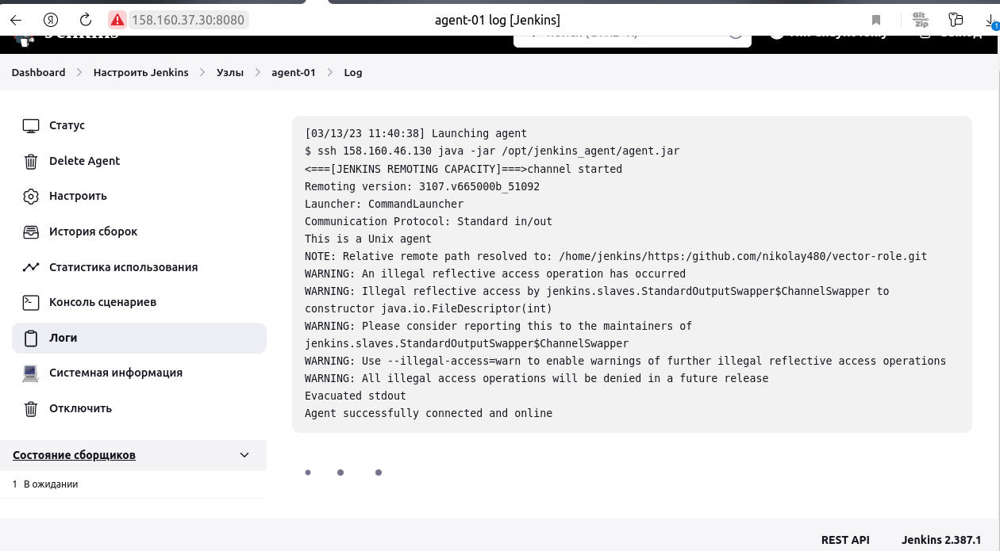
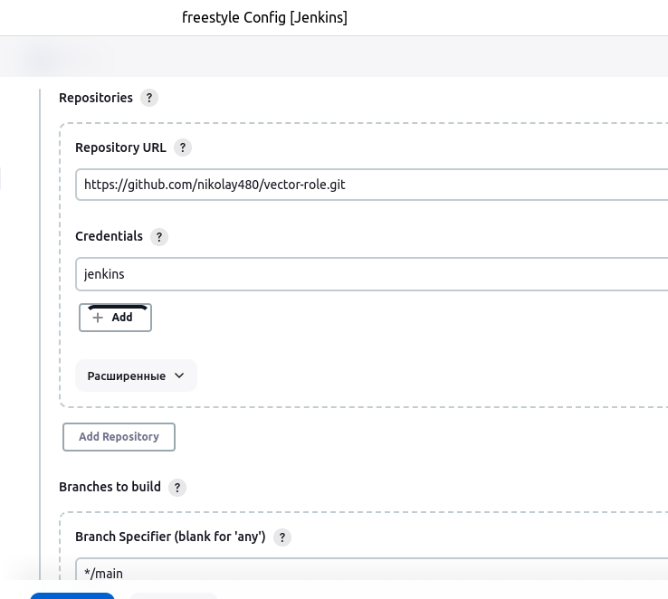
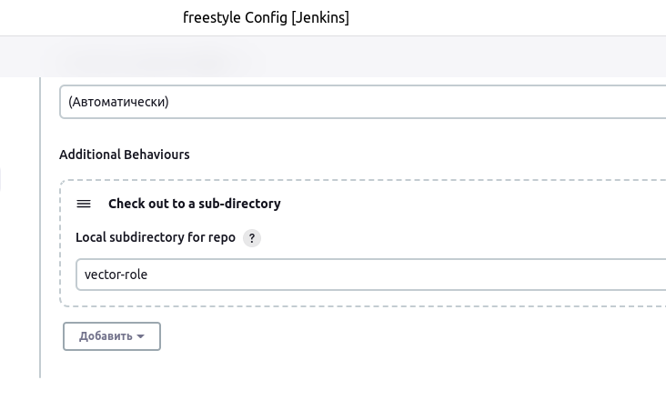
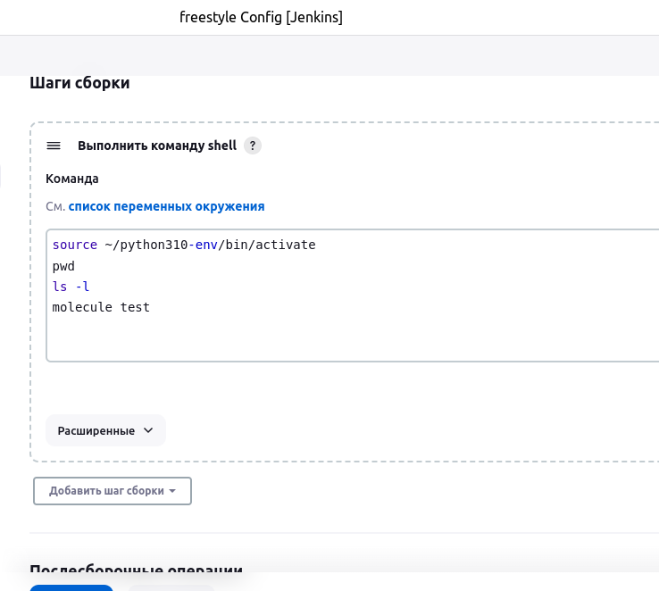
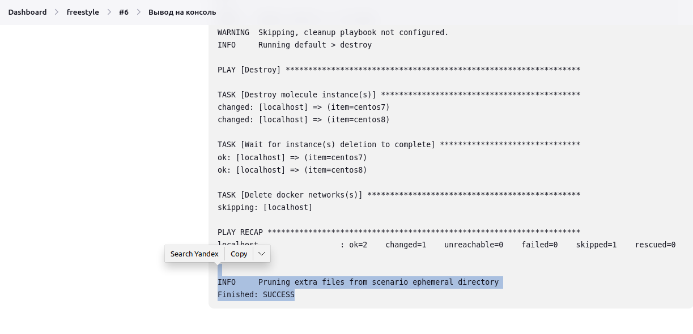
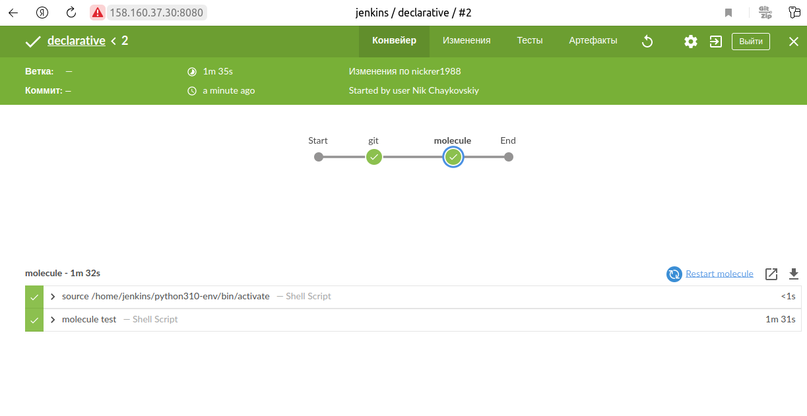
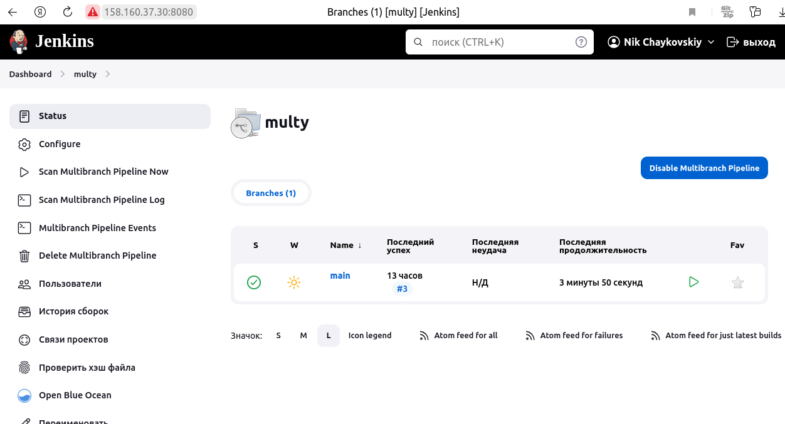
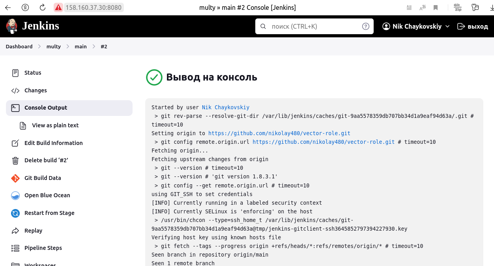
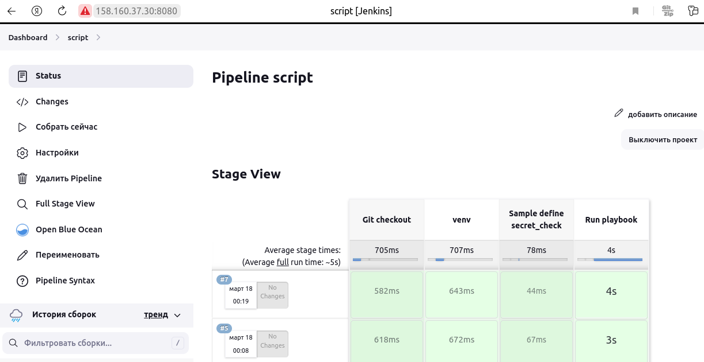

# Домашнее задание к занятию 10 «Jenkins»

## Подготовка к выполнению

1. Создать два VM: для jenkins-master и jenkins-agent.
2. Установить Jenkins при помощи playbook.
3. Запустить и проверить работоспособность.
4. Сделать первоначальную настройку.


## Основная часть

1. Сделать Freestyle Job, который будет запускать `molecule test` из любого вашего репозитория с ролью.






2. Сделать Declarative Pipeline Job, который будет запускать `molecule test` из любого вашего репозитория с ролью.
 

3. Перенести Declarative Pipeline в репозиторий в файл      `Jenkinsfile`.
   
    [Jenkinsfile](https://github.com/nikolay480/vector-role/blob/main/Jenkinsfile)

1. Создать Multibranch Pipeline на запуск `Jenkinsfile` из репозитория.
   
   

2. Создать Scripted Pipeline, наполнить его скриптом из [pipeline](./pipeline).
3. Внести необходимые изменения, чтобы Pipeline запускал `ansible-playbook` без флагов `--check --diff`, если не установлен параметр при запуске джобы (prod_run = True). По умолчанию параметр имеет значение False и запускает прогон с флагами `--check --diff`.
4. Проверить работоспособность, исправить ошибки, исправленный Pipeline вложить в репозиторий в файл `ScriptedJenkinsfile`.
  
   [ScriptedJenkinsfile](./pipeline/ScriptedJenkinsfile)



### Вывод консоли:

<details>

   ```bash

      Started by user Nik Chaykovskiy
   [Pipeline] Start of Pipeline
   [Pipeline] node
   Running on agent-01 in /opt/jenkins_agent/workspace/script
   [Pipeline] {
   [Pipeline] stage
   [Pipeline] { (Git checkout)
   [Pipeline] git
   The recommended git tool is: NONE
   using credential 8bf3ba0b-b1e8-4dd6-871b-fa6d554a9b78
   Fetching changes from the remote Git repository
   Checking out Revision b4e99ba308c63716c3de2e2033b800d2067e51fe (refs/remotes/origin/main)
   Commit message: "requirements"
    > git rev-parse --resolve-git-dir /opt/jenkins_agent/workspace/script/.git # timeout=10
    > git config remote.origin.url https://github.com/nikolay480/example-playbook.git # timeout=10
   Fetching upstream changes from https://github.com/nikolay480/example-playbook.git
    > git --version # timeout=10
    > git --version # 'git version 1.8.3.1'
   using GIT_SSH to set credentials 
   [INFO] Currently running in a labeled security context
   [INFO] Currently SELinux is 'enforcing' on the host
    > /usr/bin/chcon --type=ssh_home_t /opt/jenkins_agent/workspace/script@tmp/jenkins-gitclient-ssh14905050423765864497.key
   Verifying host key using known hosts file
   You're using 'Known hosts file' strategy to verify ssh host keys, but your known_hosts file does not exist, please go to 'Manage Jenkins' -> 'Configure Global Security' -> 'Git Host Key Verification Configuration' and configure host key verification.
    > git fetch --tags --progress https://github.com/nikolay480/example-playbook.git +refs/heads/*:refs/remotes/origin/* # timeout=10
    > git rev-parse refs/remotes/origin/main^{commit} # timeout=10
    > git config core.sparsecheckout # timeout=10
    > git checkout -f b4e99ba308c63716c3de2e2033b800d2067e51fe # timeout=10
    > git branch -a -v --no-abbrev # timeout=10
    > git branch -D main # timeout=10
    > git checkout -b main b4e99ba308c63716c3de2e2033b800d2067e51fe # timeout=10
    > git rev-list --no-walk b4e99ba308c63716c3de2e2033b800d2067e51fe # timeout=10
   [Pipeline] }
   [Pipeline] // stage
   [Pipeline] stage
   [Pipeline] { (venv)
   [Pipeline] sh
   + chmod +x -R /home/jenkins/python310-env/bin/activate
   [Pipeline] sh
   + /home/jenkins/python310-env/bin/activate
   [Pipeline] }
   [Pipeline] // stage
   [Pipeline] stage
   [Pipeline] { (Sample define secret_check)
   [Pipeline] }
   [Pipeline] // stage
   [Pipeline] stage
   [Pipeline] { (Run playbook)
   [Pipeline] sh
   + ansible-playbook site.yml -i inventory/prod.yml --diff --check

   PLAY [Install Java] ************************************************************

   TASK [Gathering Facts] *********************************************************
   ok: [localhost]

   TASK [java : Upload .tar.gz file containing binaries from local storage] *******
   skipping: [localhost]

   TASK [java : Upload .tar.gz file conaining binaries from remote storage] *******
   ok: [localhost]

   TASK [java : Ensure installation dir exists] ***********************************
   ok: [localhost]

   TASK [java : Extract java in the installation directory] ***********************
   skipping: [localhost]

   TASK [java : Export environment variables] *************************************
   ok: [localhost]

   PLAY RECAP *********************************************************************
   localhost                  : ok=4    changed=0    unreachable=0    failed=0    skipped=2    rescued=0    ignored=0   

   [Pipeline] }
   [Pipeline] // stage
   [Pipeline] }
   [Pipeline] // node
   [Pipeline] End of Pipeline
   Finished: SUCCESS
   ```
</details>

---
