# Домашнее задание к занятию 12 «GitLab»

## Подготовка к выполнению

1. Подготовьте к работе GitLab [по инструкции](https://cloud.yandex.ru/docs/tutorials/infrastructure-management/gitlab-containers).
2. Создайте свой новый проект.
3. Создайте новый репозиторий в GitLab, наполните его [файлами](./repository).
4. Проект должен быть публичным, остальные настройки по желанию.

В YandexCloud созданы необходимые ресурсы, проведны настройки.
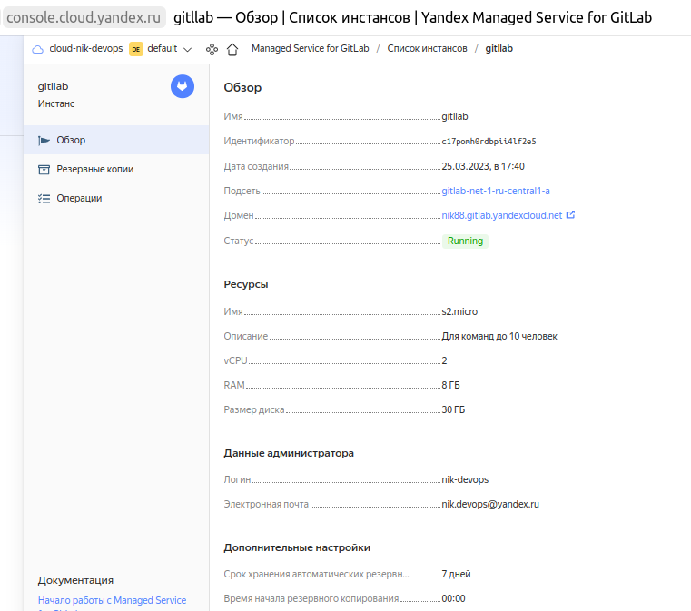
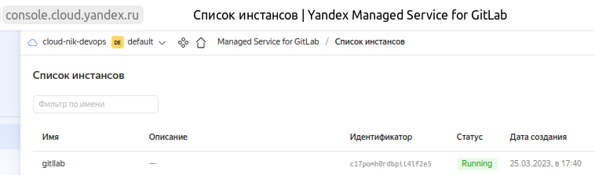
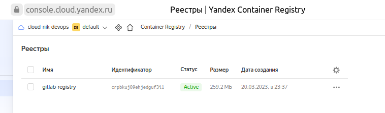

Создан проект **restful-api**

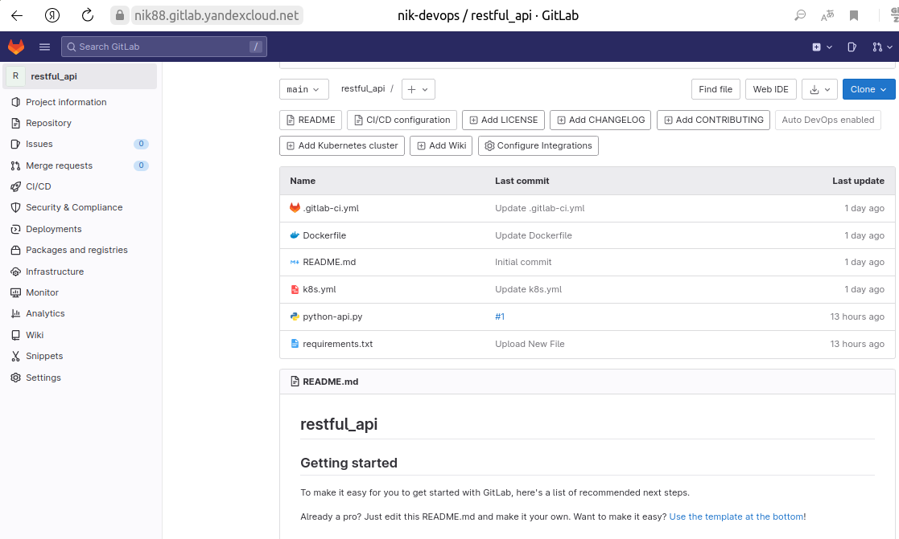

## Основная часть

### DevOps

В репозитории содержится код проекта на Python. Проект — RESTful API сервис. Ваша задача — автоматизировать сборку образа с выполнением python-скрипта:

1. Образ собирается на основе [centos:7](https://hub.docker.com/_/centos?tab=tags&page=1&ordering=last_updated).
2. Python версии не ниже 3.7.
3. Установлены зависимости: `flask` `flask-jsonpify` `flask-restful`.
4. Создана директория `/python_api`.
5. Скрипт из репозитория размещён в /python_api.
6. Точка вызова: запуск скрипта.
7. Если сборка происходит на ветке `master`: должен подняться pod kubernetes на основе образа `python-api`, иначе этот шаг нужно пропустить.

[Dockerfile](restful_api-main/Dockerfile)

[.gitlab-ci.yml](restful_api-main/.gitlab-ci.yml)

[k8s.yml](restful_api-main/k8s.yml)

### Product Owner

Вашему проекту нужна бизнесовая доработка: нужно поменять JSON ответа на вызов метода GET `/rest/api/get_info`, необходимо создать Issue в котором указать:

1. Какой метод необходимо исправить.
2. Текст с `{ "message": "Already started" }` на `{ "message": "Running"}`.
3. Issue поставить label: feature.

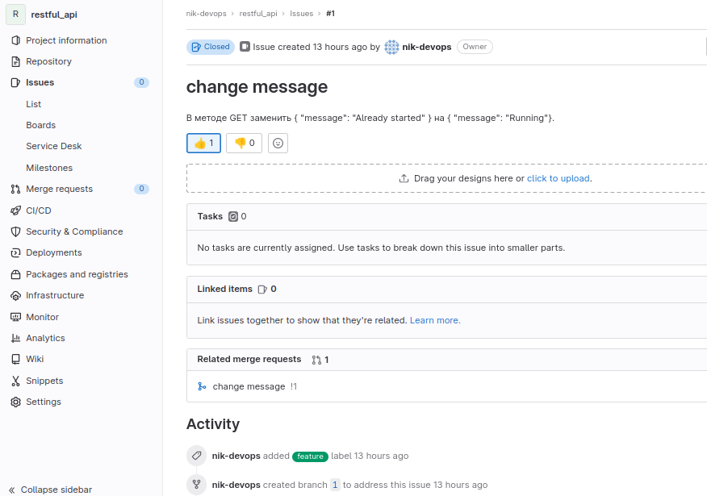

### Developer

Пришёл новый Issue на доработку, вам нужно:

1. Создать отдельную ветку, связанную с этим Issue.
2. Внести изменения по тексту из задания.
3. Подготовить Merge Request, влить необходимые изменения в `master`, проверить, что сборка прошла успешно.

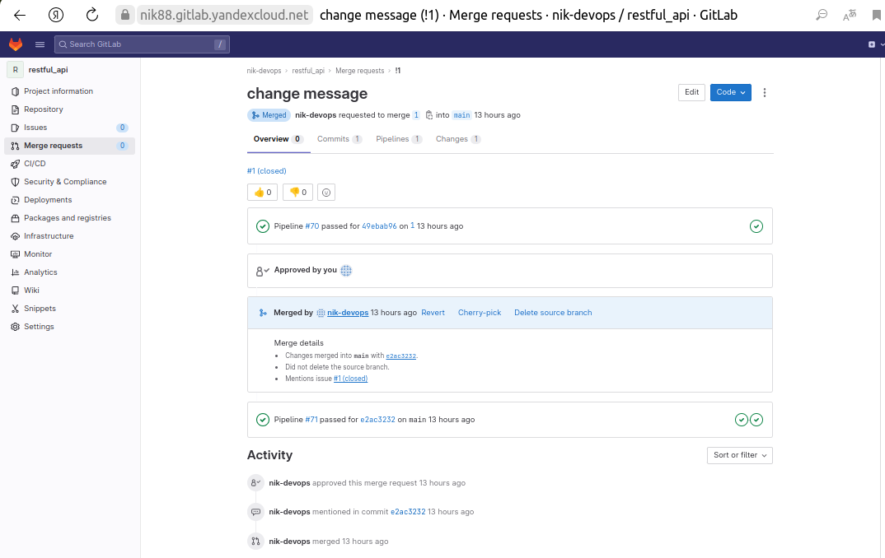

Сборка прошла успешно, образ запушили в YC-registry:
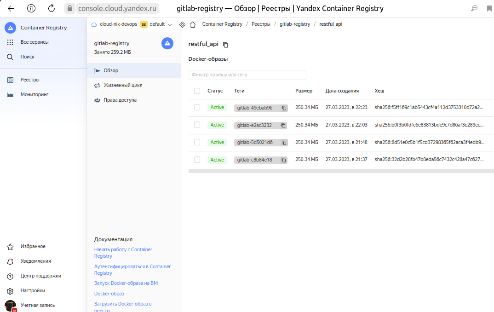

### Tester

Разработчики выполнили новый Issue, необходимо проверить валидность изменений:

1. Поднять докер-контейнер с образом `python-api:latest` и проверить возврат метода на корректность.
   
```bash

nik@DESKTOP-LE1IGVR:~$ docker pull cr.yandex/crpbkuj09ehjedguf3i1/restful_api:gitlab-49ebab96
gitlab-49ebab96: Pulling from crpbkuj09ehjedguf3i1/restful_api
c61d16cfe03e: Pull complete
eba158785ebc: Pull complete
1c921763d218: Pull complete
c395c9951b85: Pull complete
776bf87a71ac: Pull complete
85d3a9b594d7: Pull complete
6f6eb7edd1cc: Pull complete
Digest: sha256:f5ff169c1ab5443cf4a112d3753310d72a20cc0e4a5128c096d402c335c0f64b
Status: Downloaded newer image for cr.yandex/crpbkuj09ehjedguf3i1/restful_api:gitlab-49ebab96
cr.yandex/crpbkuj09ehjedguf3i1/restful_api:gitlab-49ebab96
nik@DESKTOP-LE1IGVR:~$ docker images
REPOSITORY                                   TAG               IMAGE ID       CREATED         SIZE
cr.yandex/crpbkuj09ehjedguf3i1/restful_api   gitlab-49ebab96   3da0e6f93cc9   2 hours ago     708MB
ghost                                        5.9.4             e5681a8ad06c   7 months ago    476MB
mysql                                        8.0               7b94cda7ffc7   7 months ago    446MB
gcr.io/k8s-minikube/kicbase                  v0.0.30           1312ccd2422d   13 months ago   1.14GB
centos                                       7                 eeb6ee3f44bd   18 months ago   204MB
docker/desktop-vpnkit-controller             v2.0              8c2c38aa676e   23 months ago   21MB
docker/desktop-storage-provisioner           v2.0              99f89471f470   23 months ago   41.9MB
nik@DESKTOP-LE1IGVR:~$ docker run -d --name python-api -p 5290:5290 cr.yandex/crpbkuj09ehjedguf3i1/restful_api:gitlab-49ebab96
33d5a91218041706eefccda0e762d7d4e4d8f46a6a787c52c6804908afb3b209
nik@DESKTOP-LE1IGVR:~$ curl localhost:5290/get_info
{"version": 3, "method": "GET", "message": "Running"}

```

2. Закрыть Issue с комментарием об успешности прохождения, указав желаемый результат и фактически достигнутый.

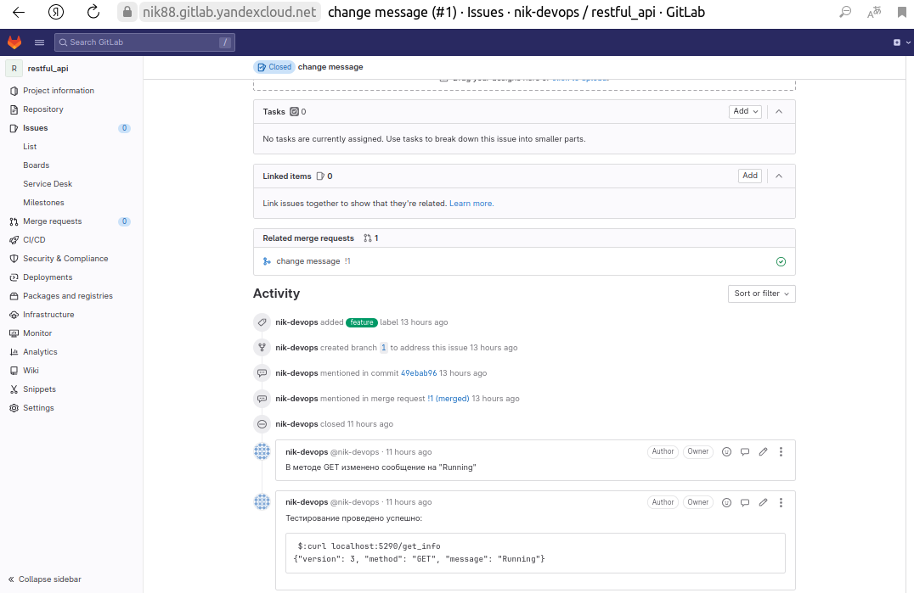

## Итог

В качестве ответа пришлите подробные скриншоты по каждому пункту задания.

[resful-api-repo](restful_api-main)


- лог успешного выполнения пайплайна:
  
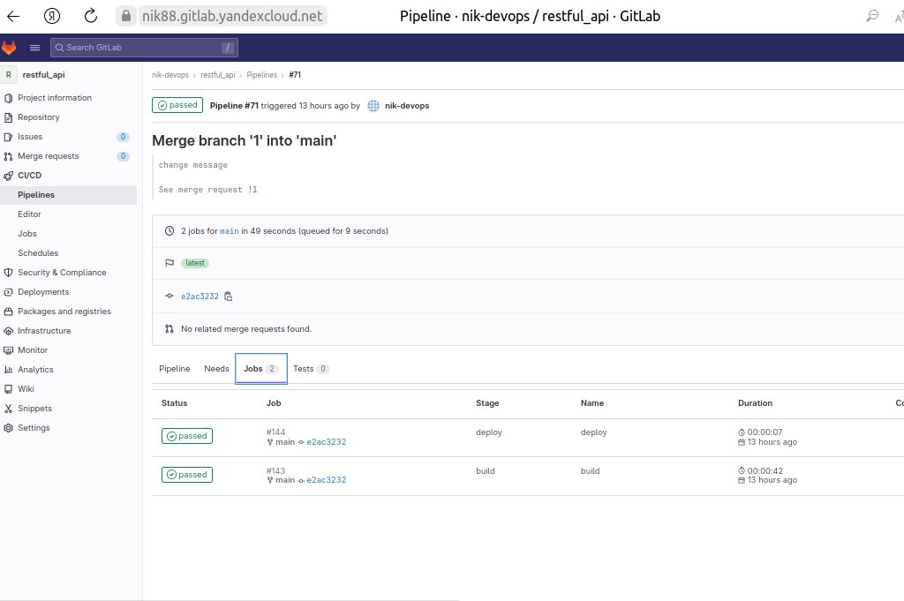

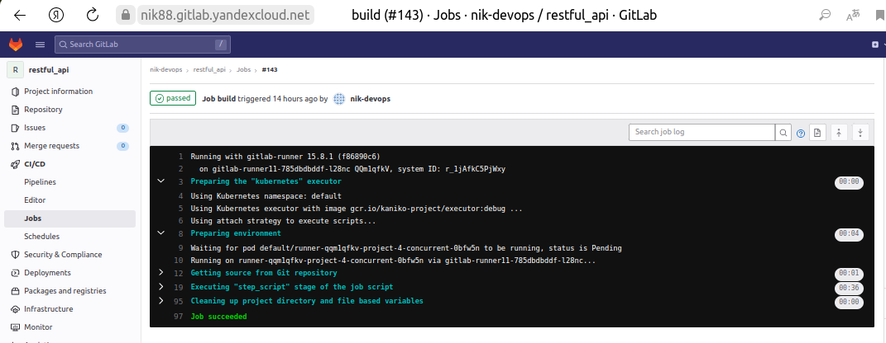

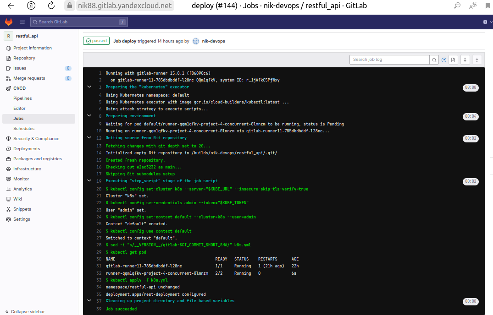

Также можем проверить работу сервиса в `pod` k8s-кластера.


Для этого используем `port-forwarding`

Посмотрим список `pod`  в нашем пространстве имен:

```bash
nik@nik-Ubuntu:~$ kubectl get pods -n restful-api
NAME                               READY   STATUS    RESTARTS      AGE
rest-deployment-676b578d45-xcpnh   1/1     Running   1 (98m ago)   14h
```

Далее используем `port-forward`:

```bash
nik@nik-Ubuntu:~$ kubectl port-forward pods/rest-deployment-676b578d45-xcpnh 5290:5290 -n restful-api
Forwarding from 127.0.0.1:5290 -> 5290
Forwarding from [::1]:5290 -> 5290
Handling connection for 5290
Handling connection for 5290
Handling connection for 5290
Handling connection for 5290
Handling connection for 5290
```

Теперь, перейдя по ссылке  `http://127.0.0.1:5290/get_info` можем увидеть вывод:

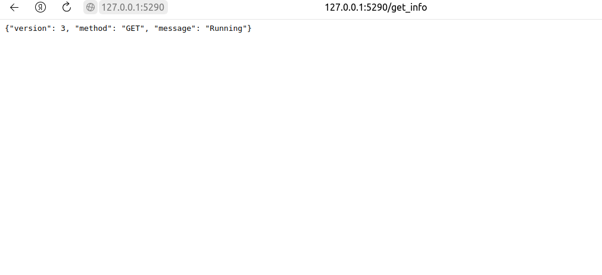