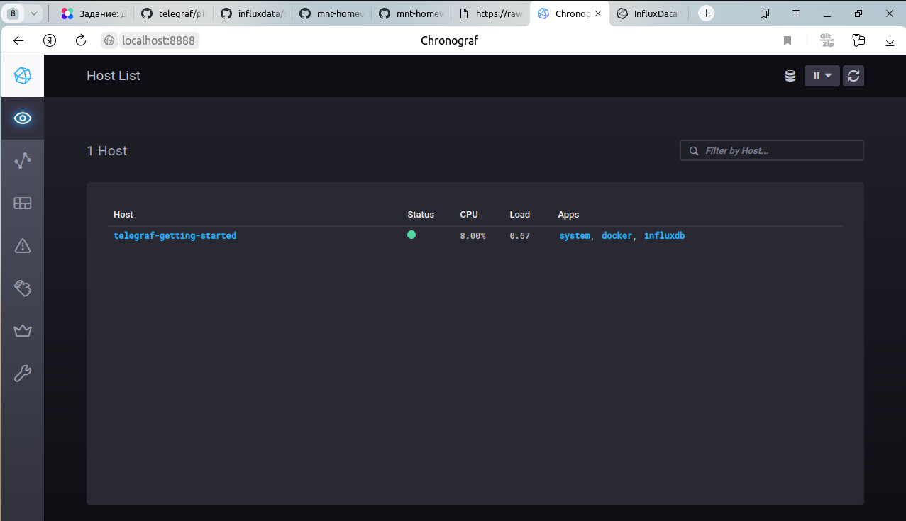
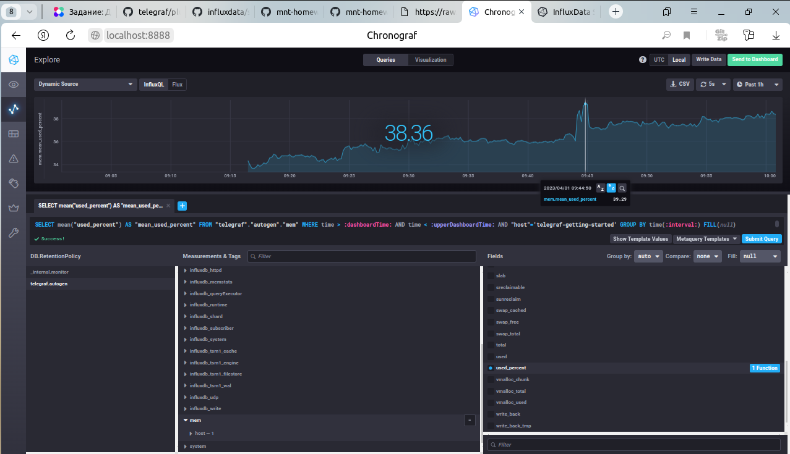
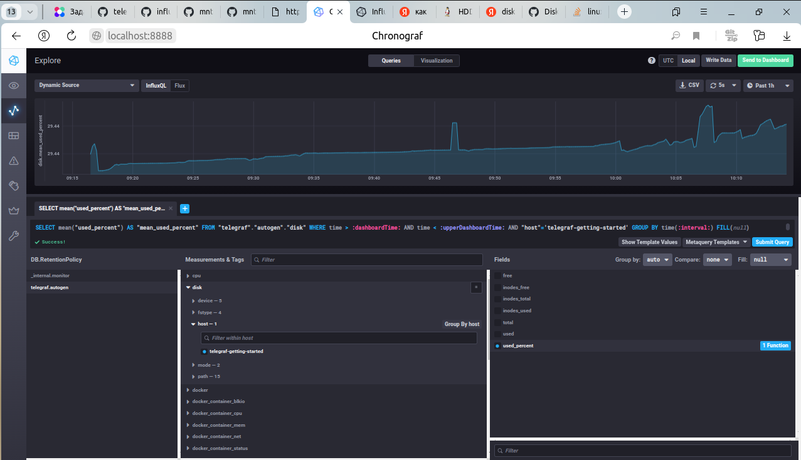
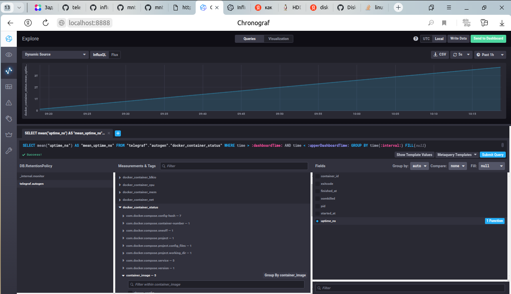

# Домашнее задание к занятию "13.Системы мониторинга"

## Обязательные задания

1. Вас пригласили настроить мониторинг на проект. На онбординге вам рассказали, что проект представляет из себя платформу для вычислений с выдачей текстовых отчетов, которые сохраняются на диск. Взаимодействие с платформой осуществляется по протоколу http. Также вам отметили, что вычисления загружают ЦПУ. Какой минимальный набор метрик вы выведите в мониторинг и почему?

    Ответ. 

    Для мониторинга описанного проекта в качестве минимального набора может быть полезно отслеживание следующих метрикЖ

    **Время отклика HTTP и коды статуса:** это поможет определить любые проблемы, связанные с тем, что сервер отвечает на запросы, такие как медленное время отклика или ошибки сервера.

    **Загрузка ЦП:** Поскольку платформа требует больших вычислительных ресурсов, мониторинг загрузки ЦП поможет определить, являются ли какие-либо конкретные вычисления или задачи причиной высокого использования ресурсов.

    **Дисковое пространство и загрузка диска (количство операций чтения/записи в минуту):** тот факт, что текстовые отчеты сохраняются на диске, означает, что мониторинг свободного дискового пространства важен для обеспечения успешного сохранения отчетов. Вместе с тем большое количество операций чтения/записи на диске может приводить к замедлению работы.

    **Использование опертивной памяти:** Мониторинг использования памяти может помочь выявить любые утечки памяти или чрезмерное использование памяти, вызванные платформой.

    **Количество отчетов, генерируемых за определенный период (час / день / неделя / месяц):** это полезно для отслеживания использования платформы и выявления любых изменений или тенденций в использовании с течением времени.

    Кроме того, в зависимости от архитектурного решения, на котором реализованна платформа, могут понадобиться дополнительные метрики(Docker, K8s).
#
2. Менеджер продукта, посмотрев на ваши метрики сказал, что ему непонятно что такое RAM/inodes/CPUla. Также он сказал, что хочет понимать, насколько мы выполняем свои обязанности перед клиентами и какое качество обслуживания. Что вы можете ему предложить?

    **Ответ.**
    
    Менеджер по продукту заинтересован в понимании технических показателей, связанных с нашей системой, а также в том, насколько хорошо наша команда работает с точки зрения обслуживания клиентов.

1) **Технические показатели.** Подготовить презентацию,объясняющую оперативную память, индексные дескрипторы и CPULA, и их отношение к производительности системы. Используя диаграммы и, по возможности, примеры, нужно объяснить их влияние на нашу систему. Это поможет менеджеру по продуктам понять технические аспекты работы и проблемы, с которыми сталкивается команда при поддержании высокого качества обслуживания.
2) **Качество обслуживания.** Необходимо добавить метрики `Black-box monitoring`, показывающие информацию об ошибках в работе платформы извне, например, время доступности сервисов для клиентов, быстродействие, время отклика. Реализовать вывод метрик в дашборды, которые будут достпно показывать все метрики и зависимость друг от друга. 
Кроме того,  можно привести примеры успешного взаимодействия с клиентами и любые отзывы, которые получены от клиентов.


#
3. Вашей DevOps команде в этом году не выделили финансирование на построение системы сбора логов. Разработчики в свою очередь хотят видеть все ошибки, которые выдают их приложения. Какое решение вы можете предпринять в этой ситуации, чтобы разработчики получали ошибки приложения?

    **Ответ.**

      - Некоторые облачные платформы предоставляют сервисы с непрерывным сбором и анализом логов, которые могут быть использованы для этой цели.

      - Многие приложения имеют встроенные системы мониторинга.

      - Можно рассмотреть вариант подключения мониторинга приложения на уровне кода, например, с помощью библиотек для логирования (например, Logging для Python,Winston для Node.js). Эти библиотеки могут быть настроены на логирование ошибок приложения вместе с трассировкой стека, и можно настроить их для отправки логов на центральный сервер по протоколу Syslog. Это позволит разработчикам получать ошибки приложения без необходимости создания отдельной инфраструктуры сбора логов.

#
4. Вы, как опытный SRE, сделали мониторинг, куда вывели отображения выполнения SLA=99% по http кодам ответов. Вычисляете этот параметр по следующей формуле: `summ_2xx_requests/summ_all_requests.` Данный параметр не поднимается выше 
70%, но при этом в вашей системе нет кодов ответа 5xx и 4xx. Где у вас ошибка?

    **Ответ.** 

    В формуле не учтено количество 300-x запросов. `summ_2xx_requests + summ_3xx_requests/summ_all_requests`
#
5. Опишите основные плюсы и минусы pull и push систем мониторинга.
   
    **Ответ.** 

    Системы `Pull` и `Push` - это два разных подхода к системному мониторингу.

    В `pull-системе ` система мониторинга периодически опрашивает контролируемую систему для запроса данных. Отслеживаемая система реагирует, предоставляя запрошенные данные. Преимущество pull-системы заключается в том, что ее проще реализовать, поскольку контролируемой системе не нужно активно передавать данные в систему мониторинга. Недостатком является то, что система мониторинга может получать последние данные не так быстро, как в `push-системе`.

    В `push-системе` отслеживаемая система активно отправляет данные в систему мониторинга, как только они становятся доступными. Преимущество `push-системы` заключается в том, что система мониторинга может получать самые свежие данные, как только они станут доступны, без необходимости ждать периодического опроса. Недостатком является то, что внедрение `push-системы` может быть более сложным, поскольку контролируемая система должна активно передавать данные в систему мониторинга.


#
6. Какие из ниже перечисленных систем относятся к push модели, а какие к pull? А может есть гибридные?

    - Prometheus 
    - TICK
    - Zabbix
    - VictoriaMetrics
    - Nagios

**Ответ.**

  `Prometheus` и `Victoria Metrics` используют pull-модель извлечения данных, при которой сервер мониторинга периодически опрашивает отслеживаемые системы на предмет наличия данных.

  `TICK`  предназначен для настройки как для pull, так и для push-модели. По умолчанию он использует модель pull, так как он применяет агенты, которые периодически собирают данные и отправляют их на сервер, который в свою очередь извлекает данные из агентов. Но  также TICK поддерживает использование плагинов для включения функции push.

  `Zabbix` по умолчанию использует pull-модель, но он также поддерживает push-модель благодаря использованию протокола `Zabbix sender protocol`.

  `Nagios` в основном полагается на модель pull, где он выполняет проверки служб и узлов в отслеживаемых системах на основе заранее определенных интервалов, а затем регистрирует результаты. Но если, например, расширение `Nagios Event Broker`, может получиться нечто похожее на push-модель, при которой сторонние приложения могут получать уведомления в режиме реального времени.
#
7. Склонируйте себе [репозиторий](https://github.com/influxdata/sandbox/tree/master) и запустите TICK-стэк, 
используя технологии docker и docker-compose.

В виде решения на это упражнение приведите скриншот веб-интерфейса ПО chronograf (`http://localhost:8888`).




P.S.: если при запуске некоторые контейнеры будут падать с ошибкой - проставьте им режим `Z`, например
`./data:/var/lib:Z`
#
8. Перейдите в веб-интерфейс Chronograf (`http://localhost:8888`) и откройте вкладку `Data explorer`.

    - Нажмите на кнопку `Add a query`
    - Изучите вывод интерфейса и выберите БД `telegraf.autogen`
    - В `measurments` выберите mem->host->telegraf_container_id , а в `fields` выберите used_percent. 
    Внизу появится график утилизации оперативной памяти в контейнере telegraf.
    - Вверху вы можете увидеть запрос, аналогичный SQL-синтаксису. 
    Поэкспериментируйте с запросом, попробуйте изменить группировку и интервал наблюдений.



Для выполнения задания приведите скриншот с отображением метрик утилизации места на диске 
(disk->host->telegraf_container_id) из веб-интерфейса.


#
9. Изучите список [telegraf inputs](https://github.com/influxdata/telegraf/tree/master/plugins/inputs). 
Добавьте в конфигурацию telegraf следующий плагин - [docker](https://github.com/influxdata/telegraf/tree/master/plugins/inputs/docker):
```
[[inputs.docker]]
  endpoint = "unix:///var/run/docker.sock"
```

Дополнительно вам может потребоваться донастройка контейнера telegraf в `docker-compose.yml` дополнительного volume и 
режима privileged:
```
  telegraf:
    image: telegraf:1.4.0
    privileged: true
    volumes:
      - ./etc/telegraf.conf:/etc/telegraf/telegraf.conf:Z
      - /var/run/docker.sock:/var/run/docker.sock:Z
    links:
      - influxdb
    ports:
      - "8092:8092/udp"
      - "8094:8094"
      - "8125:8125/udp"
```

После настройке перезапустите telegraf, обновите веб интерфейс и приведите скриншотом список `measurments` в 
веб-интерфейсе базы telegraf.autogen . Там должны появиться метрики, связанные с docker.



Факультативно можете изучить какие метрики собирает telegraf после выполнения данного задания.
