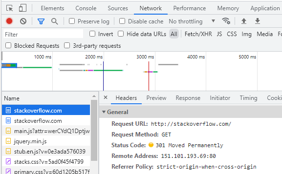
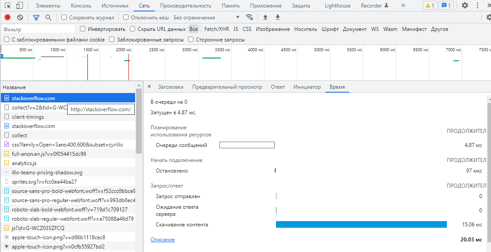
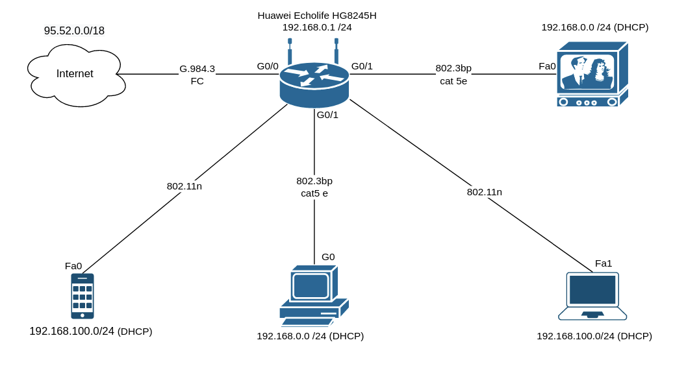

# devops-netology

## «2.4. Инструменты Git»

1.

```
git show aefea
commit aefead2207ef7e2aa5dc81a34aedf0cad4c32545
```

2.

```
git show 85024d3
tag: v0.12.23

3. 
```

git checkout b8d720
git log --pretty=format:'%h %s' –graph
56cd7859e0, 9ea88f22fc

4.

````
git log --oneline v0.12.23..v0.12.24

b14b74c493 [Website] vmc provider links
3f235065b9 Update CHANGELOG.md
6ae64e247b registry: Fix panic when server is unreachable
5c619ca1ba website: Remove links to the getting started guide's old location
06275647e2 Update CHANGELOG.md
d5f9411f51 command: Fix bug when using terraform login on Windows
4b6d06cc5d Update CHANGELOG.md
dd01a35078 Update CHANGELOG.md
225466bc3e Cleanup after v0.12.23 release
````

5. git log -S "func providerSource"

commit 8c928e83589d90a031f811fae52a81be7153e82f
Date:   Thu Apr 2 18:04:39 2020 -0700

6. git grep -p "globalPluginDirs("
   git log -L :globalPluginDirs:plugins.go
   8364383c35 Push plugin discovery down into command package
   66ebff90cd move some more plugin search path logic to command
   41ab0aef7a Add missing OS_ARCH dir to global plugin paths
   52dbf94834 keep .terraform.d/plugins for discovery
   78b1220558 Remove config.go and update things using its aliases

7. git log -S ‘func providerSource’
   Author: Martin Atkins <mart@degeneration.co.uk>
   Date:   Wed May 3 16:25:41 2017 -0700

### ### ### 

## Домашнее задание к занятию "3.2. Работа в терминале, лекция 2"

1. `cd` – внутренняя команда

   `vagrant@vagrant:~$ type cd`

   `cd is a shell builtin`
2. `grep <some_string> <some_file> -c`
3. процесс` /sbin/init`

```bash
   vagrant@vagrant:~$ ps aux
   USER PID %CPU %MEM VSZ RSS TTY STAT START TIME COMMAND
   root 1 0.0 1.1 167404 11532 ? Ss Sep02 0:06 /sbin/init
   ```

4. `ls -la /dir1 2>/dev/pts/1`

5.

```
vagrant@vagrant:~/test$ cat 1.txt
This is test message.
vagrant@vagrant:~/test$ cat < 1.txt > output.txt
vagrant@vagrant:~/test$ cat output.txt
This is test message.
```

6. Да.

   `echo "Hello World!" > /dev/tty`

7. `bash 5>&1` - создаем новый дескриптор 5 и перенаправляем его в STDOUT

   ``echo netology > /proc/$$/fd/5`` - перенаправляем результат команды в дескриптор 5
8. Получится. Для этого нужно "поменять местами STDOUT и STDERR", создав, например, новый дескриптор 5 и использовать
   его как промежуточный
   `5>&1 1>&2 2>&5 `. данное выражение выполнить после команды и перед pipe
9. показывает переменные окружения для процесса, под которым выполняется текущая оболочка bash ($$). Аналогичный вывод у
   команды `printenv`
10. `/proc/[pid]/cmdline `- Этот файл содержит полную командную строку запуска процесса, кроме тех процессов, что
    полностью ушли в своппинг, а также тех, что превратились в зомби. В этих двух случаях в файле ничего нет, то есть
    чтение этого файла вернет 0 символов. Аргументы командной строки в этом файле указаны как список строк, каждая из
    которых завешается нулевым символом, с добавочным нулевым байтом после последней строки.
    /proc/[pid]/cmdline является символьной ссылкой, содержащей фактическое полное имя выполняемого файла. Символьная
    ссылка exe может использоваться обычным образом - при попытке открыть exe будет открыт исполняемый файл
11. sse4_2

```bash
    vagrant@vagrant:~$ grep sse /proc/cpuinfo
    fpu vme de pse tsc msr pae mce cx8 apic sep mtrr pge mca cmov pat pse36 clflush mmx fxsr sse sse2 ht syscall nx
    rdtscp lm constant_tsc rep_good nopl xtopology nonstop_tsc cpuid tsc_known_freq pni pclmulqdq ssse3 cx16 sse4_1
    sse4_2 x2apic popcnt aes xsave avx hypervisor lahf_lm pti md_clear flush_l1d
```

12. По умолчанию при запуске команды через SSH не выделяется TTY. Если же не указывать команды, то TTY будет выдаваться,
    так как предполагается, что будет запущен сеанс оболочки.
    Для принудительного использования необходимо указать ключ -t.

```bash    
vagrant@vagrant:~$ ssh -t localhost tty
vagrant@localhost's password:
    /dev/pts/1
    Connection to localhost closed.
```

13. reptyr -s 3375

```bash
    vagrant@vagrant:~$ sudo nano /proc/sys/kernel/yama/ptrace_scope
    vagrant@vagrant:~$ reptyr -s 3375
    [-] Timed out waiting for child stop.
    Hangup
    vagrant@vagrant:~$ screen -S 3375
    [screen is terminating]
    vagrant@vagrant:~$
```

14. команда `tee` делает вывод одновременно и в файл, указанный в качестве параметра, и в stdout,
    в данном примере команда получает вывод из stdin, перенаправленный через pipe от stdout команды echo
    и так как команда запущена от sudo, соответственно имеет права на запись в файл.

## Домашнее задание к занятию "3.3. Операционные системы, лекция 1"

1.

`chdir("/tmp")                          = 0`

2.

```bash
/usr/share/misc/magic.mgc
openat(AT_FDCWD, "/usr/share/misc/magic.mgc", O_RDONLY) = 4
```

3.

```bash
vagrant@vagrant:/proc$ sudo lsof | grep deleted
bash 7829 vagrant 5w REG 253,0 10703 1323183 /home/vagrant/output.file (deleted)
ping 8920 vagrant 1w REG 253,0 10703 1323183 /home/vagrant/output.file (deleted)
ping 8920 vagrant 5w REG 253,0 10703 1323183 /home/vagrant/output.file (deleted)
```

Далее записываем пустую строку в 5
`echo ""| tee /proc/1580/fd/5`

4.

Зомби-процессы не занимают какие-либо системные ресурсы, но сохраняют свой ID процесса в таблице.

5.

```bash
PID COMM FD ERR PATH
643 irqbalance 6 0 /proc/interrupts
643 irqbalance 6 0 /proc/stat
643 irqbalance 6 0 /proc/irq/20/smp_affinity
643 irqbalance 6 0 /proc/irq/0/smp_affinity
643 irqbalance 6 0 /proc/irq/1/smp_affinity
643 irqbalance 6 0 /proc/irq/8/smp_affinity
643 irqbalance 6 0 /proc/irq/12/smp_affinity
643 irqbalance 6 0 /proc/irq/14/smp_affinity
643 irqbalance 6 0 /proc/irq/15/smp_affinity
```

6.

```
uname({sysname="Linux", nodename="vagrant", ...}) = 0
uname({sysname="Linux", nodename="vagrant", ...}) = 0
uname({sysname="Linux", nodename="vagrant", ...}) = 0

"Part of the utsname information is also accessible via /proc/sys/ker‐
nel/{ostype, hostname, osrelease, version, domainname}."
```

7.

`; `- выполелнение команд последовательно

`&& `- команда после `&&` выполняется, только если команда до `&&` завершилась успешно (статус выхода 0)

`set -e` - прерывает сессию при любом ненулевом значении исполняемых команд в конвейере кроме последней.
использование `&&` вместе с `set -e`- вероятно не имеет смысла, так как при ошибке выполнение команд завершится.

8.

```
-e Exit immediately if a command exits with a non-zero status.
-u Treat unset variables as an error when substituting.
-x Print commands and their arguments as they are executed.
-o pipefail the return value of a pipeline is the status of the last command to exit with a non-zero status, or zero if
no command exited with a non-zero status.
```

Данный режим обеспечит прекращение выполнения скрипта в случае ошибок и выведет информацию, (лог ошибок).

9.

```
   vagrant@vagrant:~$ ps -o stat
   Ss - ожидание завершения события ( s - лидер сессии)
   R+ - работающий или в очереди на выполнение( + находится в группе приоритетных процессов)
```

доп символы:

`< `   high-priority (not nice to other users)

`N `low-priority (nice to other users)

`L` has pages locked into memory (for real-time and
custom IO)

`s` is a session leader

`l` is multi-threaded (using CLONE_THREAD, like NPTL
pthreads do)

`+` is in the foreground process group

## Домашнее задание к занятию "3.4. Операционные системы, лекция 2"

1.

Cоздан unit-файл для Node Exporter:

```sh
root@vagrant:/etc/systemd/system# cat node_exporter.service
[Unit]
Description=Node Exporter
Wants=network.target
After=network.target

[Service]
User=node_exporter
Group=node_exporter
Type=simple
ExecStart=/usr/local/bin/node_exporter $OPTIONS
EnvironmentFile=/etc/default/node_exporter
ExecReload=/bin/kill -HUP $MAINPID
Restart=on-failure

[Install]
WantedBy=multi-user.target
```

______

Node Exporter добавлен в автозагрузку:

```sh
root@vagrant:/etc/systemd/system$ sudo systemctl enable node_exporter
Created symlink /etc/systemd/system/multi-user.target.wants/node_exporter.service →
/etc/systemd/system/node_exporter.service.
```

_________________

Процесс корректно останавливается и запускается, после перезагрузки процесс запускается:

```sh
root@vagrant:/etc/systemd/system# systemctl status node_exporter.service
● node_exporter.service - Node Exporter
Loaded: loaded (/etc/systemd/system/node_exporter.service; enabled;>
Active: active (running) since Tue 2022-09-13 13:27:07 UTC; 28s ago
Main PID: 3182 (node_exporter)
Tasks: 5 (limit: 1066)
Memory: 2.5M
CGroup: /system.slice/node_exporter.service
└─3182 /usr/local/bin/node_exporter

Sep 13 13:27:07 vagrant node_exporter[3182]: ts=2022-09-13T13:27:07.784Z>
Sep 13 13:27:07 vagrant node_exporter[3182]: ts=2022-09-13T13:27:07.784Z>
Sep 13 13:27:07 vagrant node_exporter[3182]: ts=2022-09-13T13:27:07.784Z>
Sep 13 13:27:07 vagrant node_exporter[3182]: ts=2022-09-13T13:27:07.784Z>
Sep 13 13:27:07 vagrant node_exporter[3182]: ts=2022-09-13T13:27:07.784Z>
Sep 13 13:27:07 vagrant node_exporter[3182]: ts=2022-09-13T13:27:07.784Z>
Sep 13 13:27:07 vagrant node_exporter[3182]: ts=2022-09-13T13:27:07.784Z>
Sep 13 13:27:07 vagrant node_exporter[3182]: ts=2022-09-13T13:27:07.784Z>
Sep 13 13:27:07 vagrant node_exporter[3182]: ts=2022-09-13T13:27:07.785Z>
Sep 13 13:27:07 vagrant node_exporter[3182]: ts=2022-09-13T13:27:07.786Z>
root@vagrant:/etc/systemd/system# ps -e | grep node_exporter
3182 ? 00:00:00 node_exporter

root@vagrant:/etc/systemd/system# systemctl stop node_exporter.service
root@vagrant:/etc/systemd/system# systemctl status node_exporter.service
● node_exporter.service - Node Exporter
Loaded: loaded (/etc/systemd/system/node_exporter.service; enabled;>
Active: inactive (dead) since Tue 2022-09-13 13:30:08 UTC; 9s ago
Process: 3182 ExecStart=/usr/local/bin/node_exporter $OPTIONS (code=>
Main PID: 3182 (code=killed, signal=TERM)

Sep 13 13:27:07 vagrant node_exporter[3182]: ts=2022-09-13T13:27:07.784Z>
Sep 13 13:27:07 vagrant node_exporter[3182]: ts=2022-09-13T13:27:07.784Z>
Sep 13 13:27:07 vagrant node_exporter[3182]: ts=2022-09-13T13:27:07.784Z>
Sep 13 13:27:07 vagrant node_exporter[3182]: ts=2022-09-13T13:27:07.784Z>
Sep 13 13:27:07 vagrant node_exporter[3182]: ts=2022-09-13T13:27:07.784Z>
Sep 13 13:27:07 vagrant node_exporter[3182]: ts=2022-09-13T13:27:07.785Z>
Sep 13 13:27:07 vagrant node_exporter[3182]: ts=2022-09-13T13:27:07.786Z>
Sep 13 13:30:08 vagrant systemd[1]: Stopping Node Exporter...
Sep 13 13:30:08 vagrant systemd[1]: node_exporter.service: Succeeded.
Sep 13 13:30:08 vagrant systemd[1]: Stopped Node Exporter.
root@vagrant:/etc/systemd/system# ps -e | grep node_exporter

root@vagrant:/etc/systemd/system# systemctl restart node_exporter.service

root@vagrant:/etc/systemd/system# ps -e | grep node_exporter
3262 ? 00:00:00 node_exporter

root@vagrant:/etc/systemd/system# systemctl stop node_exporter.service
root@vagrant:/etc/systemd/system# ps -e | grep node_exporter
root@vagrant:/etc/systemd/system# systemctl start node_exporter.service
root@vagrant:/etc/systemd/system# ps -e | grep node_exporter
3342 ? 00:00:00 node_exporter
```

---------------------
После перезапуска машины также процес запускается:

```sh
vagrant@vagrant:/etc/systemd/system$ exit
logout
Connection to 127.0.0.1 closed.
PS F:\vagrant> vagrant reload
PS F:\vagrant> vagrant ssh
Welcome to Ubuntu 20.04.4 LTS (GNU/Linux 5.4.0-110-generic x86_64)

* Documentation:  https://help.ubuntu.com
* Management:     https://landscape.canonical.com
* Support:        https://ubuntu.com/advantage

System information as of Tue 13 Sep 2022 01:58:56 PM UTC

System load:  1.72 Processes:             132
Usage of /:   13.5% of 30.63GB Users logged in:       0
Memory usage: 24% IPv4 address for eth0: 10.0.2.15
Swap usage:   0%

This system is built by the Bento project by Chef Software
More information can be found at https://github.com/chef/bento
Last login: Tue Sep 13 12:39:16 2022 from 10.0.2.2
vagrant@vagrant:~$ ps -e | grep node_exporter
651 ? 00:00:00 node_exporter
```

2.

```
CPU:
node_cpu_seconds_total{cpu="0",mode="idle"} 2238.49
node_cpu_seconds_total{cpu="0",mode="system"} 16.72
node_cpu_seconds_total{cpu="0",mode="user"} 6.86
process_cpu_seconds_total

Memory:
node_memory_MemAvailable_bytes
node_memory_MemFree_bytes

Disk:
node_disk_io_time_seconds_total{device="sda"}
node_disk_read_bytes_total{device="sda"}
node_disk_read_time_seconds_total{device="sda"}
node_disk_write_time_seconds_total{device="sda"}

Network:
node_network_receive_errs_total{device="eth0"}
node_network_receive_bytes_total{device="eth0"}
node_network_transmit_bytes_total{device="eth0"}
node_network_transmit_errs_total{device="eth0"}
```

3.

**Netdata** установлена на виртуальной машине и открывается с
хоста `http://localhost:19999/#menu_system_submenu_cpu;theme=slate;help=true`.

С метрикаим ознакомлен, удобно визуализированы различное множество метрик в виде онлайн-графиков загрузки.

4.

Да, данная информация содержится в dmesg:

```sh
vagrant@vagrant:~$ dmesg -T   
[Tue Sep 13 13:57:35 2022] Hypervisor detected: KVM
[Tue Sep 13 13:57:35 2022] CPU MTRRs all blank - virtualized system.
[Tue Sep 13 13:57:35 2022] Booting paravirtualized kernel on KVM
[Tue Sep 13 13:57:39 2022] systemd[1]: Detected virtualization oracle.
```

5.

```bash
vagrant@vagrant:~$ sysctl fs.nr_open
fs.nr_open = 1048576
```

`fs.nr_open` устанавливает системное ограничение на максимальное число открываемых файлов (аллоцируемых файловых
дескрипторов).
команды `ulimit -Sn` и `ulimit -Hn` отображают **soft** (данный параметр можно увеличить системным вызовом setrlimit до
пределов
установленных в переменной hard) и **hard** значение вышеназванного ограничения устанавливаемого на сессионном уровне.

```sh
vagrant@vagrant:~$ ulimit -Hn
1048576
vagrant@vagrant:~$ ulimit -Sn
1024
```

6.

```sh
root@vagrant:~# ps -e |grep sleep
2020 pts/2    00:00:00 sleep
root@vagrant:~# nsenter --target 2020 --pid --mount
root@vagrant:/# ps
    PID TTY          TIME CMD
      2 pts/0    00:00:00 bash
     11 pts/0    00:00:00 ps
```

7. Работу прервал Process Number Controller

`[ 9923.678400] cgroup: fork rejected by pids controller in /user.slice/user-1000.slice/session-6.scope`

Максимальное количество процессов для пользователя можно изменить командой
`ulimit -u <число>` или в файле `etc/security/limits.conf`
Изменить максимальное количество PID можно посредством
команд `sysctl -w kernel.pid_max=<число>, echo <число> > /proc/sys/kernel/pid_max` или задать переменную kernel.pid_max
в файле  `/etc/sysctl.conf`.
Ограничение на максимальное число процессов на уровне системы установлено в переменной DefaultTasksMax: `systemctl show
--property DefaultTasksMax` изменить данную переменную можно в файле `/etc/systemd/system.conf`
Переменная UserTasksMax в файле `/etc/systemd/logind.conf` позволяет установить ограничение по максимальному количеству
процессов на уровне пользователей

## Домашнее задание к занятию "3.5. Файловые системы"

1.

_Разрежённый файл_ (англ. sparse file) — файл, в котором последовательности нулевых байтов
заменены на информацию об этих последовательностях (список дыр).

_Дыра_ (англ. hole) — последовательность нулевых байт внутри файла, не записанная на диск.
Информация о дырах (смещение от начала файла в байтах и количество байт) хранится в метаданных ФС.

**Преимущества:**

* экономия дискового пространства. Использование разрежённых файлов считается одним из способов сжатия данных на уровне
  файловой системы;

* отсутствие временных затрат на запись нулевых байт;

* увеличение срока службы запоминающих устройств.

**Разрежённые файлы используются для хранения контейнеров**, например:
образов дисков виртуальных машин;
резервных копий дисков и/или разделов, созданных спец. ПО.

2.

Нет.
В Linux каждый файл имеет уникальный идентификатор - **индексный дескриптор (inode)**. Это число, которое однозначно
идентифицирует файл в файловой системе.
Жесткая ссылка и файл, для которой она создавалась, имеют одинаковые **inode**. Поэтому жесткая ссылка имеет те же
права доступа, владельца и время последней модификации, что и целевой файл.
Различаются только имена файлов. Фактически жесткая ссылка это еще одно имя для файла.

3.

Выполнено. Создана новая виртуальная машина с двумя дополнительными неразмеченными дисками по 2.5 Гб.

````sh
vagrant@vagrant:~$ lsblk
NAME                      MAJ:MIN RM  SIZE RO TYPE MOUNTPOINT
loop0                       7:0    0 67.2M  1 loop /snap/lxd/21835
loop1                       7:1    0 61.9M  1 loop /snap/core20/1328
loop2                       7:2    0 43.6M  1 loop /snap/snapd/14978
sda                         8:0    0   64G  0 disk
├─sda1                      8:1    0    1M  0 part
├─sda2                      8:2    0  1.5G  0 part /boot
└─sda3                      8:3    0 62.5G  0 part
  └─ubuntu--vg-ubuntu--lv 253:0    0 31.3G  0 lvm  /
sdb                         8:16   0  2.5G  0 disk
sdc                         8:32   0  2.5G  0 disk`
* ````

4.

```sh
vagrant@vagrant:~$ sudo -i
root@vagrant:~# fdisk /dev/sdb

Welcome to fdisk (util-linux 2.34).
Changes will remain in memory only, until you decide to write them.
Be careful before using the write command.

Device does not contain a recognized partition table.
Created a new DOS disklabel with disk identifier 0x87ca6434.```

Command (m for help): n
Partition type
   p   primary (0 primary, 0 extended, 4 free)
   e   extended (container for logical partitions)
Select (default p): p
Partition number (1-4, default 1): 1
First sector (2048-5242879, default 2048): 2048
Last sector, +/-sectors or +/-size{K,M,G,T,P} (2048-5242879, default 5242879): +2G

Created a new partition 1 of type 'Linux' and of size 2 GiB.

Command (m for help): n
Partition type
   p   primary (1 primary, 0 extended, 3 free)
   e   extended (container for logical partitions)
Select (default p): p
Partition number (2-4, default 2): 2
First sector (4196352-5242879, default 4196352):
Last sector, +/-sectors or +/-size{K,M,G,T,P} (4196352-5242879, default 5242879):

Created a new partition 2 of type 'Linux' and of size 511 MiB.

Command (m for help): w
The partition table has been altered.
Calling ioctl() to re-read partition table.
Syncing disks.

root@vagrant:~# lsblk
NAME                      MAJ:MIN RM  SIZE RO TYPE MOUNTPOINT
loop0                       7:0    0 67.2M  1 loop /snap/lxd/21835
loop1                       7:1    0 61.9M  1 loop /snap/core20/1328
loop2                       7:2    0 43.6M  1 loop /snap/snapd/14978
loop3                       7:3    0   48M  1 loop /snap/snapd/16778
loop4                       7:4    0 63.2M  1 loop /snap/core20/1623
loop5                       7:5    0 67.8M  1 loop /snap/lxd/22753
sda                         8:0    0   64G  0 disk
├─sda1                      8:1    0    1M  0 part
├─sda2                      8:2    0  1.5G  0 part /boot
└─sda3                      8:3    0 62.5G  0 part
  └─ubuntu--vg-ubuntu--lv 253:0    0 31.3G  0 lvm  /
sdb                         8:16   0  2.5G  0 disk
├─sdb1                      8:17   0    2G  0 part
└─sdb2                      8:18   0  511M  0 part
sdc                         8:32   0  2.5G  0 disk
`````

5.

```bash
root@vagrant:~# sfdisk -d /dev/sdb | sfdisk -f /dev/sdc
Checking that no-one is using this disk right now ... OK

Disk /dev/sdc: 2.51 GiB, 2684354560 bytes, 5242880 sectors
Disk model: VBOX HARDDISK
Units: sectors of 1 * 512 = 512 bytes
Sector size (logical/physical): 512 bytes / 512 bytes
I/O size (minimum/optimal): 512 bytes / 512 bytes

>>> Script header accepted.
>>> Script header accepted.
>>> Script header accepted.
>>> Script header accepted.
>>> Created a new DOS disklabel with disk identifier 0x87ca6434.
/dev/sdc1: Created a new partition 1 of type 'Linux' and of size 2 GiB.
/dev/sdc2: Created a new partition 2 of type 'Linux' and of size 511 MiB.
/dev/sdc3: Done.

New situation:
Disklabel type: dos
Disk identifier: 0x87ca6434

Device     Boot   Start     End Sectors  Size Id Type
/dev/sdc1          2048 4196351 4194304    2G 83 Linux
/dev/sdc2       4196352 5242879 1046528  511M 83 Linux

The partition table has been altered.
Calling ioctl() to re-read partition table.
Syncing disks.
```

----

```bash
root@vagrant:~# lsblk
NAME                      MAJ:MIN RM  SIZE RO TYPE MOUNTPOINT
loop0                       7:0    0 67.2M  1 loop /snap/lxd/21835
loop1                       7:1    0 61.9M  1 loop /snap/core20/1328
loop2                       7:2    0 43.6M  1 loop /snap/snapd/14978
loop3                       7:3    0   48M  1 loop /snap/snapd/16778
loop4                       7:4    0 63.2M  1 loop /snap/core20/1623
loop5                       7:5    0 67.8M  1 loop /snap/lxd/22753
sda                         8:0    0   64G  0 disk
├─sda1                      8:1    0    1M  0 part
├─sda2                      8:2    0  1.5G  0 part /boot
└─sda3                      8:3    0 62.5G  0 part
  └─ubuntu--vg-ubuntu--lv 253:0    0 31.3G  0 lvm  /
sdb                         8:16   0  2.5G  0 disk
├─sdb1                      8:17   0    2G  0 part
└─sdb2                      8:18   0  511M  0 part
sdc                         8:32   0  2.5G  0 disk
├─sdc1                      8:33   0    2G  0 part
└─sdc2                      8:34   0  511M  0 part
```

6.

```bash
root@vagrant:~# mdadm --create --verbose /dev/md0 --level=1 --raid-devices=2 /dev/sd{b1,c1}
mdadm: Note: this array has metadata at the start and
    may not be suitable as a boot device.  If you plan to
    store '/boot' on this device please ensure that
    your boot-loader understands md/v1.x metadata, or use
    --metadata=0.90
mdadm: size set to 2094080K
Continue creating array? Y
mdadm: Defaulting to version 1.2 metadata
mdadm: array /dev/md0 started.
```

7.

```bash
root@vagrant:~# mdadm --create --verbose /dev/md1 --level=0 --raid-devices=2 /dev/sd{b2,c2}
mdadm: chunk size defaults to 512K
mdadm: Defaulting to version 1.2 metadata
mdadm: array /dev/md1 started.
```

```bash
root@vagrant:~# cat /proc/mdstat
Personalities : [linear] [multipath] [raid0] [raid1] [raid6] [raid5] [raid4] [raid10]
md1 : active raid0 sdc2[1] sdb2[0]
      1042432 blocks super 1.2 512k chunks

md0 : active raid1 sdc1[1] sdb1[0]
      2094080 blocks super 1.2 [2/2] [UU]

unused devices: <none>
```

8.

```bash
root@vagrant:~# pvcreate /dev/md0
  Physical volume "/dev/md0" successfully created.
root@vagrant:~# pvcreate /dev/md1
  Physical volume "/dev/md1" successfully created.
```

9.

```bash
root@vagrant:~# vgcreate VG0 /dev/md0 /dev/md1
  Volume group "VG0" successfully created
```

10.

```bash
root@vagrant:~# lvcreate -L 100M VG0 /dev/md1
  Logical volume "lvol0" created.
```

11.

```bash
root@vagrant:~# mkfs.ext4 /dev/VG0/lvol0
mke2fs 1.45.5 (07-Jan-2020)
Creating filesystem with 25600 4k blocks and 25600 inodes

Allocating group tables: done
Writing inode tables: done
Creating journal (1024 blocks): done
Writing superblocks and filesystem accounting information: done
```

12.

```bash
root@vagrant:~# mkdir /tmp/new
root@vagrant:~# mount /dev/VG0/lvol0 /tmp/new
```

```bash
root@vagrant:~# cat /proc/mounts | grep /tmp/new
/dev/mapper/VG0-lvol0 /tmp/new ext4 rw,relatime,stripe=256 0 0
```

13.

```bash
root@vagrant:~# wget https://mirror.yandex.ru/ubuntu/ls-lR.gz -O /tmp/new/test.gz
--2022-09-20 13:41:25--  https://mirror.yandex.ru/ubuntu/ls-lR.gz
Resolving mirror.yandex.ru (mirror.yandex.ru)... 213.180.204.183, 2a02:6b8::183
Connecting to mirror.yandex.ru (mirror.yandex.ru)|213.180.204.183|:443... connected.
HTTP request sent, awaiting response... 200 OK
Length: 22382846 (21M) [application/octet-stream]
Saving to: ‘/tmp/new/test.gz’

/tmp/new/test.gz        100%[=============================>]  21.35M  4.77MB/s    in 5.0s

2022-09-20 13:41:31 (4.30 MB/s) - ‘/tmp/new/test.gz’ saved [22382846/22382846]

root@vagrant:~# ls /tmp/new
lost+found  test.gz
```

14.

```bash
root@vagrant:~# lsblk
NAME                      MAJ:MIN RM  SIZE RO TYPE  MOUNTPOINT
loop0                       7:0    0 67.2M  1 loop  /snap/lxd/21835
loop1                       7:1    0 61.9M  1 loop  /snap/core20/1328
loop2                       7:2    0 43.6M  1 loop  /snap/snapd/14978
loop3                       7:3    0   48M  1 loop  /snap/snapd/16778
loop4                       7:4    0 63.2M  1 loop  /snap/core20/1623
loop5                       7:5    0 67.8M  1 loop  /snap/lxd/22753
sda                         8:0    0   64G  0 disk
├─sda1                      8:1    0    1M  0 part
├─sda2                      8:2    0  1.5G  0 part  /boot
└─sda3                      8:3    0 62.5G  0 part
  └─ubuntu--vg-ubuntu--lv 253:0    0 31.3G  0 lvm   /
sdb                         8:16   0  2.5G  0 disk
├─sdb1                      8:17   0    2G  0 part
│ └─md0                     9:0    0    2G  0 raid1
└─sdb2                      8:18   0  511M  0 part
  └─md1                     9:1    0 1018M  0 raid0
    └─VG0-lvol0           253:1    0  100M  0 lvm   /tmp/new
sdc                         8:32   0  2.5G  0 disk
├─sdc1                      8:33   0    2G  0 part
│ └─md0                     9:0    0    2G  0 raid1
└─sdc2                      8:34   0  511M  0 part
  └─md1                     9:1    0 1018M  0 raid0
    └─VG0-lvol0           253:1    0  100M  0 lvm   /tmp/new
```

15.

```bash
root@vagrant:~# gzip -t /tmp/new/test.gz
root@vagrant:~# echo $?
0
```

16.

```bash
root@vagrant:~# pvmove /dev/md1 /dev/md0
  /dev/md1: Moved: 12.00%
  /dev/md1: Moved: 100.00%
root@vagrant:~# lsblk
NAME                      MAJ:MIN RM  SIZE RO TYPE  MOUNTPOINT
loop0                       7:0    0 67.2M  1 loop  /snap/lxd/21835
loop1                       7:1    0 61.9M  1 loop  /snap/core20/1328
loop2                       7:2    0 43.6M  1 loop  /snap/snapd/14978
loop3                       7:3    0   48M  1 loop  /snap/snapd/16778
loop4                       7:4    0 63.2M  1 loop  /snap/core20/1623
loop5                       7:5    0 67.8M  1 loop  /snap/lxd/22753
sda                         8:0    0   64G  0 disk
├─sda1                      8:1    0    1M  0 part
├─sda2                      8:2    0  1.5G  0 part  /boot
└─sda3                      8:3    0 62.5G  0 part
  └─ubuntu--vg-ubuntu--lv 253:0    0 31.3G  0 lvm   /
sdb                         8:16   0  2.5G  0 disk
├─sdb1                      8:17   0    2G  0 part
│ └─md0                     9:0    0    2G  0 raid1
│   └─VG0-lvol0           253:1    0  100M  0 lvm   /tmp/new
└─sdb2                      8:18   0  511M  0 part
  └─md1                     9:1    0 1018M  0 raid0
sdc                         8:32   0  2.5G  0 disk
├─sdc1                      8:33   0    2G  0 part
│ └─md0                     9:0    0    2G  0 raid1
│   └─VG0-lvol0           253:1    0  100M  0 lvm   /tmp/new
└─sdc2                      8:34   0  511M  0 part
  └─md1                     9:1    0 1018M  0 raid0
```

17.

```bash
root@vagrant:~# mdadm --fail /dev/md0 /dev/sdb1
mdadm: set /dev/sdb1 faulty in /dev/md0
root@vagrant:~# cat /proc/mdstat
Personalities : [linear] [multipath] [raid0] [raid1] [raid6] [raid5] [raid4] [raid10]
md1 : active raid0 sdc2[1] sdb2[0]
      1042432 blocks super 1.2 512k chunks

md0 : active raid1 sdc1[1] sdb1[0](F)
      2094080 blocks super 1.2 [2/1] [_U]

unused devices: <none>
```

18.

```bash
root@vagrant:~# dmesg -T | grep md0
[Tue Sep 20 12:16:35 2022] md/raid1:md0: not clean -- starting background reconstruction
[Tue Sep 20 12:16:35 2022] md/raid1:md0: active with 2 out of 2 mirrors
[Tue Sep 20 12:16:35 2022] md0: detected capacity change from 0 to 2144337920
[Tue Sep 20 12:16:35 2022] md: resync of RAID array md0
[Tue Sep 20 12:16:45 2022] md: md0: resync done.
[Tue Sep 20 14:02:45 2022] md/raid1:md0: Disk failure on sdb1, disabling device.
                           md/raid1:md0: Operation continuing on 1 devices.
```

19.

```bash
root@vagrant:~# gzip -t /tmp/new/test.gz
root@vagrant:~# echo $?
0
```

20. выполнено

## Домашнее задание к занятию "3.6. Компьютерные сети, лекция 1"

1.

```bash
vagrant@vagrant:~$ telnet stackoverflow.com 80
Trying 151.101.129.69...
Connected to stackoverflow.com.
Escape character is '^]'.
GET /questions HTTP/1.0
Host: stackoverflow.com

HTTP/1.1 301 Moved Permanently
Server: Varnish
Retry-After: 0
Location: https://stackoverflow.com/questions
Content-Length: 0
Accept-Ranges: bytes
Date: Tue, 20 Sep 2022 17:38:32 GMT
Via: 1.1 varnish
Connection: close
X-Served-By: cache-fra19122-FRA
X-Cache: HIT
X-Cache-Hits: 0
X-Timer: S1663695512.109836,VS0,VE0
Strict-Transport-Security: max-age=300
X-DNS-Prefetch-Control: off

Connection closed by foreign host.
```

Код состояния HTTP 301 или Moved Permanently (с англ. — «Перемещено навсегда») — стандартный код ответа HTTP, получаемый
в ответ от сервера в ситуации, когда запрошенный ресурс был на постоянной основе перемещён в новое месторасположение, и
указывающий на то, что текущие ссылки, использующие данный URL, должны быть обновлены. Адрес нового месторасположения
ресурса указывается в поле Location получаемого в ответ заголовка пакета протокола HTTP

2.




3.


4. Провайдер - Ростелеком, автономная система - AS12389

```bash
root@vagrant:~# whois -h whois.ripe.net 5.140.31.66
% This is the RIPE Database query service.
% The objects are in RPSL format.
%
% The RIPE Database is subject to Terms and Conditions.
% See http://www.ripe.net/db/support/db-terms-conditions.pdf

% Note: this output has been filtered.
%       To receive output for a database update, use the "-B" flag.

% Information related to '5.140.0.0 - 5.140.31.255'

% Abuse contact for '5.140.0.0 - 5.140.31.255' is 'abuse@rt.ru'

inetnum:        5.140.0.0 - 5.140.31.255
netname:        USI_ADSL_USERS
descr:          Dynamic distribution IP's for broadband services
descr:          OJSC RosteleÓom, regional branch "Urals"
country:        RU
admin-c:        UkAS1-RIPE
tech-c:         UkAS1-RIPE
status:         ASSIGNED PA
mnt-by:         MFIST-MNT
created:        2012-10-01T11:30:59Z
last-modified:  2012-10-01T11:30:59Z
source:         RIPE

role:           Uralsvyazinform KHFES Administration Staff
address:        11, Moskovskaya str.
address:        Yekaterinburg, 620014
address:        Russian Federation
admin-c:        VS1811-RIPE
admin-c:        DE2673-RIPE
admin-c:        SK3575-RIPE
tech-c:         VS1811-RIPE
tech-c:         DE2673-RIPE
tech-c:         SK3575-RIPE
mnt-by:         MFIST-MNT
nic-hdl:        UKAS1-RIPE
created:        2007-09-06T10:56:08Z
last-modified:  2018-10-05T03:50:02Z
source:         RIPE # Filtered

% Information related to '5.140.0.0/19AS12389'

route:          5.140.0.0/19
descr:          Rostelecom networks
origin:         AS12389
mnt-by:         ROSTELECOM-MNT
created:        2018-10-29T11:54:33Z
last-modified:  2018-10-29T11:54:33Z
source:         RIPE # Filtered

% This query was served by the RIPE Database Query Service version 1.103 (WAGYU)
```

5.

```bash
traceroute to 8.8.8.8 (8.8.8.8), 30 hops max, 60 byte packets
 1  10.0.2.2 [*]  0.913 ms  0.860 ms  0.825 ms
 2  192.168.1.1 [*]  5.550 ms  6.918 ms  6.879 ms
 3  178.46.189.6 [AS12389]  13.446 ms  14.309 ms  14.276 ms
 4  213.59.209.204 [AS12389]  14.232 ms  16.948 ms  17.651 ms
 5  185.140.148.155 [AS12389]  54.333 ms  54.988 ms  54.958 ms
 6  72.14.197.6 [AS15169]  59.262 ms  57.677 ms  64.997 ms
 7  108.170.250.129 [AS15169]  63.631 ms  56.312 ms  57.335 ms
 8  108.170.250.130 [AS15169]  56.811 ms  56.607 ms  56.399 ms
 9  142.250.238.214 [AS15169]  74.629 ms  75.606 ms  75.499 ms
10  142.250.235.68 [AS15169]  70.962 ms  73.826 ms  74.919 ms
11  216.239.49.113 [AS15169]  74.823 ms  74.740 ms  70.690 ms
12  * * *
13  * * *
14  * * *
15  * * *
16  * * *
17  * * *
18  * * *
19  * * *
20  * * *
21  8.8.8.8 [AS15169]  81.148 ms  83.521 ms  83.423 ms
```

6. Наибольшая задержка между 10 и 11 хостами.

```bash
                                           My traceroute  [v0.93]
vagrant (10.0.2.15)                                                                  2022-09-20T18:53:51+0000
Keys:  Help   Display mode   Restart statistics   Order of fields   quit
                                                                     Packets               Pings
 Host                                                              Loss%   Snt   Last   Avg  Best  Wrst StDev
 1. AS???    10.0.2.2                                               0.0%   103    0.9   1.3   0.3  18.0   1.7
 2. AS???    192.168.1.1                                            4.9%   103    1.9   5.7   1.7  53.0   7.1
 3. AS12389  178.46.189.6                                           0.0%   103   14.7  18.0   8.1  70.2  11.2
 4. AS12389  213.59.209.204                                         0.0%   103   10.2  15.3   8.5  72.1   7.8
 5. AS12389  185.140.148.155                                       11.7%   103   49.8  56.1  46.9 183.2  19.9
 6. AS15169  72.14.197.6                                            0.0%   103   52.0  55.7  47.7 133.9  12.2
 7. AS15169  108.170.250.129                                        0.0%   103   54.3  54.2  48.0  83.0   6.2
 8. AS15169  108.170.250.130                                        0.0%   103   50.5  52.5  47.9  67.3   3.0
 9. AS15169  142.250.238.214                                        0.0%   102   64.2  67.1  62.2  81.7   3.4
10. AS15169  142.250.235.68                                         0.0%   102   64.1  68.1  62.2 160.4  11.8
11. AS15169  216.239.49.113                                         0.0%   102   68.9  67.8  62.1 116.7   7.9
12. (waiting for reply)
13. (waiting for reply)
14. (waiting for reply)
15. (waiting for reply)
16. (waiting for reply)
17. (waiting for reply)
18. AS15169  8.8.8.8                                               97.0%   102   61.5  64.1  61.5  66.4   2.5
```

7.

```bash
vagrant@vagrant:~$ dig +trace @8.8.8.8 dns.google | grep dns.google
; <<>> DiG 9.16.1-Ubuntu <<>> +trace @8.8.8.8 dns.google
dns.google.             10800   IN      NS      ns4.zdns.google.
dns.google.             10800   IN      NS      ns1.zdns.google.
dns.google.             10800   IN      NS      ns2.zdns.google.
dns.google.             10800   IN      NS      ns3.zdns.google.
dns.google.             3600    IN      DS      56044 8 2 1B0A7E90AA6B1AC65AA5B573EFC44ABF6CB2559444251B997103D2E4 0C351B08
dns.google.             3600    IN      RRSIG   DS 8 2 3600 20221010135653 20220918135653 38313 google. QPP6t6pkPxQRFg6kYWkjBecsSUZSsUlkV4uRu/lXT9fshFTNeKZPZBdi 51k7/ByIUciDMWRZODd8WRRHIho0rW0VqHU23oC1+5e54Vr8z3LkYWs7 ZhrqWbBlpb40hkTLHlfli9DaKE3pJT5DOK3RxTT2yiIISxF0pniUSwx9 1v4=
dns.google.             900     IN      A       8.8.4.4
dns.google.             900     IN      A       8.8.8.8
dns.google.             900     IN      RRSIG   A 8 2 900 20221009005703 20220917005703 26965 dns.google. BjE+OXq0xRMJE7iZVi0iVCl/B0v8AfSTKk5fFF8d6kuP2kQl5LVc9Gg0 MvHUVJaXVUQ8WJ7flauGVnOUzc6LubU/n3+wvJbiMr17aKAyNrKtABju u55ZdMdYGG/idK+fjiz5h9u8f1T8A/6RfnYF5AIekq7lZvio98rkkN3Y Kvw=
;; Received 241 bytes from 216.239.38.114#53(ns4.zdns.google) in 76 ms
```

8. Привязано доменное имя dns.google.

```bash
vagrant@vagrant:~$ dig -x 8.8.4.4 +noall +answer
4.4.8.8.in-addr.arpa.   70486   IN      PTR     dns.google.
vagrant@vagrant:~$ dig -x 8.8.8.8 +noall +answer
8.8.8.8.in-addr.arpa.   7094    IN      PTR     dns.google.
```

## Домашнее задание к занятию "3.7. Компьютерные сети, лекция 2"

1.

Linux

```bash
root@vagrant:~# ip -c -br link
lo               UNKNOWN        00:00:00:00:00:00 <LOOPBACK,UP,LOWER_UP>
eth0             UP             08:00:27:a2:6b:fd <BROADCAST,MULTICAST,UP,LOWER_UP>
```

```bash
root@vagrant:~# netstat -i
Kernel Interface table
Iface      MTU    RX-OK RX-ERR RX-DRP RX-OVR    TX-OK TX-ERR TX-DRP TX-OVR Flg
eth0      1500   201107      0      0 0         86376      0      0      0 BMRU
lo       65536      490      0      0 0           490      0      0      0 LRU
```

```bash
root@vagrant:~# sudo nmcli device show | grep GENERAL.DEVICE
GENERAL.DEVICE:                         eth0
GENERAL.DEVICE:                         lo
```

Windows

```bash
PS C:\Users\Note> ipconfig

Настройка протокола IP для Windows


Адаптер Ethernet Ethernet:

   Состояние среды. . . . . . . . : Среда передачи недоступна.
   DNS-суффикс подключения . . . . . :

Неизвестный адаптер OpenVPN Wintun:

   Состояние среды. . . . . . . . : Среда передачи недоступна.
   DNS-суффикс подключения . . . . . :

Неизвестный адаптер Подключение по локальной сети:

   Состояние среды. . . . . . . . : Среда передачи недоступна.
   DNS-суффикс подключения . . . . . :

Адаптер Ethernet VirtualBox Host-Only Network:

   DNS-суффикс подключения . . . . . :
   Локальный IPv6-адрес канала . . . : fe80::54ac:5b61:b19b:6170%5
   IPv4-адрес. . . . . . . . . . . . : 192.168.56.1
   Основной шлюз. . . . . . . . . :

Неизвестный адаптер OpenVPN TAP-Windows6:

   Состояние среды. . . . . . . . : Среда передачи недоступна.
   DNS-суффикс подключения . . . . . :

Адаптер беспроводной локальной сети Подключение по локальной сети* 9:

   Состояние среды. . . . . . . . : Среда передачи недоступна.
   DNS-суффикс подключения . . . . . :

Адаптер беспроводной локальной сети Подключение по локальной сети* 10:

   Состояние среды. . . . . . . . : Среда передачи недоступна.
   DNS-суффикс подключения . . . . . :

Адаптер беспроводной локальной сети Беспроводная сеть:

   DNS-суффикс подключения . . . . . : Home
   Локальный IPv6-адрес канала . . . : fe80::ec2b:2d28:fc6c:5cbc%6
   IPv4-адрес. . . . . . . . . . . . : 192.168.1.8
   Маска подсети . . . . . . . . . . : 255.255.255.0
   Основной шлюз. . . . . . . . . : 192.168.1.1
```

```bash
PS C:\Users\Note> netsh interface ip show interfaces

Инд     Мет         MTU          Состояние               Имя
---  ----------  ----------  ------------  ---------------------------
  1          75  4294967295  connected     Loopback Pseudo-Interface 1
 20           5       65535  disconnected  OpenVPN Wintun
  6          50        1500  connected     Беспроводная сеть
  9          25        1500  disconnected  OpenVPN TAP-Windows6
  3          25        1500  disconnected  Подключение по локальной сети* 9
 18          15        1500  disconnected  Подключение по локальной сети
 13          25        1500  disconnected  Подключение по локальной сети* 10
 17           5        1500  disconnected  Ethernet
  5          25        1500  connected     VirtualBox Host-Only Network
```

```bash
PS C:\Users\Note> Get-NetIPInterface

ifIndex InterfaceAlias                  AddressFamily NlMtu(Bytes) InterfaceMet
                                                                            ric
------- --------------                  ------------- ------------ ------------
5       VirtualBox Host-Only Network    IPv6                  1500           25
17      Ethernet                        IPv6                  1500            5
13      Подключение по локальной сет... IPv6                  1500           25
18      Подключение по локальной сети   IPv6                  1500           15
3       Подключение по локальной сет... IPv6                  1500           25
9       OpenVPN TAP-Windows6            IPv6                  1500           25
6       Беспроводная сеть               IPv6                  1500           50
20      OpenVPN Wintun                  IPv6                 65535            5
1       Loopback Pseudo-Interface 1     IPv6            4294967295           75
5       VirtualBox Host-Only Network    IPv4                  1500           25
17      Ethernet                        IPv4                  1500            5
13      Подключение по локальной сет... IPv4                  1500           25
18      Подключение по локальной сети   IPv4                  1500           15
3       Подключение по локальной сет... IPv4                  1500           25
9       OpenVPN TAP-Windows6            IPv4                  1500           25
6       Беспроводная сеть               IPv4                  1500           50
20      OpenVPN Wintun                  IPv4                 65535            5
1       Loopback Pseudo-Interface 1     IPv4            4294967295           75
```

2.

**LLDP** – протокол для обмена информацией между соседними устройствами,
позволяет определить к какому порту коммутатора подключен сервер.

Для этого используется пакет  `lldpd`. Команда `lldpctl`.

3.

Используется технология _VLAN_.
**VLAN (Virtual Local Area Network)** — группа устройств, имеющих возможность взаимодействовать между собой напрямую на
канальном уровне, хотя физически при этом они могут быть подключены к разным сетевым коммутаторам. И наоборот,
устройства, находящиеся в разных VLAN'ах, невидимы друг для друга на канальном уровне, даже если они подключены к одному
коммутатору, и связь между этими устройствами возможна только на сетевом и более высоких уровнях.

Для того чтобы информация о созданных VLAN'ах сохранилась после перезагрузки, необходимо добавить её в
файл `/etc/network/interfaces`.
Например:

```bash
auto eth0.1400
iface eth0.1400 inet static
        address 192.168.1.1
        netmask 255.255.255.0
        vlan_raw_device eth0
```

Номер 1400 в данном случае указывает на то, какой **VLAN ID** должен использоваться.

Вручную, так же, как и в любом дистрибутиве Linux, настройка **VLAN** выполняется с помощью программы `vconfig`.
Независимо от того, настраивается **VLAN** при загрузке скрипта, обрабатывающими `/etc/network/interfaces`, своими
собственными скриптами или вручную, использование **VLAN** в Ubuntu требует установленного пакета `vlan`, содержащего
утилиту
`vconfig`.

4.

**Агрегирование каналов** (агрегация каналов, англ. link aggregation) — технология, которая позволяет объединить
несколько физических каналов в один логический. Такое объединение позволяет увеличивать пропускную способность и
надежность канала. Агрегирование каналов может быть настроено между двумя коммутаторами, коммутатором и
маршрутизатором, между коммутатором и хостом.

**Типы LAG:**

* статический; Статическое агрегирование без использования протоколов
* динамический – LACP-протокол, PAgP-протокол.

Пример конфигурационного файла:

```bash
auto bond0
iface bond0 inet static
    bond-slaves wlan0 eth0
    bond-mode active-backup
    bond-primary eth0
    bond-miimon 100
    address <ipv4address>/<maskbits>
    gateway <ipv4address>

allow-bond0 eth0
iface eth0 inet manual

allow-bond0 wlan0
iface wlan0 inet manual
#    bond-give-a-chance 10
    wpa-bridge bond0
    wpa-conf /etc/wpa_supplicant/wpa_supplicant.conf
```

**Балансировка нагрузки**

Метод балансировки нагрузки повлияет на распределение трафика во всех EtherChannel, которые созданы на коммутаторе.
В зависимости от модели коммутатора, могут поддерживаться такие методы балансировки:

1. по MAC-адресу отправителя или MAC-адресу получателя или учитывая оба адреса
2. по IP-адресу отправителя или IP-адресу получателя или учитывая оба адреса
3. по номеру порта отправителя или номеру порта получателя или учитывая оба порта

Пример вариантов на коммутаторе 3560:

```bash
sw1(config)# port-channel load-balance ?
dst-ip Dst IP Addr
dst-mac Dst Mac Addr
src-dst-ip Src XOR Dst IP Addr
src-dst-mac Src XOR Dst Mac Addr
src-ip Src IP Addr
src-mac Src Mac Addr
```

При выборе метода балансировки, необходимо учитывать топологию сети, каким образом передается трафик.

5. В сети 10.0.0.0/29 - 6 адресов

```bash
root@vagrant:~# ipcalc 10.0.0.0/29
Address:   10.0.0.0             00001010.00000000.00000000.00000 000
Netmask:   255.255.255.248 = 29 11111111.11111111.11111111.11111 000
Wildcard:  0.0.0.7              00000000.00000000.00000000.00000 111
=>
Network:   10.0.0.0/29          00001010.00000000.00000000.00000 000
HostMin:   10.0.0.1             00001010.00000000.00000000.00000 001
HostMax:   10.0.0.6             00001010.00000000.00000000.00000 110
Broadcast: 10.0.0.7             00001010.00000000.00000000.00000 111
Hosts/Net: 6                     Class A, Private Internet
```

Из сети с маской /24 можно получить 32 подсети /29:

```bash
root@vagrant:~# ipcalc 10.10.10.0/24 29
Address:   10.10.10.0           00001010.00001010.00001010. 00000000
Netmask:   255.255.255.0 = 24   11111111.11111111.11111111. 00000000
Wildcard:  0.0.0.255            00000000.00000000.00000000. 11111111
=>
Network:   10.10.10.0/24        00001010.00001010.00001010. 00000000
HostMin:   10.10.10.1           00001010.00001010.00001010. 00000001
HostMax:   10.10.10.254         00001010.00001010.00001010. 11111110
Broadcast: 10.10.10.255         00001010.00001010.00001010. 11111111
Hosts/Net: 254                   Class A, Private Internet

Subnets after transition from /24 to /29

Netmask:   255.255.255.248 = 29 11111111.11111111.11111111.11111 000
Wildcard:  0.0.0.7              00000000.00000000.00000000.00000 111

 1.
Network:   10.10.10.0/29        00001010.00001010.00001010.00000 000
HostMin:   10.10.10.1           00001010.00001010.00001010.00000 001
HostMax:   10.10.10.6           00001010.00001010.00001010.00000 110
Broadcast: 10.10.10.7           00001010.00001010.00001010.00000 111
Hosts/Net: 6                     Class A, Private Internet

 2.
Network:   10.10.10.8/29        00001010.00001010.00001010.00001 000
HostMin:   10.10.10.9           00001010.00001010.00001010.00001 001
HostMax:   10.10.10.14          00001010.00001010.00001010.00001 110
Broadcast: 10.10.10.15          00001010.00001010.00001010.00001 111
Hosts/Net: 6                     Class A, Private Internet

.........

  32.
Network:   10.10.10.248/29      00001010.00001010.00001010.11111 000
HostMin:   10.10.10.249         00001010.00001010.00001010.11111 001
HostMax:   10.10.10.254         00001010.00001010.00001010.11111 110
Broadcast: 10.10.10.255         00001010.00001010.00001010.11111 111
Hosts/Net: 6                     Class A, Private Internet


Subnets:   32
Hosts:     192
```

6.

К частным "серым" адресам относятся IP-адреса в том числе:
100.64.0.0 до 100.127.255.255 с маской подсети 255.192.0.0 или /10;
данная подсеть рекомендована согласно rfc6598 для использования в качестве адресов для CGN (Carrier-Grade NAT)

```bash
root@vagrant:~# ipcalc 100.64.0.0/10 -s 50
Address:   100.64.0.0           01100100.01 000000.00000000.00000000
Netmask:   255.192.0.0 = 10     11111111.11 000000.00000000.00000000
Wildcard:  0.63.255.255         00000000.00 111111.11111111.11111111
=>
Network:   100.64.0.0/10        01100100.01 000000.00000000.00000000
HostMin:   100.64.0.1           01100100.01 000000.00000000.00000001
HostMax:   100.127.255.254      01100100.01 111111.11111111.11111110
Broadcast: 100.127.255.255      01100100.01 111111.11111111.11111111
Hosts/Net: 4194302               Class A

1. Requested size: 50 hosts
Netmask:   255.255.255.192 = 26 11111111.11111111.11111111.11 000000
Network:   100.64.0.0/26        01100100.01000000.00000000.00 000000
HostMin:   100.64.0.1           01100100.01000000.00000000.00 000001
HostMax:   100.64.0.62          01100100.01000000.00000000.00 111110
Broadcast: 100.64.0.63          01100100.01000000.00000000.00 111111
Hosts/Net: 62                    Class A

Needed size:  64 addresses.
Used network: 100.64.0.0/26
Unused:
100.64.0.64/26
100.64.0.128/25
100.64.1.0/24
100.64.2.0/23
100.64.4.0/22
100.64.8.0/21
100.64.16.0/20
100.64.32.0/19
100.64.64.0/18
100.64.128.0/17
100.65.0.0/16
100.66.0.0/15
100.68.0.0/14
100.72.0.0/13
100.80.0.0/12
100.96.0.0/11
```

пример - 100.64.0.1

7.

**Linux**

Посмотреть таблицы:

```bash
root@vagrant:~# ip neigh
10.0.2.2 dev eth0 lladdr 52:54:00:12:35:02 DELAY
10.0.2.3 dev eth0 lladdr 52:54:00:12:35:03 REACHABLE
```

Удалить один адрес:

```bash
ip neigh del {IP} dev {DEVICE}
```

очистка ARP таблицы:

```bash
ip neigh flush all
```

**Windows**

Просмотр:

```bash
arp -a
```

Удаление одного адреса:

```bash
arp -d 10.0.2.2
```

Очистка arp-кэша:

```bash
netsh interface ip delete arpcache
```

## Домашнее задание к занятию "3.8. Компьютерные сети, лекция 3"

1.

```
vagrant@vagrant:$ telnet route-views.routeviews.org
Trying 128.223.51.103...
Connected to route-views.routeviews.org.
Escape character is '^]'.
C
**********************************************************************
User Access Verification

Username: rviews
```

```bash
route-views>sh ip ro 178.46.36.10
Routing entry for 178.46.32.0/19
  Known via "bgp 6447", distance 20, metric 0
  Tag 2497, type external
  Last update from 202.232.0.2 7w0d ago
  Routing Descriptor Blocks:
  * 202.232.0.2, from 202.232.0.2, 7w0d ago
      Route metric is 0, traffic share count is 1
      AS Hops 2
      Route tag 2497
      MPLS label: none
```

**BGP (Border Gateway Protocol)** — это основной протокол динамической маршрутизации, который используется в Интернете.

Маршрутизаторы, использующие протокол BGP, обмениваются информацией о доступности сетей. Вместе с информацией о сетях
передаются различные атрибуты этих сетей, с помощью которых BGP выбирает лучший маршрут и настраиваются политики
маршрутизации.

```bash
route-views>sh bgp 178.46.36.10
BGP routing table entry for 178.46.32.0/19, version 2285990089
Paths: (23 available, best #22, table default)
  Not advertised to any peer
  Refresh Epoch 1
  3333 1103 12389
    193.0.0.56 from 193.0.0.56 (193.0.0.56)
      Origin IGP, localpref 100, valid, external
      path 7FE09A22B308 RPKI State valid
      rx pathid: 0, tx pathid: 0
  Refresh Epoch 1
  4901 6079 3356 12389
    162.250.137.254 from 162.250.137.254 (162.250.137.254)
      Origin IGP, localpref 100, valid, external
      Community: 65000:10100 65000:10300 65000:10400
      path 7FE0A6DDB240 RPKI State valid
      rx pathid: 0, tx pathid: 0
  Refresh Epoch 1
  3267 12389
    194.85.40.15 from 194.85.40.15 (185.141.126.1)
      Origin IGP, metric 0, localpref 100, valid, external
      path 7FE0E65A79E8 RPKI State valid
      rx pathid: 0, tx pathid: 0
  Refresh Epoch 1
  8283 1299 12389
```

2.

создаем 2 файла в `/etc/systemd/network/`:

**10-dummy0.netdev**

```
[NetDev]
Name=dummy0
Kind=dummy
```

20-dummy0.network

```
[Match]
Name=dummy0

[Network]
Address=10.2.2.2/32
```

```bash
root@vagrant:/etc/systemd/network# systemctl restart systemd-networkd
root@vagrant:/etc/systemd/network# ip a
1: lo: <LOOPBACK,UP,LOWER_UP> mtu 65536 qdisc noqueue state UNKNOWN group default qlen 1000
    link/loopback 00:00:00:00:00:00 brd 00:00:00:00:00:00
    inet 127.0.0.1/8 scope host lo
       valid_lft forever preferred_lft forever
    inet6 ::1/128 scope host
       valid_lft forever preferred_lft forever
2: eth0: <BROADCAST,MULTICAST,UP,LOWER_UP> mtu 1500 qdisc fq_codel state UP group default qlen 1000
    link/ether 08:00:27:a2:6b:fd brd ff:ff:ff:ff:ff:ff
    inet 10.0.2.15/24 brd 10.0.2.255 scope global dynamic eth0
       valid_lft 86397sec preferred_lft 86397sec
    inet6 fe80::a00:27ff:fea2:6bfd/64 scope link
       valid_lft forever preferred_lft forever
4: dummy0: <BROADCAST,NOARP,UP,LOWER_UP> mtu 1500 qdisc noqueue state UNKNOWN group default qlen 1000
    link/ether 7e:f5:36:7a:89:07 brd ff:ff:ff:ff:ff:ff
    inet 10.2.2.2/32 scope global dummy0
       valid_lft forever preferred_lft forever
    inet6 fe80::7cf5:36ff:fe7a:8907/64 scope link
       valid_lft forever preferred_lft forever
```

```bash
vagrant@vagrant:~$ sudo ip route add 10.0.3.0/24 via 10.0.2.1
vagrant@vagrant:~$ sudo ip route add 10.0.5.0/24 via 10.0.2.1
vagrant@vagrant:~$ route
Kernel IP routing table
Destination     Gateway         Genmask         Flags Metric Ref    Use Iface
default         _gateway        0.0.0.0         UG    100    0        0 eth0
10.0.2.0        0.0.0.0         255.255.255.0   U     0      0        0 eth0
_gateway        0.0.0.0         255.255.255.255 UH    100    0        0 eth0
10.0.3.0        10.0.2.1        255.255.255.0   UG    0      0        0 eth0
10.0.5.0        10.0.2.1        255.255.255.0   UG    0      0        0 eth0
```

3.

Открыты порты 53 и 22:

* Порт 53 использутся процессом systemd-resolve, который работает как распознаватель для DNS.
* Порт 22 используется для ssh-соединения.

```bash
vagrant@vagrant:~$ sudo netstat -plnt
Active Internet connections (only servers)
Proto Recv-Q Send-Q Local Address           Foreign Address         State       PID/Program name
tcp        0      0 127.0.0.53:53           0.0.0.0:*               LISTEN      659/systemd-resolve
tcp        0      0 0.0.0.0:22              0.0.0.0:*               LISTEN      925/sshd: /usr/sbin
tcp6       0      0 :::22                   :::*                    LISTEN      925/sshd: /usr/sbin   
```

4.

Открыты UDP-порты 53 и 68:

* Порт 53 использутся процессом systemd-resolve (как и TCP-port), который работает как распознаватель для DNS.
* Порт 68 используется процесом systemd-networkd.

**systemd-networkd** — системный демон для управления сетевыми настройками. Его задачей является обнаружение и настройка
сетевых устройств по мере их появления, а также создание виртуальных сетевых устройств

```bash
vagrant@vagrant:~$ sudo netstat -plnu
Active Internet connections (only servers)
Proto Recv-Q Send-Q Local Address           Foreign Address         State       PID/Program name
udp        0      0 127.0.0.53:53           0.0.0.0:*                           659/systemd-resolve
udp        0      0 10.0.2.15:68            0.0.0.0:*                           19059/systemd-netwo
```

5.



## Домашнее задание к занятию "3.9. Элементы безопасности информационных систем"
1. 

2. 

3. 
Установка apache2:
```bash
vagrant@vagrant:~$ sudo apt install apache2
vagrant@vagrant:~$ apache2 -v
Server version: Apache/2.4.41 (Ubuntu)
Server built:   2022-06-14T13:30:55
vagrant@vagrant:~$ sudo systemctl status apache2
● apache2.service - The Apache HTTP Server
     Loaded: loaded (/lib/systemd/system/apache2.service; enabled; vendor preset: enabled)
     Active: active (running) since Sat 2022-09-24 09:12:14 UTC; 1min 13s ago
       Docs: https://httpd.apache.org/docs/2.4/
   Main PID: 13745 (apache2)
      Tasks: 55 (limit: 1066)
     Memory: 5.5M
     CGroup: /system.slice/apache2.service
             ├─13745 /usr/sbin/apache2 -k start
             ├─13747 /usr/sbin/apache2 -k start
             └─13748 /usr/sbin/apache2 -k start


HTTP Server...
e2: Could not reliably determine the server's fully qualified domain name, using 127.0.1.1. Set the 'ServerName>
TTP Server.
~
~
~

 ESCOD
● apache2.service - The Apache HTTP Server
     Loaded: loaded (/lib/systemd/system/apache2.service; enabled; vendor preset: enabled)
     Active: active (running) since Sat 2022-09-24 09:12:14 UTC; 1min 13s ago
       Docs: https://httpd.apache.org/docs/2.4/
   Main PID: 13745 (apache2)
      Tasks: 55 (limit: 1066)
     Memory: 5.5M
     CGroup: /system.slice/apache2.service
             ├─13745 /usr/sbin/apache2 -k start
             ├─13747 /usr/sbin/apache2 -k start
             └─13748 /usr/sbin/apache2 -k start

Sep 24 09:12:14 vagrant systemd[1]: Starting The Apache HTTP Server...
Sep 24 09:12:14 vagrant apachectl[13743]: AH00558: apache2: Could not reliably determine the server's fully qua>
Sep 24 09:12:14 vagrant systemd[1]: Started The Apache HTTP Server.
~
~
~
 ESCOD
● apache2.service - The Apache HTTP Server
     Loaded: loaded (/lib/systemd/system/apache2.service; enabled; vendor preset: enabled)
     Active: active (running) since Sat 2022-09-24 09:12:14 UTC; 1min 13s ago
       Docs: https://httpd.apache.org/docs/2.4/
   Main PID: 13745 (apache2)
      Tasks: 55 (limit: 1066)
     Memory: 5.5M
     CGroup: /system.slice/apache2.service
             ├─13745 /usr/sbin/apache2 -k start
             ├─13747 /usr/sbin/apache2 -k start
             └─13748 /usr/sbin/apache2 -k start

Sep 24 09:12:14 vagrant systemd[1]: Starting The Apache HTTP Server...
Sep 24 09:12:14 vagrant apachectl[13743]: AH00558: apache2: Could not reliably determine the server's fully qua>
Sep 24 09:12:14 vagrant systemd[1]: Started The Apache HTTP Server.
```


```bash
vagrant@vagrant:~$ wget www.mynetology.ru
--2022-09-24 10:46:18--  http://www.mynetology.ru/
Resolving www.mynetology.ru (www.mynetology.ru)... 127.0.0.1
Connecting to www.mynetology.ru (www.mynetology.ru)|127.0.0.1|:80... connected.
HTTP request sent, awaiting response... 200 OK
Length: 2296 (2.2K) [text/html]
Saving to: ‘index.html.1’

index.html.1                100%[===========================================>]   2.24K  --.-KB/s    in 0s

2022-09-24 10:46:18 (143 MB/s) - ‘index.html.1’ saved [2296/2296]
```
```bash
vagrant@vagrant:~$ sudo openssl req -x509 -nodes -days 365 -newkey rsa:2048 \
> -keyout /etc/ssl/private/apache-selfsigned.key \
> -out /etc/ssl/certs/apache-selfsigned.crt \
> -subj "/C=RU/ST=Moscow/L=Moscow/O=Company Name/OU=Org/CN=www.mynetology.ru"
Generating a RSA private key
....................+++++
....................................................+++++
writing new private key to '/etc/ssl/private/apache-selfsigned.key'
-----
```


4. 
```bash
vagrant@vagrant:~/testssl.sh$ ./testssl.sh -U --sneaky https://www.hawk.ru/

###########################################################
    testssl.sh       3.2rc1 from https://testssl.sh/dev/
    (33376cc 2022-09-18 21:50:30)

      This program is free software. Distribution and
             modification under GPLv2 permitted.
      USAGE w/o ANY WARRANTY. USE IT AT YOUR OWN RISK!

       Please file bugs @ https://testssl.sh/bugs/

###########################################################

 Using "OpenSSL 1.0.2-bad (1.0.2k-dev)" [~183 ciphers]
 on vagrant:./bin/openssl.Linux.x86_64
 (built: "Sep  1 14:03:44 2022", platform: "linux-x86_64")


 Start 2022-09-24 18:56:15        -->> 185.65.149.76:443 (www.hawk.ru) <<--

 rDNS (185.65.149.76):   --
 Service detected:       HTTP


 Testing vulnerabilities

 Heartbleed (CVE-2014-0160)                not vulnerable (OK), no heartbeat extension
 CCS (CVE-2014-0224)                       not vulnerable (OK)
 Ticketbleed (CVE-2016-9244), experiment.  not vulnerable (OK)
 ROBOT                                     not vulnerable (OK)
 Secure Renegotiation (RFC 5746)           supported (OK)
 Secure Client-Initiated Renegotiation     not vulnerable (OK)
 CRIME, TLS (CVE-2012-4929)                not vulnerable (OK)
 BREACH (CVE-2013-3587)                    potentially NOT ok, "gzip" HTTP compression detected. - only supplied "/" tested
                                           Can be ignored for static pages or if no secrets in the page
 POODLE, SSL (CVE-2014-3566)               not vulnerable (OK)
 TLS_FALLBACK_SCSV (RFC 7507)              Downgrade attack prevention supported (OK)
 SWEET32 (CVE-2016-2183, CVE-2016-6329)    VULNERABLE, uses 64 bit block ciphers
 FREAK (CVE-2015-0204)                     not vulnerable (OK)
 DROWN (CVE-2016-0800, CVE-2016-0703)      not vulnerable on this host and port (OK)
                                           make sure you don't use this certificate elsewhere with SSLv2 enabled services, see
                                           https://search.censys.io/search?resource=hosts&virtual_hosts=INCLUDE&q=6262978825B4C87148E5B4E24109F3423CC400A6A5501C320A773E9D3DC4D8EF
 LOGJAM (CVE-2015-4000), experimental      not vulnerable (OK): no DH EXPORT ciphers, no DH key detected with <= TLS 1.2
 BEAST (CVE-2011-3389)                     TLS1: ECDHE-RSA-AES128-SHA AES128-SHA DES-CBC3-SHA
                                           VULNERABLE -- but also supports higher protocols  TLSv1.1 TLSv1.2 (likely mitigated)
 LUCKY13 (CVE-2013-0169), experimental     potentially VULNERABLE, uses cipher block chaining (CBC) ciphers with TLS. Check patches
 Winshock (CVE-2014-6321), experimental    not vulnerable (OK)
 RC4 (CVE-2013-2566, CVE-2015-2808)        no RC4 ciphers detected (OK)


 Done 2022-09-24 18:57:16 [  67s] -->> 185.65.149.76:443 (www.hawk.ru) <<--
```
5. 
```bash
PS F:\vagrant> vagrant ssh conor
Welcome to Ubuntu 20.04.4 LTS (GNU/Linux 5.4.0-110-generic x86_64)

 * Documentation:  https://help.ubuntu.com
 * Management:     https://landscape.canonical.com
 * Support:        https://ubuntu.com/advantage

  System information as of Sat 24 Sep 2022 06:57:15 PM UTC

  System load:  0.54               Users logged in:       1
  Usage of /:   12.0% of 30.63GB   IPv4 address for eth0: 10.0.2.15
  Memory usage: 20%                IPv4 address for eth1: 192.168.0.17
  Swap usage:   0%                 IPv4 address for eth2: 192.168.88.10
  Processes:    113
  
vagrant@vagrant:~$ ssh-keygen

vagrant@vagrant:~$ cd .ssh
vagrant@vagrant:~/.ssh$ ssh-copy-id -i id_rsa.pub vagrant@192.168.88.11
/usr/bin/ssh-copy-id: INFO: Source of key(s) to be installed: "id_rsa.pub"
/usr/bin/ssh-copy-id: INFO: attempting to log in with the new key(s), to filter out any that are already installed
/usr/bin/ssh-copy-id: INFO: 1 key(s) remain to be installed -- if you are prompted now it is to install the new keys
vagrant@192.168.88.11's password:

Number of key(s) added: 1

Now try logging into the machine, with:   "ssh 'vagrant@192.168.88.11'"
and check to make sure that only the key(s) you wanted were added.
```
```bash
vagrant@vagrant:~/.ssh$ ssh vagrant@192.168.88.11
Welcome to Ubuntu 20.04.4 LTS (GNU/Linux 5.4.0-110-generic x86_64)

 * Documentation:  https://help.ubuntu.com
 * Management:     https://landscape.canonical.com
 * Support:        https://ubuntu.com/advantage

  System information as of Sat 24 Sep 2022 07:21:23 PM UTC

  System load:  0.0                Users logged in:       1
  Usage of /:   11.9% of 30.63GB   IPv4 address for eth0: 10.0.2.15
  Memory usage: 20%                IPv4 address for eth1: 192.168.0.17
  Swap usage:   0%                 IPv4 address for eth2: 192.168.88.11
```
6. 
```bash
vagrant@vagrant:~/.ssh$ mv id_rsa id_rsa1
vagrant@vagrant:~/.ssh$ mv id_rsa.pub id_rsa1.pub

vagrant@vagrant:~/.ssh$ nano config
vagrant@vagrant:~/.ssh$ cat config
Host WS02
    HostName 192.168.88.11
    Port 22
    IdentityFile ~/.ssh/rsa-pub1

vagrant@vagrant:~/.ssh$ ll
total 28
drwx------ 2 vagrant vagrant 4096 Sep 25 03:49 ./
drwxr-xr-x 6 vagrant vagrant 4096 Sep 25 03:37 ../
-rw------- 1 vagrant vagrant  389 Sep 24 18:44 authorized_keys
-rw-rw-r-- 1 vagrant vagrant   70 Sep 25 03:49 config
-rw------- 1 vagrant vagrant 2602 Sep 24 19:06 id_rsa1
-rw-r--r-- 1 vagrant vagrant  569 Sep 24 19:06 id_rsa1.pub
-rw-r--r-- 1 vagrant vagrant  222 Sep 24 19:00 known_hosts

vagrant@vagrant:~/.ssh$ ssh WS02
vagrant@192.168.88.11's password:
Welcome to Ubuntu 20.04.4 LTS (GNU/Linux 5.4.0-110-generic x86_64)

 * Documentation:  https://help.ubuntu.com
 * Management:     https://landscape.canonical.com
 * Support:        https://ubuntu.com/advantage

  System information as of Sun 25 Sep 2022 03:53:59 AM UTC

  System load:  0.08               Users logged in:       1
  Usage of /:   11.9% of 30.63GB   IPv4 address for eth0: 10.0.2.15
  Memory usage: 20%                IPv4 address for eth1: 192.168.0.17
  Swap usage:   0%                 IPv4 address for eth2: 192.168.88.11
  Processes:    111


This system is built by the Bento project by Chef Software
More information can be found at https://github.com/chef/bento
Last login: Sat Sep 24 19:21:24 2022 from 192.168.88.10
```
7.
Linux
```bash
vagrant@vagrant:~$ sudo tcpdump -w dump.pcap -c 100 -i eth2
tcpdump: listening on eth2, link-type EN10MB (Ethernet), capture size 262144 bytes
100 packets captured
101 packets received by filter
0 packets dropped by kernel
```
```bash
vagrant@vagrant:~$ sudo apt-get install wireshark tshark
```

Имеющаяся ОС не поддерживает GUI для просмотра в wireshark.
```bash
vagrant@vagrant:~$ wireshark
qt.qpa.plugin: Could not load the Qt platform plugin "xcb" in "" even though it was found.
This application failed to start because no Qt platform plugin could be initialized. Reinstalling the application may fix this problem.

Available platform plugins are: eglfs, linuxfb, minimal, minimalegl, offscreen, vnc, xcb.

Aborted (core dumped)
```
Интерфейс wirehorse рассмотрен в ОС Windows.
