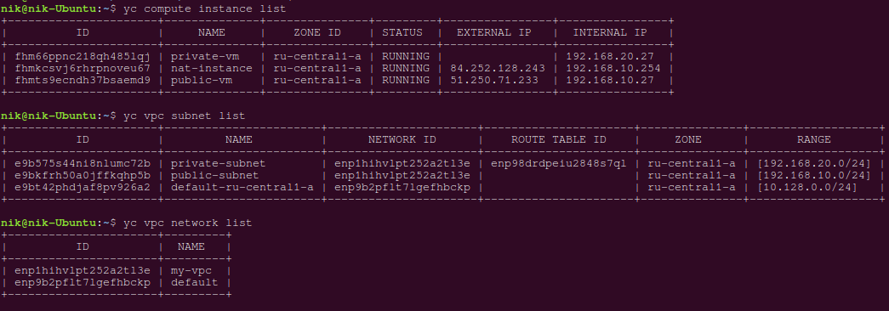
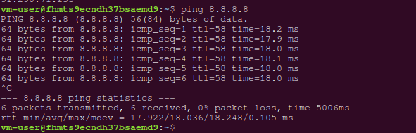
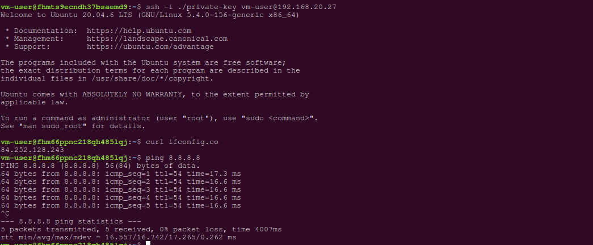

# Домашнее задание к занятию «Организация сети»

### Подготовка к выполнению задания

1. Домашнее задание состоит из обязательной части, которую нужно выполнить на провайдере Yandex Cloud, и дополнительной части в AWS (выполняется по желанию). 
2. Все домашние задания в блоке 15 связаны друг с другом и в конце представляют пример законченной инфраструктуры.  
3. Все задания нужно выполнить с помощью Terraform. Результатом выполненного домашнего задания будет код в репозитории. 
4. Перед началом работы настройте доступ к облачным ресурсам из Terraform, используя материалы прошлых лекций и домашнее задание по теме «Облачные провайдеры и синтаксис Terraform». Заранее выберите регион (в случае AWS) и зону.

---
### Задание 1. Yandex Cloud 

**Что нужно сделать**

1. Создать пустую VPC. Выбрать зону.
2. Публичная подсеть.

 - Создать в VPC subnet с названием public, сетью 192.168.10.0/24.
 - Создать в этой подсети NAT-инстанс, присвоив ему адрес 192.168.10.254. В качестве image_id использовать fd80mrhj8fl2oe87o4e1.
 - Создать в этой публичной подсети виртуалку с публичным IP, подключиться к ней и убедиться, что есть доступ к интернету.
3. Приватная подсеть.
 - Создать в VPC subnet с названием private, сетью 192.168.20.0/24.
 - Создать route table. Добавить статический маршрут, направляющий весь исходящий трафик private сети в NAT-инстанс.
 - Создать в этой приватной подсети виртуалку с внутренним IP, подключиться к ней через виртуалку, созданную ранее, и убедиться, что есть доступ к интернету.

Resource Terraform для Yandex Cloud:

- [VPC subnet](https://registry.terraform.io/providers/yandex-cloud/yandex/latest/docs/resources/vpc_subnet).
- [Route table](https://registry.terraform.io/providers/yandex-cloud/yandex/latest/docs/resources/vpc_route_table).
- [Compute Instance](https://registry.terraform.io/providers/yandex-cloud/yandex/latest/docs/resources/compute_instance).

---
### Ответ

**NAT-инстанс** — специальная виртуальная машина с преднастроенными правилами маршрутизации и трансляции IP-адресов.

В Yandex Cloud можно настроить связь нескольких ВМ с интернетом через NAT-инстанс с помощью статической маршрутизации. При этом будет использован только один публичный IP-адрес — тот, который присвоен NAT-инстансу.

Создадим необходимую инфраструктуру, описав  ее в [файлах конфигурации](./yc-tf/) terraform.

```bash
nik@nik-Ubuntu:~/devops-netology/cloud-provider/yc-tf$ terraform apply
........
........
Apply complete! Resources: 8 added, 0 changed, 0 destroyed.
```



Подключимся к виртуальной машине,которая находится в публичной подсети:
```bash
nik@nik-Ubuntu:$ ssh vm-user@51.250.71.233
```
ПРоверим доступность интернет:


Затем создадим файл  и вставим в него содержимое с закрытым SSH-ключом ВМ из приватной подсети:

```bash
vm-user@fhmts9ecndh37bsaemd9:~$ nano private-key
```

Подключимся в ВМ из приватной подсети по ssh и проверим доступность интернета:



Здесь мы видим, что поcле выполнения команды `curl ifconfig.co` возвращается ip-адрес NAT-instance.

