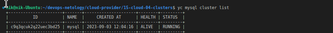
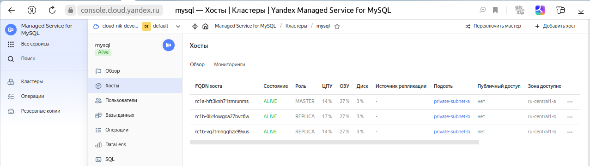
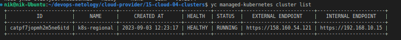
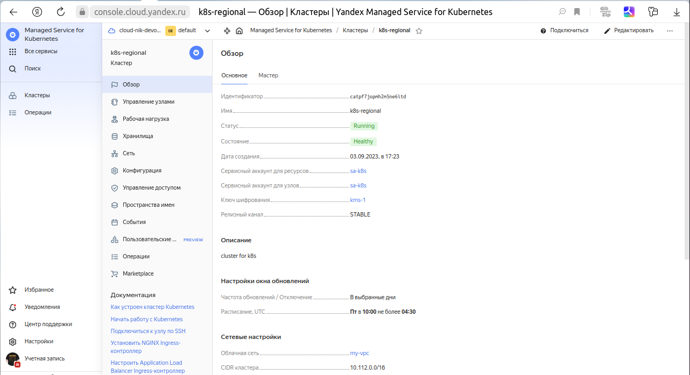
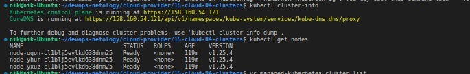
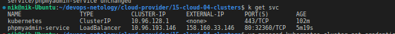
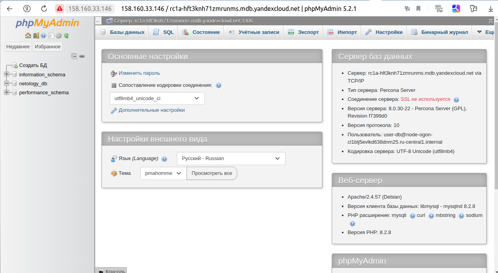

# Домашнее задание к занятию «Кластеры. Ресурсы под управлением облачных провайдеров»

### Цели задания 

1. Организация кластера Kubernetes и кластера баз данных MySQL в отказоустойчивой архитектуре.
2. Размещение в private подсетях кластера БД, а в public — кластера Kubernetes.

---
## Задание 1. Yandex Cloud

1. Настроить с помощью Terraform кластер баз данных MySQL.

Создадим необходимую инфраструктуру, описав  ее в [файлах конфигурации](./yc-tf/) terraform.

 - Используя настройки VPC из предыдущих домашних заданий, добавить дополнительно подсеть private в разных зонах, чтобы обеспечить отказоустойчивость. 
 - Разместить ноды кластера MySQL в разных подсетях.
 - Необходимо предусмотреть репликацию с произвольным временем технического обслуживания.
 - Использовать окружение Prestable, платформу Intel Broadwell с производительностью 50% CPU и размером диска 20 Гб.
 - Задать время начала резервного копирования — 23:59.
 - Включить защиту кластера от непреднамеренного удаления.
 - Создать БД с именем `netology_db`, логином и паролем.

2. Настроить с помощью Terraform кластер Kubernetes.

 - Используя настройки VPC из предыдущих домашних заданий, добавить дополнительно две подсети public в разных зонах, чтобы обеспечить отказоустойчивость.
 - Создать отдельный сервис-аккаунт с необходимыми правами. 
 - Создать региональный мастер Kubernetes с размещением нод в трёх разных подсетях.
 - Добавить возможность шифрования ключом из KMS, созданным в предыдущем домашнем задании.
 - Создать группу узлов, состояющую из трёх машин с автомасштабированием до шести.
 - Подключиться к кластеру с помощью `kubectl`.
 - *Запустить микросервис phpmyadmin и подключиться к ранее созданной БД.
 - *Создать сервис-типы Load Balancer и подключиться к phpmyadmin. Предоставить скриншот с публичным адресом и подключением к БД.

Добавим учетные данные кластера Kubernetes в конфигурационный файл kubectl: `yc managed-kubernetes cluster get-credentials --id catpf7jopmh2m5ne6itd --external` и подключимся к кластеру:

Cоздадим [манифест](phpadm.yaml) для деплоймента `phpmyadmin` и сервиса для него с типом `LoadBalancer`, затем применим его с помощью команды `k apply -f phpadm.yaml `.

Посмотрим созданный сервис, обратим внимание на внешний ip-адрес сервиса:

Перейдем по этому ip-адресу, введем учетные данные пользователя базы данных, которые были указаны при развертывании:

Полезные документы:

- [MySQL cluster](https://registry.terraform.io/providers/yandex-cloud/yandex/latest/docs/resources/mdb_mysql_cluster).
- [Создание кластера Kubernetes](https://cloud.yandex.ru/docs/managed-kubernetes/operations/kubernetes-cluster/kubernetes-cluster-create)
- [K8S Cluster](https://registry.terraform.io/providers/yandex-cloud/yandex/latest/docs/resources/kubernetes_cluster).
- [K8S node group](https://registry.terraform.io/providers/yandex-cloud/yandex/latest/docs/resources/kubernetes_node_group).

--- 

AWS:

- [Модуль EKS](https://learn.hashicorp.com/tutorials/terraform/eks).
------
Полезные команды:
CLI
'yc mysql cluster update c9qu1kvr8jqctqokfegc --deletion-protection=false' - снять защиту от удаления
