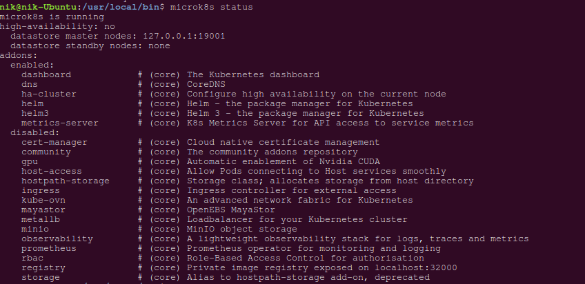
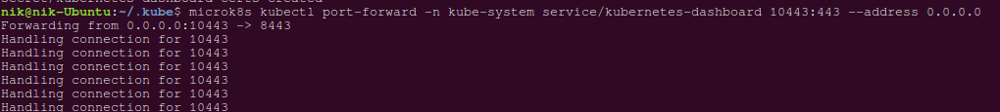
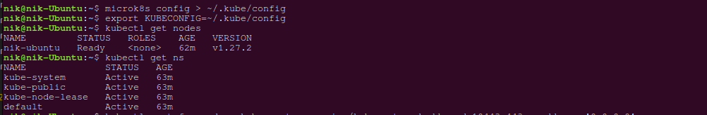
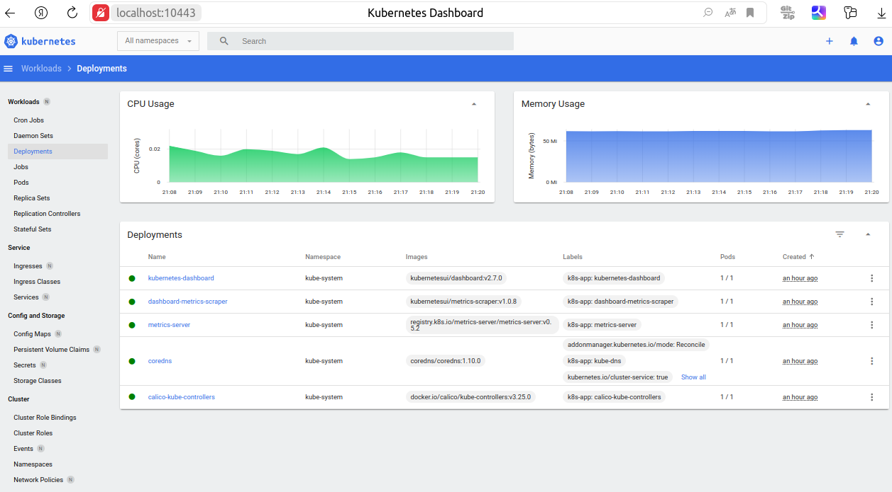

# Домашнее задание к занятию «Kubernetes. Причины появления. Команда kubectl»

### Цель задания

Для экспериментов и валидации ваших решений вам нужно подготовить тестовую среду для работы с Kubernetes. Оптимальное решение — развернуть на рабочей машине или на отдельной виртуальной машине MicroK8S.

------

### Чеклист готовности к домашнему заданию

1. Личный компьютер с ОС Linux или MacOS 

или

2. ВМ c ОС Linux в облаке либо ВМ на локальной машине для установки MicroK8S  

------

### Инструкция к заданию

<details>

1. Установка MicroK8S:
    - sudo apt update,
    - sudo apt install snapd,
    - sudo snap install microk8s --classic,
    - добавить локального пользователя в группу `sudo usermod -a -G microk8s $USER`,
    - изменить права на папку с конфигурацией `sudo chown -f -R $USER ~/.kube`.

2. Полезные команды:
    - проверить статус `microk8s status --wait-ready`;
    - подключиться к microK8s и получить информацию можно через команду `microk8s command`, например, `microk8s kubectl get nodes`;
    - включить addon можно через команду `microk8s enable`; 
    - список addon `microk8s status`;
    - вывод конфигурации `microk8s config`;
    - проброс порта для подключения локально `microk8s kubectl port-forward -n kube-system service/kubernetes-dashboard 10443:443`.

3. Настройка внешнего подключения:
    - отредактировать файл /var/snap/microk8s/current/certs/csr.conf.template
    ```shell
    # [ alt_names ]
    # Add
    # IP.4 = 123.45.67.89
    ```
    - обновить сертификаты `sudo microk8s refresh-certs --cert front-proxy-client.crt`.

4. Установка kubectl:
    - curl -LO https://storage.googleapis.com/kubernetes-release/release/`curl -s https://storage.googleapis.com/kubernetes-release/release/stable.txt`/bin/linux/amd64/kubectl;
    - chmod +x ./kubectl;
    - sudo mv ./kubectl /usr/local/bin/kubectl;
    - настройка автодополнения в текущую сессию `bash source <(kubectl completion bash)`;
    - добавление автодополнения в командную оболочку bash `echo "source <(kubectl completion bash)" >> ~/.bashrc`.

------
</details>


### Инструменты и дополнительные материалы, которые пригодятся для выполнения задания

1. [Инструкция](https://microk8s.io/docs/getting-started) по установке MicroK8S.
2. [Инструкция](https://kubernetes.io/ru/docs/reference/kubectl/cheatsheet/#bash) по установке автодополнения **kubectl**.
3. [Шпаргалка](https://kubernetes.io/ru/docs/reference/kubectl/cheatsheet/) по **kubectl**.

------

### Задание 1. Установка MicroK8S

1. Установить MicroK8S на локальную машину или на удалённую виртуальную машину.
2. Установить dashboard.
3. Сгенерировать сертификат для подключения к внешнему ip-адресу.

## Ответ.

После установки microk8s включим `dashboard`:

`microk8s enable dashboard`




- Создадим сертификат для аутентификации: 

`openssl req -x509 -nodes -days 365 -newkey rsa:2048 -keyout dashboard.key -out dashboard.crt -subj "/CN=dashboard"`

- создадим манифест-файл со следующим содержанием:

```yaml
apiVersion: v1
kind: Secret
metadata:
  name: kubernetes-dashboard-certs
  namespace: kube-system
data:
  tls.crt: |-
    $(cat dashboard.crt | base64 | tr -d '\n')
  tls.key: |-
    $(cat dashboard.key | base64 | tr -d '\n')
type: kubernetes.io/tls
```

- применим манифест
  
```bash
nik@nik-Ubuntu:~/.kube$ microk8s kubectl apply -f dashboard.yaml
secret/kubernetes-dashboard-certs created
```

- Используем команду `microk8s kubectl port-forward -n kube-system service/kubernetes-dashboard 10443:443 --address 0.0.0.0` для перенаправления порта 443 сервиса kubernetes-dashboard на порт 10443 локальной машины.
  


### Задание 2. Установка и настройка локального kubectl
1. Установить на локальную машину kubectl.
2. Настроить локально подключение к кластеру.



3. Подключиться к дашборду с помощью port-forward.




------