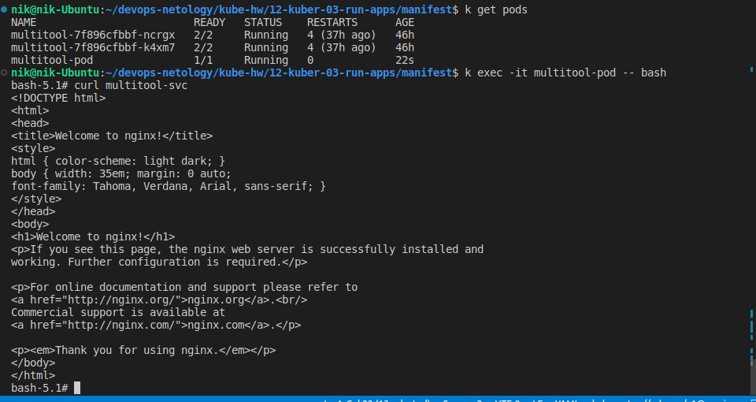
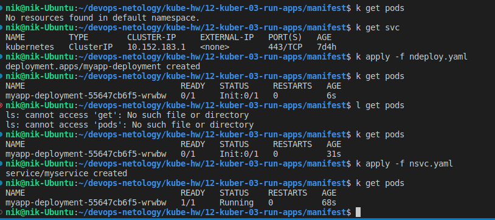

# Домашнее задание к занятию «Запуск приложений в K8S»

### Цель задания

В тестовой среде для работы с Kubernetes, установленной в предыдущем ДЗ, необходимо развернуть Deployment с приложением, состоящим из нескольких контейнеров, и масштабировать его.

------

### Чеклист готовности к домашнему заданию

1. Установленное k8s-решение (например, MicroK8S).
2. Установленный локальный kubectl.
3. Редактор YAML-файлов с подключённым git-репозиторием.

------

### Инструменты и дополнительные материалы, которые пригодятся для выполнения задания

1. [Описание](https://kubernetes.io/docs/concepts/workloads/controllers/deployment/) Deployment и примеры манифестов.
2. [Описание](https://kubernetes.io/docs/concepts/workloads/pods/init-containers/) Init-контейнеров.
3. [Описание](https://github.com/wbitt/Network-MultiTool) Multitool.

------

### Задание 1. Создать Deployment и обеспечить доступ к репликам приложения из другого Pod

1. Создать Deployment приложения, состоящего из двух контейнеров — nginx и multitool. Решить возникшую ошибку.
[deploy.yaml](./manifest/de

1. Создать Service, который обеспечит доступ до реплик приложений из п.1.
    
    [multitool-svc.yaml](./manifest/multitool-svc.yaml)

```bash
nik@nik-Ubuntu:~/devops-netology/kube-hw/12-kuber-03-run-apps/manifest$ k apply -f multitool-svc.yaml 
service/multitool-svc created
nik@nik-Ubuntu:~/devops-netology/kube-hw/12-kuber-03-run-apps/manifest$ k get svc
NAME            TYPE        CLUSTER-IP       EXTERNAL-IP   PORT(S)   AGE
kubernetes      ClusterIP   10.152.183.1     <none>        443/TCP   3d8h
multitool-svc   ClusterIP   10.152.183.108   <none>        80/TCP    12s
```

2. Создать отдельный Pod с приложением multitool и убедиться с помощью `curl`, что из пода есть доступ до приложений из п.1.

    [multitool-pod.yaml](./manifest/multitool-pod.yaml)

```bash
nik@nik-Ubuntu:~/devops-netology/kube-hw/12-kuber-03-run-apps/manifest$ k apply -f multitool-pod.yaml 
pod/multitool-pod created
nik@nik-Ubuntu:~/devops-netology/kube-hw/12-kuber-03-run-apps/manifest$ k get pods
NAME                         READY   STATUS    RESTARTS      AGE
multitool-7f896cfbbf-ncrgx   2/2     Running   4 (37h ago)   46h
multitool-7f896cfbbf-k4xm7   2/2     Running   4 (37h ago)   46h
multitool-pod                1/1     Running   0             22s
```

Зайдем внутрь Pod с помощью команды `kubectl exec`, затем выполним команду `curl multitool-svc` для проверки доступности приложения.



------

### Задание 2. Создать Deployment и обеспечить старт основного контейнера при выполнении условий

1. Создать Deployment приложения nginx и обеспечить старт контейнера только после того, как будет запущен сервис этого приложения.
   
    [nginx-deploy.yaml](./manifest/ndeploy.yaml)

2. Убедиться, что nginx не стартует. В качестве Init-контейнера взять busybox.
3. Создать и запустить Service. Убедиться, что Init запустился.
   
   [nginx-service.yaml](./manifest/nsvc.yaml)

4. Продемонстрировать состояние пода до и после запуска сервиса.
   


В init-container выполняется команда: `['sh', '-c', 'until nslookup myservice; do echo waiting for myservice; sleep 2; done']` , эта команда используется для ожидания доступности сервиса "myservice".
Как видим, после запуска `service` init-container завершает работу  и запускается основной контейнер `nginx `.

------
