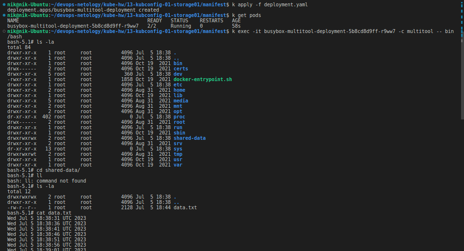
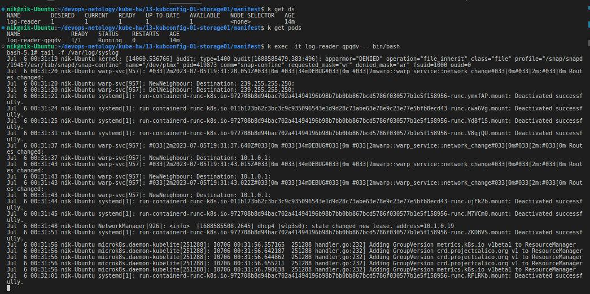

# Домашнее задание к занятию «Хранение в K8s. Часть 1»

### Цель задания

В тестовой среде Kubernetes нужно обеспечить обмен файлами между контейнерам пода и доступ к логам ноды.

------

### Чеклист готовности к домашнему заданию

1. Установленное K8s-решение (например, MicroK8S).
2. Установленный локальный kubectl.
3. Редактор YAML-файлов с подключенным GitHub-репозиторием.

------

### Дополнительные материалы для выполнения задания

1. [Инструкция по установке MicroK8S](https://microk8s.io/docs/getting-started).
2. [Описание Volumes](https://kubernetes.io/docs/concepts/storage/volumes/).
3. [Описание Multitool](https://github.com/wbitt/Network-MultiTool).

------

### Задание 1 

**Что нужно сделать**

Создать Deployment приложения, состоящего из двух контейнеров и обменивающихся данными.

1. Создать Deployment приложения, состоящего из контейнеров busybox и multitool.
2. Сделать так, чтобы busybox писал каждые пять секунд в некий файл в общей директории.
3. Обеспечить возможность чтения файла контейнером multitool.
4. Продемонстрировать, что multitool может читать файл, который периодически обновляется.
5. Предоставить манифесты Deployment в решении, а также скриншоты или вывод команды из п. 4.

### Ответ

Создадим [манифест-файл](./manifest/busybox-multitool-deployment.yaml). В этом манифесте мы определяем Deployment с двумя контейнерами: `busybox` и `multitool`. Контейнер `busybox` будет записывать текущую дату и время в файл `/shared-data/data.txt` каждые пять секунд с помощью команды `echo $(date)` в бесконечном цикле. Контейнер `multitool` будет иметь доступ к этому файлу для чтения.

После успешного развертывания можно проверить вывод файла `/shared-data/data.txt` в контейнере `multitool`. Увидим содержимое файла с записями о дате и времени каждые пять секунд.

------

### Задание 2

**Что нужно сделать**

Создать DaemonSet приложения, которое может прочитать логи ноды.

1. Создать DaemonSet приложения, состоящего из multitool.
2. Обеспечить возможность чтения файла `/var/log/syslog` кластера MicroK8S.
3. Продемонстрировать возможность чтения файла изнутри пода.
4. Предоставить манифесты Deployment, а также скриншоты или вывод команды из п. 2.

### Ответ

Создадим [манифест-файл](./manifest/ds-multitool.yaml), в котором определим `DaemonSet`. Этот `DaemonSet` будет создавать поды на каждой ноде кластера (так как использую microk8s на одной хостовой машине, то создастся 1 пода), которые запускают контейнер с образом `multitool` и выполняют команду для чтения содержимого файла /`var/log/syslog`. Файл `/var/log/syslog` будет доступен в поде через точку монтирования в виде тома `"syslog-volume"`.

------