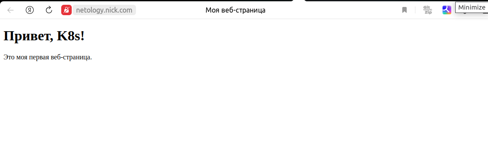

# Домашнее задание к занятию «Конфигурация приложений»

### Цель задания

В тестовой среде Kubernetes необходимо создать конфигурацию и продемонстрировать работу приложения.

------

### Чеклист готовности к домашнему заданию

1. Установленное K8s-решение (например, MicroK8s).
2. Установленный локальный kubectl.
3. Редактор YAML-файлов с подключённым GitHub-репозиторием.

------

### Инструменты и дополнительные материалы, которые пригодятся для выполнения задания

1. [Описание](https://kubernetes.io/docs/concepts/configuration/secret/) Secret.
2. [Описание](https://kubernetes.io/docs/concepts/configuration/configmap/) ConfigMap.
3. [Описание](https://github.com/wbitt/Network-MultiTool) Multitool.

------

### Задание 1. Создать Deployment приложения и решить возникшую проблему с помощью ConfigMap. Добавить веб-страницу

1. Создать Deployment приложения, состоящего из контейнеров busybox и multitool.
2. Решить возникшую проблему с помощью ConfigMap.
3. Продемонстрировать, что pod стартовал и оба конейнера работают.
4. Сделать простую веб-страницу и подключить её к Nginx с помощью ConfigMap. Подключить Service и показать вывод curl или в браузере.
5. Предоставить манифесты, а также скриншоты или вывод необходимых команд.

## Решение

[configmap](./manifest/1/cm.yaml)

[manifest](./manifest/1/deploy.yaml)

```bash
nik@nik-Ubuntu:~$ k get pod
NAME                                 READY   STATUS    RESTARTS   AGE
my-app-deployment-7b6f587b78-gczqp   2/2     Running   0          16m
nik@nik-Ubuntu:~$ k get svc
NAME            TYPE        CLUSTER-IP      EXTERNAL-IP   PORT(S)             AGE
kubernetes      ClusterIP   10.152.183.1    <none>        443/TCP             41h
multitool-svc   ClusterIP   10.152.183.82   <none>        9001/TCP,9002/TCP   79m
nik@nik-Ubuntu:~$ k port-forward service/multitool-svc 8080:9002 --address 0.0.0.0
Forwarding from 0.0.0.0:8080 -> 80
Handling connection for 8080
Handling connection for 8080
```

------

### Задание 2. Создать приложение с вашей веб-страницей, доступной по HTTPS 

1. Создать Deployment приложения, состоящего из Nginx.
   
[deployment + service](./manifest/2/deploy.yaml)

```bash
nik@nik-Ubuntu:~/devops-netology/kube-hw/13-kubconfig-03-config/manifest/2$ k get deployments.apps 
NAME               READY   UP-TO-DATE   AVAILABLE   AGE
nginx-deployment   1/1     1            1           60s
```
2. Создать собственную веб-страницу и подключить её как ConfigMap к приложению.
   
[configMap](./manifest/2/cm.yaml)

```bash
nik@nik-Ubuntu:~/devops-netology/kube-hw/13-kubconfig-03-config/manifest/2$ k get cm
NAME               DATA   AGE
kube-root-ca.crt   1      43h
my-config          1      79s
```

3. Выпустить самоподписной сертификат SSL:
   
```bash
nik@nik-Ubuntu:~/devops-netology/kube-hw/13-kubconfig-03-config/manifest/2$ openssl req -x509 -nodes -days 365 -newkey rsa:2048 -keyout tls.key -out tls.crt -subj "/CN=netology.nik.com"
```

Создать Secret для использования сертификата.

```bash
nik@nik-Ubuntu:~/devops-netology/kube-hw/13-kubconfig-03-config/manifest/2$ kubectl create secret tls nginx-secret --key tls.key --cert tls.crt
secret/nginx-secret created`
```

4. Создать Ingress и необходимый Service, подключить к нему SSL в вид. 
  
[ingress](./manifest/2/ingress.yaml)

```bash
nik@nik-Ubuntu:~/devops-netology/kube-hw/13-kubconfig-03-config/manifest/2$ k get ingress
NAME         CLASS    HOSTS               ADDRESS     PORTS     AGE
my-ingress   public   netology.nick.com   127.0.0.1   80, 443   4m8s
```

Продемонстировать доступ к приложению по HTTPS.



------

### Правила приёма работы

1. Домашняя работа оформляется в своём GitHub-репозитории в файле README.md. Выполненное домашнее задание пришлите ссылкой на .md-файл в вашем репозитории.
2. Файл README.md должен содержать скриншоты вывода необходимых команд `kubectl`, а также скриншоты результатов.
3. Репозиторий должен содержать тексты манифестов или ссылки на них в файле README.md.

------