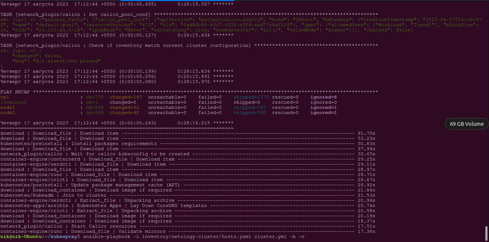
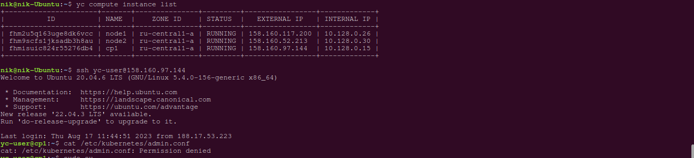
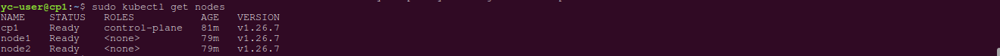
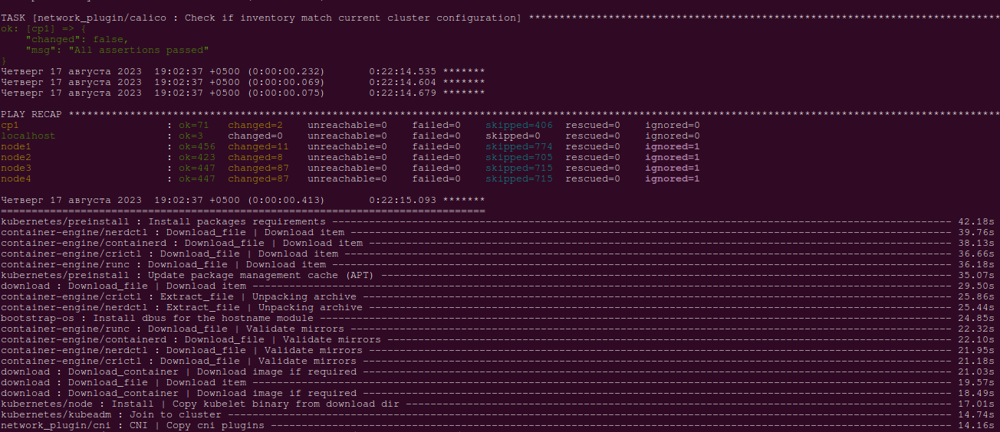
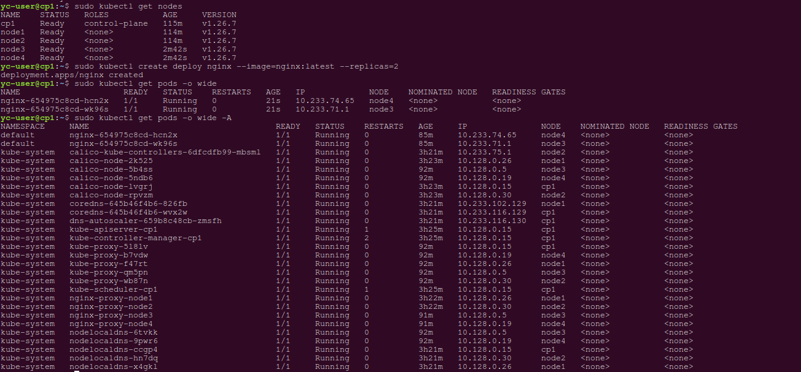
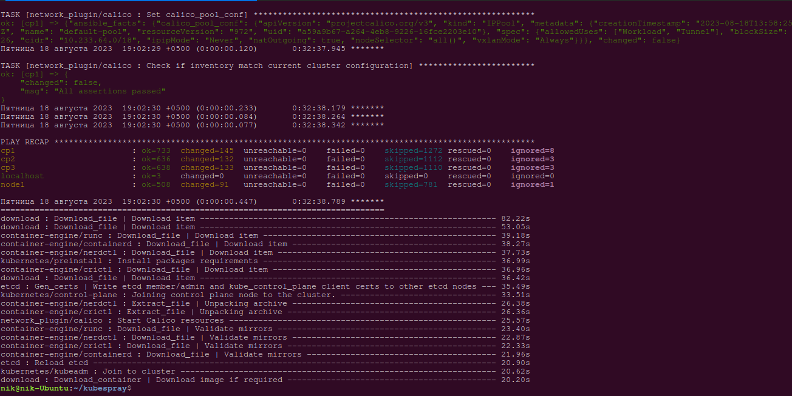
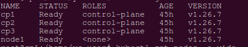
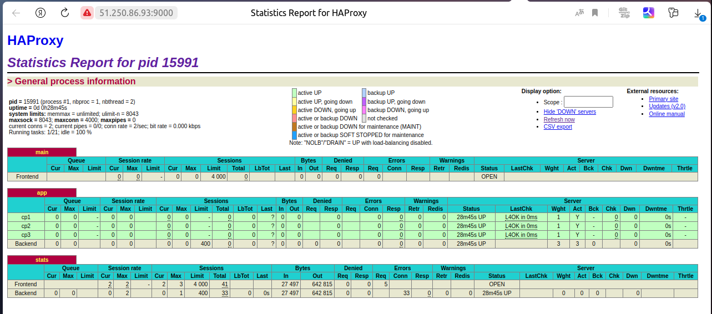

# Домашнее задание к занятию «Установка Kubernetes»

### Цель задания

Установить кластер K8s.

### Чеклист готовности к домашнему заданию

1. Развёрнутые ВМ с ОС Ubuntu 20.04-lts.


### Инструменты и дополнительные материалы, которые пригодятся для выполнения задания

1. [Инструкция по установке kubeadm](https://kubernetes.io/docs/setup/production-environment/tools/kubeadm/create-cluster-kubeadm/).
2. [Документация kubespray](https://kubespray.io/).

-----

### Задание 1. Установить кластер k8s с 1 master node

1. Подготовка работы кластера из 5 нод: 1 мастер и 4 рабочие ноды.
2. В качестве CRI — containerd.
3. Запуск etcd производить на мастере.
4. Способ установки выбрать самостоятельно.

---
### Решение
Будем устанавливать с помощью `kubespray`.

Склонируем репозиторий:

 `git clone https://github.com/kubernetes-sigs/kubespray`

Установим зависимости:

`sudo pip3 install -r requirements.txt`

Скопируем пример inventory в папку для создания своей конфигурации:

`cp -rfp inventory/sample inventory/netology-cluster`

С помощью билдера обновим inventory ansible файл, указав ip-адреса узлов. Для начала в целях ускорения процесса установки сделаем 1 узел для control plane и 2 worker ноды:

`declare -a IPS=(158.160.97.144 158.160.117.200 158.160.52.213)
CONFIG_FILE=inventory/mycluster/hosts.yaml python3 contrib/inventory_builder/inventory.py ${IPS[@]}`

Отредактируем файл `inventory/netology-cluster/hosts.yaml`

Запустим ansible-playbook:
```bash
nik@nik-Ubuntu:~/kubespray$ ansible-playbook -i inventory/netology-cluster/hosts.yaml cluster.yml -b -v
```


Подключимся к мастер-ноде:


Выполним команду `kubectl get nodes`


Теперь добавим к кластеру еще 2 ноды, прописав их в файл [hosts.yaml](./files/hosts.yaml)

Запустим asnible-playbook scale.yml:

```bash
nik@nik-Ubuntu:~/kubespray$ ansible-playbook -i inventory/netology-cluster/hosts.yaml scale.yml -b -v
```


Повторно проверим установку на мастер-ноде:


## Дополнительные задания (со звёздочкой)

**Настоятельно рекомендуем выполнять все задания под звёздочкой.** Их выполнение поможет глубже разобраться в материале.   
Задания под звёздочкой необязательные к выполнению и не повлияют на получение зачёта по этому домашнему заданию. 

------
### Задание 2*. Установить HA кластер

1. Установить кластер в режиме HA.
2. Использовать нечётное количество Master-node.
3. Для cluster ip использовать keepalived или другой способ.


Аналогично установим кластер с 3 мастер-нодами 1 воркер нодой, используя кубспрей.

Отредактируем файл [host.yaml](./files/hosts1.yaml)

После запуска плейбука и завершения установки проверим наш кластер:




На каждой мастер-ноде установим `keepalived`, `haproxy`, `nginx`.

Отредактируем файлы конфигурации:

```bash
root@cp1:/home/yc-user# nano /etc/haproxy/haproxy.cfg

global
    chroot      /var/lib/haproxy
    pidfile     /var/run/haproxy.pid
    maxconn     4000
    user        haproxy
    group       haproxy
    daemon

defaults
    log     global
    mode    tcp
    retries 2
    timeout client 30m
    timeout connect 4s
    timeout server 30m
    timeout check 5s

frontend main
    bind 10.128.0.1:7443
    default_backend             app

backend app
    balance     roundrobin
    server cp1 10.128.0.33:6443 check
    server cp2 10.128.0.6:6443 check
    server cp3 10.128.0.8:6443 check

listen stats
    bind *:9000
    mode http
    stats enable  # Enable stats page
    stats hide-version  # Hide HAProxy version
    stats realm Haproxy\ Statistics  # Title text for popup window
    stats uri /haproxy_stats  # Stats URI

```

```bash
root@cp1:/home/yc-user# nano /etc/keepalived/keepalived.conf

vrrp_script chk_haproxy {
  script "killall -0 haproxy" # check the haproxy process
  interval 2                  # every 2 seconds
  weight 2                    # add 2 points if OK
}

vrrp_instance VI_1 {
  interface eth0              # interface to monitor
  state MASTER                # MASTER on master, BACKUP on slaves

  virtual_router_id 51
  priority 101                # 101 on master, 100 on slaves

  virtual_ipaddress {
    10.128.0.1/24          # virtual ip address
  }

  track_script {
    chk_haproxy
  }
}

```

Отличие конфигурации keepalived на ноде сp1  - `state MASTER`, на нодах cp2 и cp3 - `state BACKUP`.

```bash
root@cp1:/home/yc-user# systemctl restart keepalived
root@cp1:/home/yc-user# systemctl restart haproxy
```

Просмотрим статистику haproxy по ссылке http://51.250.86.93:9000/haproxy_stats




Если остановить nginx на ноде cp1 
```bash
root@cp1:/home/yc-user# systemctl stop nginx
```
По прежнему получим доступ к нашему приложению:


### Правила приёма работы

1. Домашняя работа оформляется в своем Git-репозитории в файле README.md. Выполненное домашнее задание пришлите ссылкой на .md-файл в вашем репозитории.
2. Файл README.md должен содержать скриншоты вывода необходимых команд `kubectl get nodes`, а также скриншоты результатов.
3. Репозиторий должен содержать тексты манифестов или ссылки на них в файле README.md.