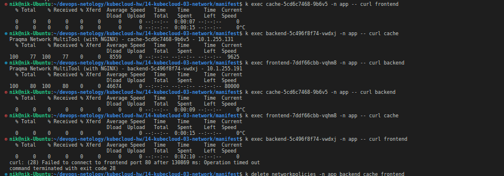

# Домашнее задание к занятию «Как работает сеть в K8s»

### Цель задания

Настроить сетевую политику доступа к подам.

### Чеклист готовности к домашнему заданию

1. Кластер K8s с установленным сетевым плагином Calico.

### Инструменты и дополнительные материалы, которые пригодятся для выполнения задания

1. [Документация Calico](https://www.tigera.io/project-calico/).
2. [Network Policy](https://kubernetes.io/docs/concepts/services-networking/network-policies/).
3. [About Network Policy](https://docs.projectcalico.org/about/about-network-policy).

-----

### Задание 1. Создать сетевую политику или несколько политик для обеспечения доступа

1. Создать deployment'ы приложений frontend, backend и cache и соответсвующие сервисы.
2. В качестве образа использовать network-multitool.
3. Разместить поды в namespace App.
4. Создать политики, чтобы обеспечить доступ frontend -> backend -> cache. Другие виды подключений должны быть запрещены.
5. Продемонстрировать, что трафик разрешён и запрещён.

### Правила приёма работы

1. Домашняя работа оформляется в своём Git-репозитории в файле README.md. Выполненное домашнее задание пришлите ссылкой на .md-файл в вашем репозитории.
2. Файл README.md должен содержать скриншоты вывода необходимых команд, а также скриншоты результатов.
3. Репозиторий должен содержать тексты манифестов или ссылки на них в файле README.md.

### Решение

Cоздадим пространство имен `app`:

```bash
nik@nik-Ubuntu:~/devops-netology/kubecloud-hw/14-kubecloud-03-network/manifest$ k create namespace app
namespace/app created
```
Развернем деплойменты и запустим сервисы приложений [frontend](./manifest/frontend.yaml), [backend](./manifest/backend.yaml) и [cache](./manifest/cache.yaml):

```bash
nik@nik-Ubuntu:~/devops-netology/kubecloud-hw/14-kubecloud-03-network/manifest$ k apply -f frontend.yaml
deployment.apps/frontend created
service/frontend created
nik@nik-Ubuntu:~/devops-netology/kubecloud-hw/14-kubecloud-03-network/manifest$ k apply -f backend.yaml 
deployment.apps/backend created
service/backend created
nik@nik-Ubuntu:~/devops-netology/kubecloud-hw/14-kubecloud-03-network/manifest$ k apply -f cache.yaml 
deployment.apps/cache created
service/cache created

nik@nik-Ubuntu:~/devops-netology/kubecloud-hw/14-kubecloud-03-network/manifest$ k get deployments.apps -n app
NAME       READY   UP-TO-DATE   AVAILABLE   AGE
frontend   1/1     1            1           44s
backend    1/1     1            1           35s
cache      1/1     1            1           14s

nik@nik-Ubuntu:~/devops-netology/kubecloud-hw/14-kubecloud-03-network/manifest$ k get pods -n app
NAME                       READY   STATUS    RESTARTS   AGE
frontend-7ddf66cbb-vqhm8   1/1     Running   0          55s
backend-5c496f8f74-vwdxj   1/1     Running   0          47s
cache-5cd6c7468-9b6v5      1/1     Running   0          26s

nik@nik-Ubuntu:~/devops-netology/kubecloud-hw/14-kubecloud-03-network/manifest$ k get svc -n app
NAME       TYPE        CLUSTER-IP       EXTERNAL-IP   PORT(S)   AGE
frontend   ClusterIP   10.152.183.17    <none>        80/TCP    80s
backend    ClusterIP   10.152.183.87    <none>        80/TCP    71s
cache      ClusterIP   10.152.183.135   <none>        80/TCP    50s
```
Убедимся, что все поды доступны друг для друга:


Создадим манифесты для `NetworkPolicy`  - [np-backend.yaml](./manifest/network-policy/np-backend.yaml), [np-frontemd.yaml](./manifest/network-policy/np-frontend.yaml), [np-cashe](./manifest/network-policy/np-cache.yaml) и запустим их
```bash
nik@nik-Ubuntu:~/devops-netology/kubecloud-hw/14-kubecloud-03-network/manifest$ k apply -f ./network-policy/
networkpolicy.networking.k8s.io/backend created
networkpolicy.networking.k8s.io/cache created
networkpolicy.networking.k8s.io/frontend created

nik@nik-Ubuntu:~/devops-netology/kubecloud-hw/14-kubecloud-03-network/manifest$ k get networkpolicies -n app
NAME       POD-SELECTOR   AGE
backend    app=backend    26s
cache      app=cache      26s
frontend   app=frontend   26s
```

Убедимся, что политика настроена верно и есть доступ `frontend -> backend -> cache`, а другие виды подключений запрещены:

