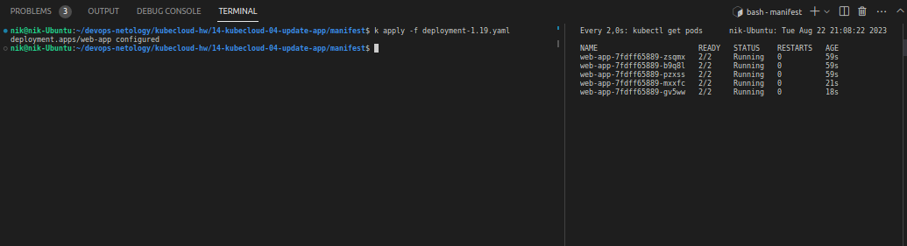
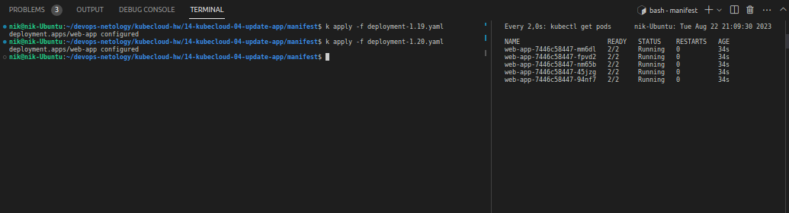
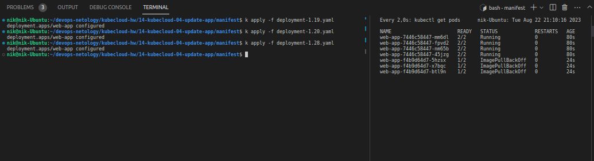
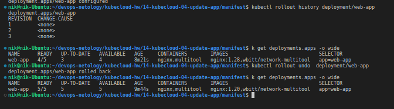
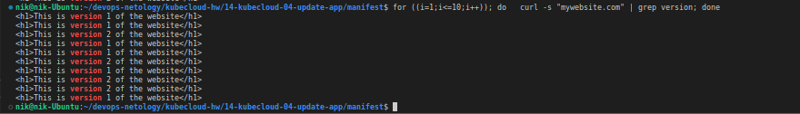

# Домашнее задание к занятию «Обновление приложений»

### Цель задания

Выбрать и настроить стратегию обновления приложения.

### Чеклист готовности к домашнему заданию

1. Кластер K8s.

### Инструменты и дополнительные материалы, которые пригодятся для выполнения задания

1. [Документация Updating a Deployment](https://kubernetes.io/docs/concepts/workloads/controllers/deployment/#updating-a-deployment).
2. [Статья про стратегии обновлений](https://habr.com/ru/companies/flant/articles/471620/).

-----

### Задание 1. Выбрать стратегию обновления приложения и описать ваш выбор

1. Имеется приложение, состоящее из нескольких реплик, которое требуется обновить.
2. Ресурсы, выделенные для приложения, ограничены, и нет возможности их увеличить.
3. Запас по ресурсам в менее загруженный момент времени составляет 20%.
4. Обновление мажорное, новые версии приложения не умеют работать со старыми.
5. Вам нужно объяснить свой выбор стратегии обновления приложения.

### Ответ

Учитывая ограниченные ресурсы и наличие запаса в менее загруженное время, я бы предпочел использовать стратегию `RollingUpdate `(постепенного обновления). При этом, реплики приложения будут обновляться поэтапно, давая возможность использовать ресурсы оптимальным образом и избежать потенциальной перегрузки.

Перед обновлением всех реплик, при возможности я бы провел тестирование новой версии приложения на тестовой среде. Это позволит выявить и исправить возможные ошибки, прежде чем обновить все реплики.

Важно непрерывно мониторить процесс обновления, чтобы заметить любые проблемы и быстро решить их. 

Выбор стратегии `RollingUpdate` позволит максимально эффективно использовать ограниченные ресурсы, а также минимизировать возможные риски и проблемы, связанные с переводом всех реплик на новую версию приложения одновременно.


### Задание 2. Обновить приложение

1. Создать deployment приложения с контейнерами nginx и multitool. Версию nginx взять 1.19. Количество реплик — 5.
   
Создадим [deployment-1.19.yaml](./manifest/deployment-1.19.yaml) и запустим его.


2. Обновить версию nginx в приложении до версии 1.20, сократив время обновления до минимума. Приложение должно быть доступно.


Создадим [deployment-1.20.yaml](./manifest/deployment-1.20.yaml). Так как время обновления должно быть минимальным, выберем типом стратегии обновления   -   `Recreate.`



3. Попытаться обновить nginx до версии 1.28, приложение должно оставаться доступным.
   
Создадим [deployment-1.20.yaml](./manifest/deployment-1.28.yaml). Тип стратегии обновления - `RollingUpdate`.
В данном случае обновление завершается с ошибкой, но часть подов продолжает работать, приложение доступно.



4. Откатиться после неудачного обновления.

Просмотрим список ревизий. Затем откатимся к предыдущей версии.



## Дополнительные задания — со звёздочкой*

Задания дополнительные, необязательные к выполнению, они не повлияют на получение зачёта по домашнему заданию. **Но мы настоятельно рекомендуем вам выполнять все задания со звёздочкой.** Это поможет лучше разобраться в материале.   

### Задание 3*. Создать Canary deployment

1. Создать два deployment'а приложения nginx.

Создадим 2 манифеста, содержащие деплойменты и их сервисы [nginx-deployment-v1.yaml](./manifest/canary/nginx-deployment-v1.yaml), [nginx-deployment-v2.yaml](./manifest/canary/nginx-deployment-v2.yaml)

2. При помощи разных ConfigMap сделать две версии приложения — веб-страницы.

Создадим 2 манифеста  ConfigMap - [nginx-config-v1.yaml], [nginx-config-v1](./manifest/canary/nginx-config-v2.yaml)

3. С помощью ingress создать канареечный деплоймент, чтобы можно было часть трафика перебросить на разные версии приложения.

Создадим  манифест для Ingress - [nginx-ingress.yaml](./manifest/canary/nginx-ingress.yaml)

При чем для `canary-ingress` определим параметры, которые включают `canary `и определют долю распределяемого трафика `30%`:
```yaml
annotations:
    nginx.ingress.kubernetes.io/canary: "true"
    nginx.ingress.kubernetes.io/canary-weight: 30%
```

Применим наши манифесты:

```bash
nik@nik-Ubuntu:~/devops-netology/kubecloud-hw/14-kubecloud-04-update-app/manifest$ k apply -f ./canary/
configmap/nginx-config-v1 created
configmap/nginx-config-v2 created
deployment.apps/nginx-deployment-v1 created
service/nginx-service created
deployment.apps/nginx-deployment-v2 created
service/nginx-service-canary created
ingress.networking.k8s.io/nginx-ingress created
ingress.networking.k8s.io/canary-ingress created
```
Запустим цикл запросов и увидим, как загружаются разные версии приложения:



### Правила приёма работы

1. Домашняя работа оформляется в своем Git-репозитории в файле README.md. Выполненное домашнее задание пришлите ссылкой на .md-файл в вашем репозитории.
2. Файл README.md должен содержать скриншоты вывода необходимых команд, а также скриншоты результатов.
3. Репозиторий должен содержать тексты манифестов или ссылки на них в файле README.md.