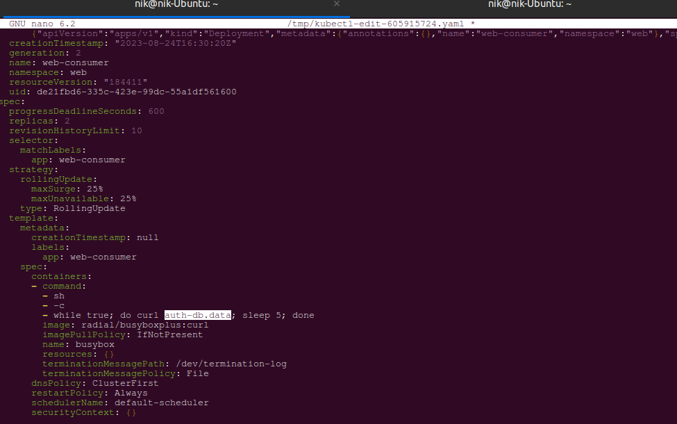
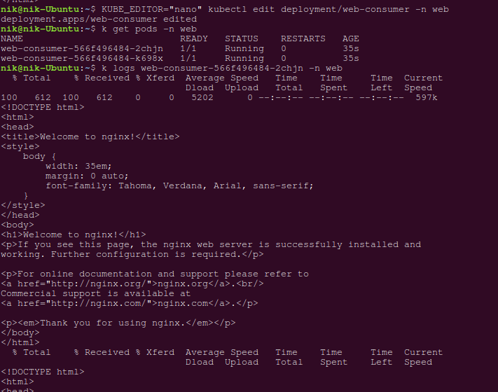

# Домашнее задание к занятию Troubleshooting

### Цель задания

Устранить неисправности при деплое приложения.

### Чеклист готовности к домашнему заданию

1. Кластер K8s.

### Задание. При деплое приложение web-consumer не может подключиться к auth-db. Необходимо это исправить

1. Установить приложение по команде:
```shell
kubectl apply -f https://raw.githubusercontent.com/netology-code/kuber-homeworks/main/3.5/files/task.yaml
```
2. Выявить проблему и описать.
3. Исправить проблему, описать, что сделано.
4. Продемонстрировать, что проблема решена.

### Ответ
Итак, запустим установку приложения.

```bash
nik@nik-Ubuntu:~$ kubectl apply -f https://raw.githubusercontent.com/netology-code/kuber-homeworks/main/3.5/files/task.yaml
Error from server (NotFound): error when creating "https://raw.githubusercontent.com/netology-code/kuber-homeworks/main/3.5/files/task.yaml": namespaces "web" not found
Error from server (NotFound): error when creating "https://raw.githubusercontent.com/netology-code/kuber-homeworks/main/3.5/files/task.yaml": namespaces "data" not found
Error from server (NotFound): error when creating "https://raw.githubusercontent.com/netology-code/kuber-homeworks/main/3.5/files/task.yaml": namespaces "data" not found
```
Ошибка - отсутствуют namespase `web` и `data`. Видим что это действительно так. Создадим необходимые namespace и заново запустим манифест:

```bash
nik@nik-Ubuntu:~$ k get ns -A
NAME              STATUS   AGE
default           Active   3d1h
kube-node-lease   Active   3d1h
kube-public       Active   3d1h
kube-system       Active   3d1h
nik@nik-Ubuntu:~$ k create ns web
namespace/web created
nik@nik-Ubuntu:~$ k create ns data
namespace/data created
nik@nik-Ubuntu:~$ kubectl apply -f https://raw.githubusercontent.com/netology-code/kuber-homeworks/main/3.5/files/task.yaml
deployment.apps/web-consumer created
deployment.apps/auth-db created
service/auth-db created
```
Запущены 2 поды в пространстве имен web, а также 1 пода и 1 сервис в пространстве имен data.
```bash
nik@nik-Ubuntu:~$ k get pod -n web
NAME                            READY   STATUS    RESTARTS   AGE
web-consumer-577d47b97d-knsqg   1/1     Running   0          5m48s
web-consumer-577d47b97d-w2zft   1/1     Running   0          5m48s

nik@nik-Ubuntu:~$ k get pod -n data
NAME                       READY   STATUS    RESTARTS   AGE
auth-db-795c96cddc-rk4fj   1/1     Running   0          5m14s


nik@nik-Ubuntu:~$ kubectl get svc -A
NAMESPACE     NAME         TYPE        CLUSTER-IP      EXTERNAL-IP   PORT(S)                  AGE
data          auth-db      ClusterIP   10.233.57.237   <none>        80/TCP                   13m
default       kubernetes   ClusterIP   10.233.0.1      <none>        443/TCP                  3d1h
kube-system   coredns      ClusterIP   10.233.0.3      <none>        53/UDP,53/TCP,9153/TCP   3d1h
```

Посмотрим лог поды web-consumer-577d47b97d-knsqg:

```bash
nik@nik-Ubuntu:~$ k logs web-consumer-577d47b97d-knsqg -n web
curl: (6) Couldn't resolve host 'auth-db'
curl: (6) Couldn't resolve host 'auth-db'
curl: (6) Couldn't resolve host 'auth-db'
curl: (6) Couldn't resolve host 'auth-db'
curl: (6) Couldn't resolve host 'auth-db'
```
Увидим, что имя хоста 'auth-db' не удалось преобразовать в IP-адрес. Обычно это происходит при сбое разрешения DNS для имени хоста.

Использование утилиты `nslookup` также говорит об этом:

```bash
nik@nik-Ubuntu:~$ kubectl exec -it web-consumer-577d47b97d-knsqg -n web -- nslookup auth-db
Server:    169.254.25.10
Address 1: 169.254.25.10

nslookup: can't resolve 'auth-db'
command terminated with exit code 1
```
Выполним запрос по ip-адресу сервиса и увидим, что сервис доступен:
```bash
nik@nik-Ubuntu:~$ kubectl exec -it web-consumer-577d47b97d-knsqg -n web -- curl 10.233.57.237
<!DOCTYPE html>
<html>
<head>
<title>Welcome to nginx!</title>
<style>
    body {
        width: 35em;
        margin: 0 auto;
        font-family: Tahoma, Verdana, Arial, sans-serif;
    }
</style>
</head>
<body>
<h1>Welcome to nginx!</h1>
<p>If you see this page, the nginx web server is successfully installed and
working. Further configuration is required.</p>

<p>For online documentation and support please refer to
<a href="http://nginx.org/">nginx.org</a>.<br/>
Commercial support is available at
<a href="http://nginx.com/">nginx.com</a>.</p>

<p><em>Thank you for using nginx.</em></p>
</body>
</html>
```

Для устранения проблемы можно добавить строку `10.233.57.237 auth-db` в файл `/etc/hosts` в каждую из pod пространства имен `web`. Однако это придется делать после каждого перезапуска pod.

Второй способ, который я поробовал сделать - отредактировать манифест деплоймента. Дело в том, что DNS-запрос может возвращать разные результаты в зависимости от пространства имен модуля, создающего его. Запросы DNS, в которых не указано пространство имен, ограничены пространством имен модуля. Для доступа к сервисам другого пространства имен необходимо указать это пространство имен в запросе.

```bash
nik@nik-Ubuntu:~$ KUBE_EDITOR="nano" kubectl edit deployment/web-consumer -n web
deployment.apps/web-consumer edited
```



Также можно в манифест добавить параметр `dnsConfig`. 
[Ссылка на документацию](https://kubernetes.io/docs/concepts/services-networking/dns-pod-service/#namespaces-of-services)

После завершения редактирования деплоймента он будет перезапущен, пересоздадутся новые pod. В логах pod ошибка исчезнет.




### Правила приёма работы

1. Домашняя работа оформляется в своём Git-репозитории в файле README.md. Выполненное домашнее задание пришлите ссылкой на .md-файл в вашем репозитории.
2. Файл README.md должен содержать скриншоты вывода необходимых команд, а также скриншоты результатов.
3. Репозиторий должен содержать тексты манифестов или ссылки на них в файле README.md.