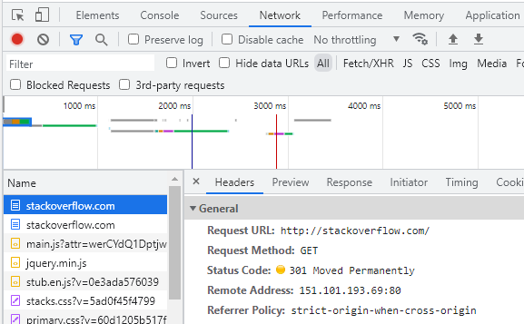
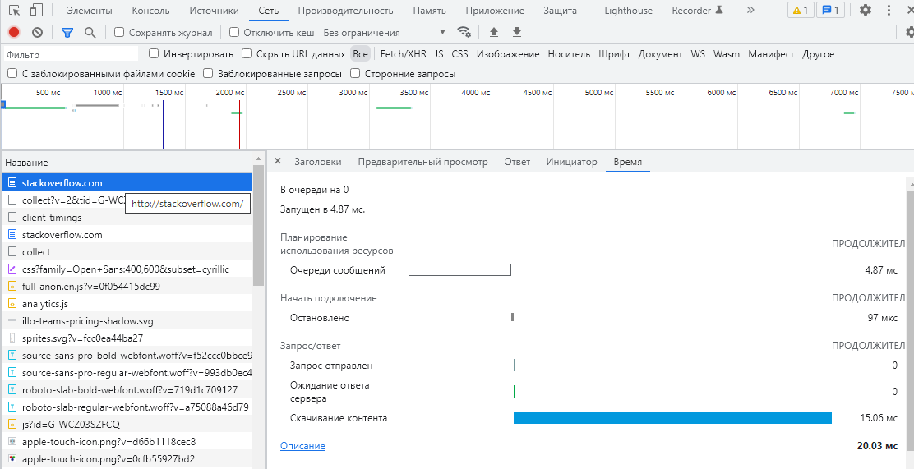
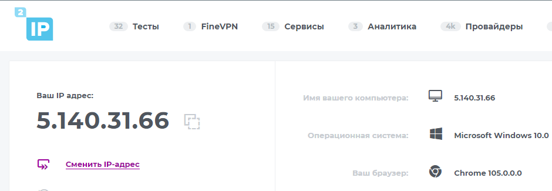

## Домашнее задание к занятию "3.6. Компьютерные сети, лекция 1"

1.

```bash
vagrant@vagrant:~$ telnet stackoverflow.com 80
Trying 151.101.129.69...
Connected to stackoverflow.com.
Escape character is '^]'.
GET /questions HTTP/1.0
Host: stackoverflow.com

HTTP/1.1 301 Moved Permanently
Server: Varnish
Retry-After: 0
Location: https://stackoverflow.com/questions
Content-Length: 0
Accept-Ranges: bytes
Date: Tue, 20 Sep 2022 17:38:32 GMT
Via: 1.1 varnish
Connection: close
X-Served-By: cache-fra19122-FRA
X-Cache: HIT
X-Cache-Hits: 0
X-Timer: S1663695512.109836,VS0,VE0
Strict-Transport-Security: max-age=300
X-DNS-Prefetch-Control: off

Connection closed by foreign host.
```

Код состояния HTTP 301 или Moved Permanently (с англ. — «Перемещено навсегда») — стандартный код ответа HTTP, получаемый
в ответ от сервера в ситуации, когда запрошенный ресурс был на постоянной основе перемещён в новое месторасположение, и
указывающий на то, что текущие ссылки, использующие данный URL, должны быть обновлены. Адрес нового месторасположения
ресурса указывается в поле Location получаемого в ответ заголовка пакета протокола HTTP

2.




3.



4. Провайдер - Ростелеком, автономная система - AS12389

```bash
root@vagrant:~# whois -h whois.ripe.net 5.140.31.66
% This is the RIPE Database query service.
% The objects are in RPSL format.
%
% The RIPE Database is subject to Terms and Conditions.
% See http://www.ripe.net/db/support/db-terms-conditions.pdf

% Note: this output has been filtered.
%       To receive output for a database update, use the "-B" flag.

% Information related to '5.140.0.0 - 5.140.31.255'

% Abuse contact for '5.140.0.0 - 5.140.31.255' is 'abuse@rt.ru'

inetnum:        5.140.0.0 - 5.140.31.255
netname:        USI_ADSL_USERS
descr:          Dynamic distribution IP's for broadband services
descr:          OJSC RosteleÓom, regional branch "Urals"
country:        RU
admin-c:        UkAS1-RIPE
tech-c:         UkAS1-RIPE
status:         ASSIGNED PA
mnt-by:         MFIST-MNT
created:        2012-10-01T11:30:59Z
last-modified:  2012-10-01T11:30:59Z
source:         RIPE

role:           Uralsvyazinform KHFES Administration Staff
address:        11, Moskovskaya str.
address:        Yekaterinburg, 620014
address:        Russian Federation
admin-c:        VS1811-RIPE
admin-c:        DE2673-RIPE
admin-c:        SK3575-RIPE
tech-c:         VS1811-RIPE
tech-c:         DE2673-RIPE
tech-c:         SK3575-RIPE
mnt-by:         MFIST-MNT
nic-hdl:        UKAS1-RIPE
created:        2007-09-06T10:56:08Z
last-modified:  2018-10-05T03:50:02Z
source:         RIPE # Filtered

% Information related to '5.140.0.0/19AS12389'

route:          5.140.0.0/19
descr:          Rostelecom networks
origin:         AS12389
mnt-by:         ROSTELECOM-MNT
created:        2018-10-29T11:54:33Z
last-modified:  2018-10-29T11:54:33Z
source:         RIPE # Filtered

% This query was served by the RIPE Database Query Service version 1.103 (WAGYU)
```

5.

```bash
traceroute to 8.8.8.8 (8.8.8.8), 30 hops max, 60 byte packets
 1  10.0.2.2 [*]  0.913 ms  0.860 ms  0.825 ms
 2  192.168.1.1 [*]  5.550 ms  6.918 ms  6.879 ms
 3  178.46.189.6 [AS12389]  13.446 ms  14.309 ms  14.276 ms
 4  213.59.209.204 [AS12389]  14.232 ms  16.948 ms  17.651 ms
 5  185.140.148.155 [AS12389]  54.333 ms  54.988 ms  54.958 ms
 6  72.14.197.6 [AS15169]  59.262 ms  57.677 ms  64.997 ms
 7  108.170.250.129 [AS15169]  63.631 ms  56.312 ms  57.335 ms
 8  108.170.250.130 [AS15169]  56.811 ms  56.607 ms  56.399 ms
 9  142.250.238.214 [AS15169]  74.629 ms  75.606 ms  75.499 ms
10  142.250.235.68 [AS15169]  70.962 ms  73.826 ms  74.919 ms
11  216.239.49.113 [AS15169]  74.823 ms  74.740 ms  70.690 ms
12  * * *
13  * * *
14  * * *
15  * * *
16  * * *
17  * * *
18  * * *
19  * * *
20  * * *
21  8.8.8.8 [AS15169]  81.148 ms  83.521 ms  83.423 ms
```

6. Наибольшая задержка между 10 и 11 хостами.

```bash
                                           My traceroute  [v0.93]
vagrant (10.0.2.15)                                                                  2022-09-20T18:53:51+0000
Keys:  Help   Display mode   Restart statistics   Order of fields   quit
                                                                     Packets               Pings
 Host                                                              Loss%   Snt   Last   Avg  Best  Wrst StDev
 1. AS???    10.0.2.2                                               0.0%   103    0.9   1.3   0.3  18.0   1.7
 2. AS???    192.168.1.1                                            4.9%   103    1.9   5.7   1.7  53.0   7.1
 3. AS12389  178.46.189.6                                           0.0%   103   14.7  18.0   8.1  70.2  11.2
 4. AS12389  213.59.209.204                                         0.0%   103   10.2  15.3   8.5  72.1   7.8
 5. AS12389  185.140.148.155                                       11.7%   103   49.8  56.1  46.9 183.2  19.9
 6. AS15169  72.14.197.6                                            0.0%   103   52.0  55.7  47.7 133.9  12.2
 7. AS15169  108.170.250.129                                        0.0%   103   54.3  54.2  48.0  83.0   6.2
 8. AS15169  108.170.250.130                                        0.0%   103   50.5  52.5  47.9  67.3   3.0
 9. AS15169  142.250.238.214                                        0.0%   102   64.2  67.1  62.2  81.7   3.4
10. AS15169  142.250.235.68                                         0.0%   102   64.1  68.1  62.2 160.4  11.8
11. AS15169  216.239.49.113                                         0.0%   102   68.9  67.8  62.1 116.7   7.9
12. (waiting for reply)
13. (waiting for reply)
14. (waiting for reply)
15. (waiting for reply)
16. (waiting for reply)
17. (waiting for reply)
18. AS15169  8.8.8.8                                               97.0%   102   61.5  64.1  61.5  66.4   2.5
```

7.

```bash
vagrant@vagrant:~$ dig +trace @8.8.8.8 dns.google | grep dns.google
; <<>> DiG 9.16.1-Ubuntu <<>> +trace @8.8.8.8 dns.google
dns.google.             10800   IN      NS      ns4.zdns.google.
dns.google.             10800   IN      NS      ns1.zdns.google.
dns.google.             10800   IN      NS      ns2.zdns.google.
dns.google.             10800   IN      NS      ns3.zdns.google.
dns.google.             3600    IN      DS      56044 8 2 1B0A7E90AA6B1AC65AA5B573EFC44ABF6CB2559444251B997103D2E4 0C351B08
dns.google.             3600    IN      RRSIG   DS 8 2 3600 20221010135653 20220918135653 38313 google. QPP6t6pkPxQRFg6kYWkjBecsSUZSsUlkV4uRu/lXT9fshFTNeKZPZBdi 51k7/ByIUciDMWRZODd8WRRHIho0rW0VqHU23oC1+5e54Vr8z3LkYWs7 ZhrqWbBlpb40hkTLHlfli9DaKE3pJT5DOK3RxTT2yiIISxF0pniUSwx9 1v4=
dns.google.             900     IN      A       8.8.4.4
dns.google.             900     IN      A       8.8.8.8
dns.google.             900     IN      RRSIG   A 8 2 900 20221009005703 20220917005703 26965 dns.google. BjE+OXq0xRMJE7iZVi0iVCl/B0v8AfSTKk5fFF8d6kuP2kQl5LVc9Gg0 MvHUVJaXVUQ8WJ7flauGVnOUzc6LubU/n3+wvJbiMr17aKAyNrKtABju u55ZdMdYGG/idK+fjiz5h9u8f1T8A/6RfnYF5AIekq7lZvio98rkkN3Y Kvw=
;; Received 241 bytes from 216.239.38.114#53(ns4.zdns.google) in 76 ms
```

8. Привязано доменное имя dns.google.

```bash
vagrant@vagrant:~$ dig -x 8.8.4.4 +noall +answer
4.4.8.8.in-addr.arpa.   70486   IN      PTR     dns.google.
vagrant@vagrant:~$ dig -x 8.8.8.8 +noall +answer
8.8.8.8.in-addr.arpa.   7094    IN      PTR     dns.google.
```
