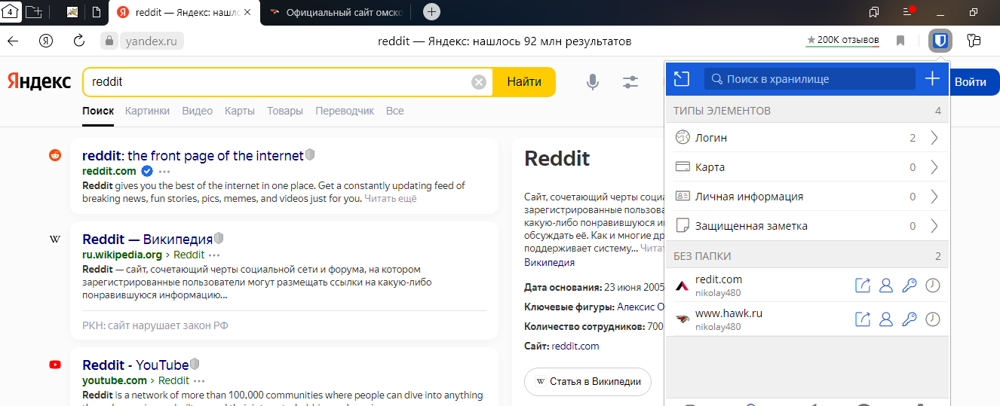

## Домашнее задание к занятию "3.9. Элементы безопасности информационных систем"

1.



2.


3.

Установка apache2:

```bash
vagrant@vagrant:~$ sudo apt install apache2
vagrant@vagrant:~$ apache2 -v
Server version: Apache/2.4.41 (Ubuntu)
Server built:   2022-06-14T13:30:55
vagrant@vagrant:~$ sudo systemctl status apache2
● apache2.service - The Apache HTTP Server
     Loaded: loaded (/lib/systemd/system/apache2.service; enabled; vendor preset: enabled)
     Active: active (running) since Sat 2022-09-24 09:12:14 UTC; 1min 13s ago
       Docs: https://httpd.apache.org/docs/2.4/
   Main PID: 13745 (apache2)
      Tasks: 55 (limit: 1066)
     Memory: 5.5M
     CGroup: /system.slice/apache2.service
             ├─13745 /usr/sbin/apache2 -k start
             ├─13747 /usr/sbin/apache2 -k start
             └─13748 /usr/sbin/apache2 -k start


HTTP Server...
e2: Could not reliably determine the server's fully qualified domain name, using 127.0.1.1. Set the 'ServerName>
TTP Server.
~
~
~

 ESCOD
● apache2.service - The Apache HTTP Server
     Loaded: loaded (/lib/systemd/system/apache2.service; enabled; vendor preset: enabled)
     Active: active (running) since Sat 2022-09-24 09:12:14 UTC; 1min 13s ago
       Docs: https://httpd.apache.org/docs/2.4/
   Main PID: 13745 (apache2)
      Tasks: 55 (limit: 1066)
     Memory: 5.5M
     CGroup: /system.slice/apache2.service
             ├─13745 /usr/sbin/apache2 -k start
             ├─13747 /usr/sbin/apache2 -k start
             └─13748 /usr/sbin/apache2 -k start

Sep 24 09:12:14 vagrant systemd[1]: Starting The Apache HTTP Server...
Sep 24 09:12:14 vagrant apachectl[13743]: AH00558: apache2: Could not reliably determine the server's fully qua>
Sep 24 09:12:14 vagrant systemd[1]: Started The Apache HTTP Server.
~
~
~
 ESCOD
● apache2.service - The Apache HTTP Server
     Loaded: loaded (/lib/systemd/system/apache2.service; enabled; vendor preset: enabled)
     Active: active (running) since Sat 2022-09-24 09:12:14 UTC; 1min 13s ago
       Docs: https://httpd.apache.org/docs/2.4/
   Main PID: 13745 (apache2)
      Tasks: 55 (limit: 1066)
     Memory: 5.5M
     CGroup: /system.slice/apache2.service
             ├─13745 /usr/sbin/apache2 -k start
             ├─13747 /usr/sbin/apache2 -k start
             └─13748 /usr/sbin/apache2 -k start

Sep 24 09:12:14 vagrant systemd[1]: Starting The Apache HTTP Server...
Sep 24 09:12:14 vagrant apachectl[13743]: AH00558: apache2: Could not reliably determine the server's fully qua>
Sep 24 09:12:14 vagrant systemd[1]: Started The Apache HTTP Server.
```


```bash
vagrant@vagrant:~$ wget www.mynetology.ru
--2022-09-24 10:46:18--  http://www.mynetology.ru/
Resolving www.mynetology.ru (www.mynetology.ru)... 127.0.0.1
Connecting to www.mynetology.ru (www.mynetology.ru)|127.0.0.1|:80... connected.
HTTP request sent, awaiting response... 200 OK
Length: 2296 (2.2K) [text/html]
Saving to: ‘index.html.1’

index.html.1                100%[===========================================>]   2.24K  --.-KB/s    in 0s

2022-09-24 10:46:18 (143 MB/s) - ‘index.html.1’ saved [2296/2296]
```

```bash
vagrant@vagrant:~$ sudo openssl req -x509 -nodes -days 365 -newkey rsa:2048 \
> -keyout /etc/ssl/private/apache-selfsigned.key \
> -out /etc/ssl/certs/apache-selfsigned.crt \
> -subj "/C=RU/ST=Moscow/L=Moscow/O=Company Name/OU=Org/CN=www.mynetology.ru"
Generating a RSA private key
....................+++++
....................................................+++++
writing new private key to '/etc/ssl/private/apache-selfsigned.key'
-----
```


4.

```bash
vagrant@vagrant:~/testssl.sh$ ./testssl.sh -U --sneaky https://www.hawk.ru/

###########################################################
    testssl.sh       3.2rc1 from https://testssl.sh/dev/
    (33376cc 2022-09-18 21:50:30)

      This program is free software. Distribution and
             modification under GPLv2 permitted.
      USAGE w/o ANY WARRANTY. USE IT AT YOUR OWN RISK!

       Please file bugs @ https://testssl.sh/bugs/

###########################################################

 Using "OpenSSL 1.0.2-bad (1.0.2k-dev)" [~183 ciphers]
 on vagrant:./bin/openssl.Linux.x86_64
 (built: "Sep  1 14:03:44 2022", platform: "linux-x86_64")


 Start 2022-09-24 18:56:15        -->> 185.65.149.76:443 (www.hawk.ru) <<--

 rDNS (185.65.149.76):   --
 Service detected:       HTTP


 Testing vulnerabilities

 Heartbleed (CVE-2014-0160)                not vulnerable (OK), no heartbeat extension
 CCS (CVE-2014-0224)                       not vulnerable (OK)
 Ticketbleed (CVE-2016-9244), experiment.  not vulnerable (OK)
 ROBOT                                     not vulnerable (OK)
 Secure Renegotiation (RFC 5746)           supported (OK)
 Secure Client-Initiated Renegotiation     not vulnerable (OK)
 CRIME, TLS (CVE-2012-4929)                not vulnerable (OK)
 BREACH (CVE-2013-3587)                    potentially NOT ok, "gzip" HTTP compression detected. - only supplied "/" tested
                                           Can be ignored for static pages or if no secrets in the page
 POODLE, SSL (CVE-2014-3566)               not vulnerable (OK)
 TLS_FALLBACK_SCSV (RFC 7507)              Downgrade attack prevention supported (OK)
 SWEET32 (CVE-2016-2183, CVE-2016-6329)    VULNERABLE, uses 64 bit block ciphers
 FREAK (CVE-2015-0204)                     not vulnerable (OK)
 DROWN (CVE-2016-0800, CVE-2016-0703)      not vulnerable on this host and port (OK)
                                           make sure you don't use this certificate elsewhere with SSLv2 enabled services, see
                                           https://search.censys.io/search?resource=hosts&virtual_hosts=INCLUDE&q=6262978825B4C87148E5B4E24109F3423CC400A6A5501C320A773E9D3DC4D8EF
 LOGJAM (CVE-2015-4000), experimental      not vulnerable (OK): no DH EXPORT ciphers, no DH key detected with <= TLS 1.2
 BEAST (CVE-2011-3389)                     TLS1: ECDHE-RSA-AES128-SHA AES128-SHA DES-CBC3-SHA
                                           VULNERABLE -- but also supports higher protocols  TLSv1.1 TLSv1.2 (likely mitigated)
 LUCKY13 (CVE-2013-0169), experimental     potentially VULNERABLE, uses cipher block chaining (CBC) ciphers with TLS. Check patches
 Winshock (CVE-2014-6321), experimental    not vulnerable (OK)
 RC4 (CVE-2013-2566, CVE-2015-2808)        no RC4 ciphers detected (OK)


 Done 2022-09-24 18:57:16 [  67s] -->> 185.65.149.76:443 (www.hawk.ru) <<--
```

5.

```bash
PS F:\vagrant> vagrant ssh conor
Welcome to Ubuntu 20.04.4 LTS (GNU/Linux 5.4.0-110-generic x86_64)

 * Documentation:  https://help.ubuntu.com
 * Management:     https://landscape.canonical.com
 * Support:        https://ubuntu.com/advantage

  System information as of Sat 24 Sep 2022 06:57:15 PM UTC

  System load:  0.54               Users logged in:       1
  Usage of /:   12.0% of 30.63GB   IPv4 address for eth0: 10.0.2.15
  Memory usage: 20%                IPv4 address for eth1: 192.168.0.17
  Swap usage:   0%                 IPv4 address for eth2: 192.168.88.10
  Processes:    113
  
vagrant@vagrant:~$ ssh-keygen

vagrant@vagrant:~$ cd .ssh
vagrant@vagrant:~/.ssh$ ssh-copy-id -i id_rsa.pub vagrant@192.168.88.11
/usr/bin/ssh-copy-id: INFO: Source of key(s) to be installed: "id_rsa.pub"
/usr/bin/ssh-copy-id: INFO: attempting to log in with the new key(s), to filter out any that are already installed
/usr/bin/ssh-copy-id: INFO: 1 key(s) remain to be installed -- if you are prompted now it is to install the new keys
vagrant@192.168.88.11's password:

Number of key(s) added: 1

Now try logging into the machine, with:   "ssh 'vagrant@192.168.88.11'"
and check to make sure that only the key(s) you wanted were added.
```

```bash
vagrant@vagrant:~/.ssh$ ssh vagrant@192.168.88.11
Welcome to Ubuntu 20.04.4 LTS (GNU/Linux 5.4.0-110-generic x86_64)

 * Documentation:  https://help.ubuntu.com
 * Management:     https://landscape.canonical.com
 * Support:        https://ubuntu.com/advantage

  System information as of Sat 24 Sep 2022 07:21:23 PM UTC

  System load:  0.0                Users logged in:       1
  Usage of /:   11.9% of 30.63GB   IPv4 address for eth0: 10.0.2.15
  Memory usage: 20%                IPv4 address for eth1: 192.168.0.17
  Swap usage:   0%                 IPv4 address for eth2: 192.168.88.11
```

6.

```bash
vagrant@vagrant:~/.ssh$ mv id_rsa id_rsa1
vagrant@vagrant:~/.ssh$ mv id_rsa.pub id_rsa1.pub

vagrant@vagrant:~/.ssh$ nano config
vagrant@vagrant:~/.ssh$ cat config
Host WS02
    HostName 192.168.88.11
    Port 22
    IdentityFile ~/.ssh/rsa-pub1

vagrant@vagrant:~/.ssh$ ll
total 28
drwx------ 2 vagrant vagrant 4096 Sep 25 03:49 ./
drwxr-xr-x 6 vagrant vagrant 4096 Sep 25 03:37 ../
-rw------- 1 vagrant vagrant  389 Sep 24 18:44 authorized_keys
-rw-rw-r-- 1 vagrant vagrant   70 Sep 25 03:49 config
-rw------- 1 vagrant vagrant 2602 Sep 24 19:06 id_rsa1
-rw-r--r-- 1 vagrant vagrant  569 Sep 24 19:06 id_rsa1.pub
-rw-r--r-- 1 vagrant vagrant  222 Sep 24 19:00 known_hosts

vagrant@vagrant:~/.ssh$ ssh WS02
vagrant@192.168.88.11's password:
Welcome to Ubuntu 20.04.4 LTS (GNU/Linux 5.4.0-110-generic x86_64)

 * Documentation:  https://help.ubuntu.com
 * Management:     https://landscape.canonical.com
 * Support:        https://ubuntu.com/advantage

  System information as of Sun 25 Sep 2022 03:53:59 AM UTC

  System load:  0.08               Users logged in:       1
  Usage of /:   11.9% of 30.63GB   IPv4 address for eth0: 10.0.2.15
  Memory usage: 20%                IPv4 address for eth1: 192.168.0.17
  Swap usage:   0%                 IPv4 address for eth2: 192.168.88.11
  Processes:    111


This system is built by the Bento project by Chef Software
More information can be found at https://github.com/chef/bento
Last login: Sat Sep 24 19:21:24 2022 from 192.168.88.10
```

7.

Linux

```bash
vagrant@vagrant:~$ sudo tcpdump -w dump.pcap -c 100 -i eth2
tcpdump: listening on eth2, link-type EN10MB (Ethernet), capture size 262144 bytes
100 packets captured
101 packets received by filter
0 packets dropped by kernel
```

```bash
vagrant@vagrant:~$ sudo apt-get install wireshark tshark
```

Имеющаяся ОС не поддерживает GUI для просмотра в wireshark.

```bash
vagrant@vagrant:~$ wireshark
qt.qpa.plugin: Could not load the Qt platform plugin "xcb" in "" even though it was found.
This application failed to start because no Qt platform plugin could be initialized. Reinstalling the application may fix this problem.

Available platform plugins are: eglfs, linuxfb, minimal, minimalegl, offscreen, vnc, xcb.

Aborted (core dumped)
```

Интерфейс wirehorse рассмотрен в ОС Windows.