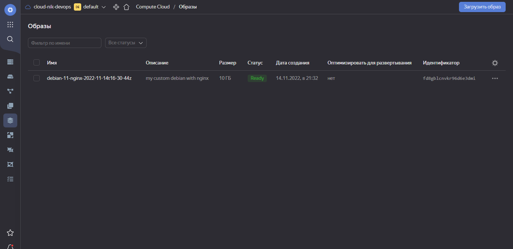
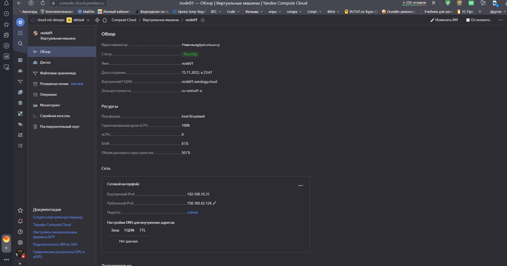
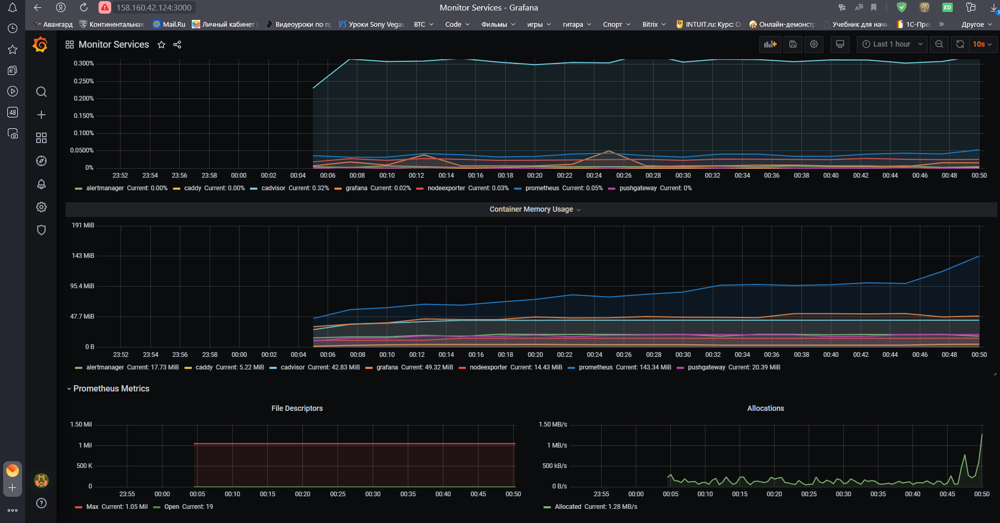

## Домашнее задание к занятию "5.1. Введение в виртуализацию. Типы и функции гипервизоров. Обзор рынка вендоров и областей применения."

### Задача 1

_Опишите кратко, как вы поняли: в чем основное отличие полной (аппаратной) виртуализации, паравиртуализации и
виртуализации на основе ОС._

### Ответ

**Полная виртуализация** - это когда система управления виртуальными машинами полностью и на 100% изображает компьютер,
со всеми физическими устройствами, обеспечивая тотальную изоляцию гостевой ОС.

**Паравиртуализация** - программное обеспечение, использующее операционную систему для разделения ресурсов между
виртуальными машинами.

**Виртуализация на уровне ОС** реализуется без отдельного слоя гипервизора, виртуализируется пользовательское окружение
ОС.

*`Дополнительный вопрос`**: В чём разница при работе с ядром гостевой ОС для полной и паравиртуализации?

При полной виртуализации виртуальные машины позволяют выполнять инструкции при запуске неизмененной операционной системы
полностью изолированным способом.

В отличие от полной виртуализации, паравиртуализация не реализует полную изоляцию; вместо этого в подходе реализована
частичная изоляция. Гипервизор в данном случае изменяет ядро ОС

Основное отличие паравиртуализации от остальных типов виртуализации - необходимость модификации ядра гостевой ОС.
________________________________________________________________________________

### Задача 2

Выберите один из вариантов использования организации физических серверов, в зависимости от условий использования.

Организация серверов:

физические сервера, паравиртуализация, виртуализация уровня ОС.

Условия использования:

Высоконагруженная база данных, чувствительная к отказу.
Различные web-приложения.
Windows системы для использования бухгалтерским отделом.
Системы, выполняющие высокопроизводительные расчеты на GPU.
Опишите, почему вы выбрали к каждому целевому использованию такую организацию.

### Ответ

**Высоконагруженная база данных, чувствительная к отказу** - физические сервера, поскольку применение виртуализации в
данном случае уменьшит производительность и ухудшит надёжность. Кластер можно собрать при помощи самой СУБД, без
использования средств виртуализации.

**Различные web-приложения** - виртуализация уровня ОС, т.к. используется пользовательское окружение

**Windows системы для использования бухгалтерским отделом** - паравиртуализация, например Hyper-V. Среди преимуществ
облегченное создание бэкапов и миграции.

**Системы, выполняющие высокопроизводительные расчеты на GPU** - лучше размещать на аппаратной виртуализации для того
чтобы задействовать максимум ресурсов.
_________________________________________________________________________________

### Задача 3

Выберите подходящую систему управления виртуализацией для предложенного сценария. Детально опишите ваш выбор.

Сценарии:

1) 100 виртуальных машин на базе Linux и Windows, общие задачи, нет особых требований. Преимущественно Windows based
   инфраструктура, требуется реализация программных балансировщиков нагрузки, репликации данных и автоматизированного
   механизма создания резервных копий.
2) Требуется наиболее производительное бесплатное open source решение для виртуализации небольшой (20-30 серверов)
   инфраструктуры на базе Linux и Windows виртуальных машин.
3) Необходимо бесплатное, максимально совместимое и производительное решение для виртуализации Windows инфраструктуры.
4) Необходимо рабочее окружение для тестирования программного продукта на нескольких дистрибутивах Linux.

### Ответ

1) Коммерческие VMwareESXI или Vsphere. Так как преимущественно Windows - инфраструктура, можно использовать Hyper-V.
2) Могут подойти Xen, KVM. Xen - кроссплатформенный гипервизор.
3) Microsoft Hyper-V Server имеющий наибольшую совместимость с Windows системами. Как альтернатива - Xen.
4) Наибольшую скорость развёртывания в данном случае могут обеспечить решения виртуализации уровне ОС - Docker, Podman.

_________________________________________________________________________________

### Задача 4

Опишите возможные проблемы и недостатки гетерогенной среды виртуализации (использования нескольких систем управления
виртуализацией одновременно) и что необходимо сделать для минимизации этих рисков и проблем. Если бы у вас был выбор, то
создавали бы вы гетерогенную среду или нет? Мотивируйте ваш ответ примерами.

### Ответ

Гетерогенные виртуальные среды могут быть неэффективны и сложны в управлении.
Требуется целый набор специалистов различного профиля, данный способ виртуализации инфраструктуры является дорогостоящим
и неэффективным в долгосрочной перспективе, поскольку, по мере развития технологий, компании стремятся обеспечить
легкость в управлении, совместимость различных систем и масштабируемость инфраструктуры. Усложняются операции по
переносу виртуальных машин между различными средами и масштабированию.

Необходимость создания гетерогенной среды может быть продиктована, например, решением задач распределения аппаратных
ресурсов посредством полной виртуализации и облегчения задач размещения и развёртывания программного обеспечения
посредством виртуализационных решений на уровне ОС;

## Домашнее задание к занятию "2. Применение принципов IaaC в работе с виртуальными машинами"

### Задача 1

* Опишите своими словами основные преимущества применения на практике IaaC паттернов.
* Какой из принципов IaaC является основополагающим?

### Ответ

* **CI/CD (+СD)** — набор методов и практик, отвечающий требованиям современной ПО-разработки. Принципы непрерывной
  интеграции
  и доставки помогают внедрять решения быстро, оперативно согласовывать их и доводить до релиза, не рискуя при этом
  качеством продукта.CI/CD не стоит считать панацеей для каждой ситуации — для внедрения этой методологии нужно знать
  бизнес-приоритеты, иметь четкий план действий, согласованные технологии и, конечно же, команду опытных
  DevOps-специалистов.

* Основным принципом IaaC является **идемпотентность** - это свойство объекта или операции, при повторном выполнении
  которой
  мы получаем результат идентичный предыдущему и всем последующим выполнениям

### Задача 2

* Чем Ansible выгодно отличается от других систем управление конфигурациями?
* Какой, на ваш взгляд, метод работы систем конфигурации более надёжный push или pull?

Преимущества Ansible по сравнению с другими аналогичными решениями:

1. на управляемые узлы не нужно устанавливать никакого дополнительного ПО, всё работает через SSH (в случае
   необходимости дополнительные модули можно взять из официального репозитория);
2. код программы, написанный на Python, очень прост; при необходимости написание дополнительных модулей не составляет
   особого труда;
3. язык, на котором пишутся сценарии, также предельно прост;
4. низкий порог вхождения: обучиться работе с Ansible можно за очень короткое время;
5. документация к продукту написана очень подробно и вместе с тем — просто и понятно; она регулярно обновляется;

* метод push, потому что не требует установки ни демонов, ни агентов, в случае с pull методом такие агенты нужны, что
  потенциально может быть еще одной точкой сбоя.

### Задача 3

Установить на личный компьютер:

* VirtualBox
* Vagrant
* Ansible

Приложить вывод команд установленных версий каждой из программ, оформленный в markdown.

```bash
nik@ubuntuVM:~$ vboxmanage --version
6.1.38_Ubuntur153438
nik@ubuntuVM:~$ vagrant --version
Vagrant 2.2.6
nik@ubuntuVM:~$ ansible --version
ansible 2.9.6
  config file = /etc/ansible/ansible.cfg
  configured module search path = ['/home/nik/.ansible/plugins/modules', '/usr/share/ansible/plugins/modules']
  ansible python module location = /usr/lib/python3/dist-packages/ansible
  executable location = /usr/bin/ansible
  python version = 3.8.10 (default, Jun 22 2022, 20:18:18) [GCC 9.4.0]
```

## Домашнее задание к занятию "3. Введение. Экосистема. Архитектура. Жизненный цикл Docker контейнера"

### Задача 1

<details>
Сценарий выполения задачи:

* создайте свой репозиторий на https://hub.docker.com;
* выберете любой образ, который содержит веб-сервер Nginx;
* создайте свой fork образа;
* реализуйте функциональность: запуск веб-сервера в фоне с индекс-страницей, содержащей HTML-код ниже:

```html

<html>
<head>
    Hey, Netology
</head>
<body>
<h1>I’m DevOps Engineer!</h1>
</body>
</html>
```

Опубликуйте созданный форк в своем репозитории и предоставьте ответ в виде ссылки
на https://hub.docker.com/username_repo
</details>

### Ответ

Ссылка на репозиторий:
`https://hub.docker.com/repository/docker/nikolay480/`

```bash
nik@ubuntuVM:~/netology/3.1.Docker$ cat Dockerfile
FROM nginx:alpine
COPY ./index.html /usr/share/nginx/html/index.html
```

```bash
nik@ubuntuVM:~/netology/3.1.Docker$ docker build -t nikolay480/webpage:v.1.1 .
nik@ubuntuVM:~/netology/3.1.Docker$ docker run -d -p 80:80 nikolay480/webpage:v.1.1
f111079122dd13062e8982717f0fe0d0964e5a638889a21fa142d9168b6c3d37
nik@ubuntuVM:~/netology/3.1.Docker$ docker ps
CONTAINER ID   IMAGE                      COMMAND                  CREATED          STATUS          PORTS                               NAMES
f111079122dd   nikolay480/webpage:v.1.1   "/docker-entrypoint.…"   19 seconds ago   Up 18 seconds   0.0.0.0:80->80/tcp, :::80->80/tcp   cool_noyce
```

```bash 
nik@ubuntuVM:~/netology/3.1.Docker$ docker push nikolay480/webpage:v.1.1
The push refers to repository [docker.io/nikolay480/webpage]
bb4444ee2a15: Pushed 
bd502c2dee4c: Pushed 
9365b1fffb04: Pushed 
6636f46e559d: Pushed 
fcf860bf48b4: Pushed 
07099189e7ec: Pushed 
e5e13b0c77cb: Pushed 
v.1.1: digest: sha256:387a71095d812baed31124340228e768da36a9387bc7c2a372bc4294a87006c3 size: 1775
```

### Задача 2

<details>

Посмотрите на сценарий ниже и ответьте на вопрос: "Подходит ли в этом сценарии использование Docker контейнеров или
лучше подойдет виртуальная машина, физическая машина? Может быть возможны разные варианты?"

Детально опишите и обоснуйте свой выбор.
</details>

### Ответ

* Высоконагруженное монолитное java веб-приложение - предпочтительнее VM, так как приложение монолитное и не разбито на сервисы/микросервисы
* **Nodejs веб-приложение** - использование docker-контейнеризации позволит снизить затраты на развертывание приложения,
  установку зависимостей.
* Мобильное приложение c версиями для Android и iOS - виртуальная машина, для упрощения тестирования
* **Шина данных на базе Apache Kafka** - возможно развернуть в docker.
* **Elasticsearch кластер для реализации логирования продуктивного веб-приложения - три ноды elasticsearch, два logstash
  и две ноды kibana;** - для Elasticsearch в связи с немаленькими системными требованиями потребуется VM. Однако
  возможно также развернуть в контейнерах, используя Docker Compose.
* **Мониторинг-стек на базе Prometheus и Grafana** - возможно использование  docker или VM,  так как системные требования меньше, чем у ELK, а также для упрощения развертывания и масштабирования.
* **MongoDB, как основное хранилище данных для java-приложения** - можно использовать все три варианта, при этом для
  Docker потребуется смонтировать внешний том для хранения данных. Использование физического сервера будет надежнее VM.
* **Gitlab сервер для реализации CI/CD процессов и приватный (закрытый) Docker Registry** - возможно развертывание как через docker, так и на виртуальной или физической машине.

### Задача 3
<details>

* Запустите первый контейнер из образа centos c любым тэгом в фоновом режиме, подключив папку /data из текущей рабочей директории на хостовой машине в /data контейнера;
* Запустите второй контейнер из образа debian в фоновом режиме, подключив папку /data из текущей рабочей директории на хостовой машине в /data контейнера;
* Подключитесь к первому контейнеру с помощью docker exec и создайте текстовый файл любого содержания в /data;
* Добавьте еще один файл в папку /data на хостовой машине;
* Подключитесь во второй контейнер и отобразите листинг и содержание файлов  в /data контейнера. 
</details>

### Ответ
```bash
nik@ubuntuVM:~/netology/3.1.Docker$ docker run -v $(pwd)/data/:/data -dt centos
nik@ubuntuVM:~/netology/3.1.Docker$ docker run -v $(pwd)/data/:/data -dt debian

nik@ubuntuVM:~/netology/3.1.Docker$ docker ps
CONTAINER ID   IMAGE                      COMMAND                  CREATED          STATUS          PORTS                               NAMES
c5c3cf7d5953   centos                     "/bin/bash"              2 seconds ago    Up 1 second                                         stoic_bell
ebf8cfd114e1   debian                     "bash"                   17 seconds ago   Up 15 seconds                                       stupefied_hamilton

nik@ubuntuVM:~/netology/3.1.Docker$ docker exec c5c3cf7d5953 bash -c "echo 'hello' > /data/test.txt"
nik@ubuntuVM:~/netology/3.1.Docker$ cd data
nik@ubuntuVM:~/netology/3.1.Docker/data$ sudo touch 123.txt

nik@ubuntuVM:~/netology/3.1.Docker/data$ docker exec ebf8cfd114e1 ls /data
123.txt
test.txt
```
### Задача 4
<details>
Воспроизвести практическую часть лекции самостоятельно.

Соберите Docker образ с Ansible, загрузите на Docker Hub и пришлите ссылку вместе с остальными ответами к задачам.
</details>

`https://hub.docker.com/repository/docker/nikolay480/ansible`


## Домашнее задание к занятию "4. Оркестрация группой Docker контейнеров на примере Docker Compose"

### Задача 1
<details>
Создать собственный образ операционной системы с помощью Packer.

Для получения зачета, вам необходимо предоставить:

Скриншот страницы, как на слайде из презентации (слайд 37).
</details>

###  Ответ


### Задача 2
<details>
Создать вашу первую виртуальную машину в Яндекс.Облаке.

Для получения зачета, вам необходимо предоставить:

Скриншот страницы свойств созданной ВМ, как на примере ниже:
</details>

###  Ответ


### Задача 3
<details>
Создать ваш первый готовый к боевой эксплуатации компонент мониторинга, состоящий из стека микросервисов.

Для получения зачета, вам необходимо предоставить:

Скриншот работающего веб-интерфейса Grafana с текущими метриками, как на примере ниже
</details> 

###  Ответ



