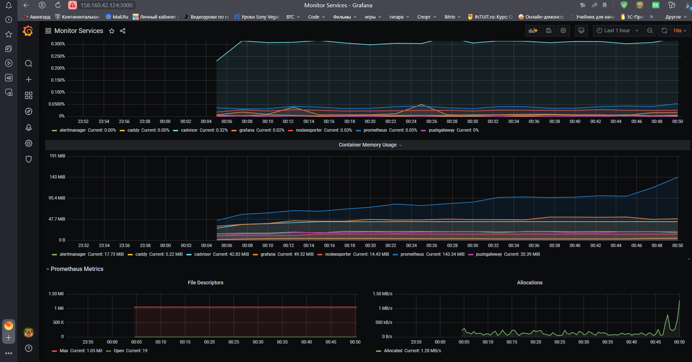
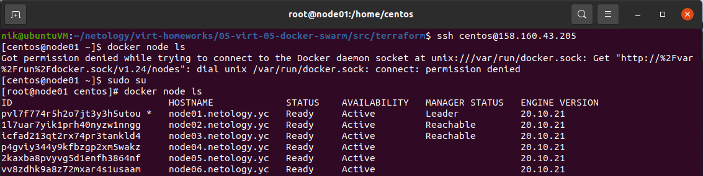
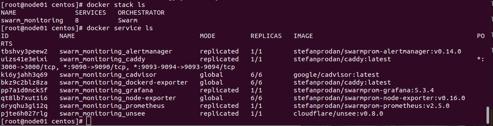
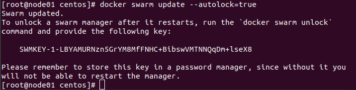

## Домашнее задание к занятию "5.1. Введение в виртуализацию. Типы и функции гипервизоров. Обзор рынка вендоров и областей применения."

### Задача 1

_Опишите кратко, как вы поняли: в чем основное отличие полной (аппаратной) виртуализации, паравиртуализации и
виртуализации на основе ОС._

### Ответ

**Полная виртуализация** - это когда система управления виртуальными машинами полностью и на 100% изображает компьютер,
со всеми физическими устройствами, обеспечивая тотальную изоляцию гостевой ОС.

**Паравиртуализация** - программное обеспечение, использующее операционную систему для разделения ресурсов между
виртуальными машинами.

**Виртуализация на уровне ОС** реализуется без отдельного слоя гипервизора, виртуализируется пользовательское окружение
ОС.

*`Дополнительный вопрос`**: В чём разница при работе с ядром гостевой ОС для полной и паравиртуализации?

При полной виртуализации виртуальные машины позволяют выполнять инструкции при запуске неизмененной операционной системы
полностью изолированным способом.

В отличие от полной виртуализации, паравиртуализация не реализует полную изоляцию; вместо этого в подходе реализована
частичная изоляция. Гипервизор в данном случае изменяет ядро ОС

Основное отличие паравиртуализации от остальных типов виртуализации - необходимость модификации ядра гостевой ОС.
________________________________________________________________________________

### Задача 2

Выберите один из вариантов использования организации физических серверов, в зависимости от условий использования.

Организация серверов:

физические сервера, паравиртуализация, виртуализация уровня ОС.

Условия использования:

Высоконагруженная база данных, чувствительная к отказу.
Различные web-приложения.
Windows системы для использования бухгалтерским отделом.
Системы, выполняющие высокопроизводительные расчеты на GPU.
Опишите, почему вы выбрали к каждому целевому использованию такую организацию.

### Ответ

**Высоконагруженная база данных, чувствительная к отказу** - физические сервера, поскольку применение виртуализации в
данном случае уменьшит производительность и ухудшит надёжность. Кластер можно собрать при помощи самой СУБД, без
использования средств виртуализации.

**Различные web-приложения** - виртуализация уровня ОС, т.к. используется пользовательское окружение

**Windows системы для использования бухгалтерским отделом** - паравиртуализация, например Hyper-V. Среди преимуществ
облегченное создание бэкапов и миграции.

**Системы, выполняющие высокопроизводительные расчеты на GPU** - лучше размещать на аппаратной виртуализации для того
чтобы задействовать максимум ресурсов.
_________________________________________________________________________________

### Задача 3

Выберите подходящую систему управления виртуализацией для предложенного сценария. Детально опишите ваш выбор.

Сценарии:

1) 100 виртуальных машин на базе Linux и Windows, общие задачи, нет особых требований. Преимущественно Windows based
   инфраструктура, требуется реализация программных балансировщиков нагрузки, репликации данных и автоматизированного
   механизма создания резервных копий.
2) Требуется наиболее производительное бесплатное open source решение для виртуализации небольшой (20-30 серверов)
   инфраструктуры на базе Linux и Windows виртуальных машин.
3) Необходимо бесплатное, максимально совместимое и производительное решение для виртуализации Windows инфраструктуры.
4) Необходимо рабочее окружение для тестирования программного продукта на нескольких дистрибутивах Linux.

### Ответ

1) Коммерческие VMwareESXI или Vsphere. Так как преимущественно Windows - инфраструктура, можно использовать Hyper-V.
2) Могут подойти Xen, KVM. Xen - кроссплатформенный гипервизор.
3) Microsoft Hyper-V Server имеющий наибольшую совместимость с Windows системами. Как альтернатива - Xen.
4) Наибольшую скорость развёртывания в данном случае могут обеспечить решения виртуализации уровне ОС - Docker, Podman.

_________________________________________________________________________________

### Задача 4

Опишите возможные проблемы и недостатки гетерогенной среды виртуализации (использования нескольких систем управления
виртуализацией одновременно) и что необходимо сделать для минимизации этих рисков и проблем. Если бы у вас был выбор, то
создавали бы вы гетерогенную среду или нет? Мотивируйте ваш ответ примерами.

### Ответ

Гетерогенные виртуальные среды могут быть неэффективны и сложны в управлении.
Требуется целый набор специалистов различного профиля, данный способ виртуализации инфраструктуры является дорогостоящим
и неэффективным в долгосрочной перспективе, поскольку, по мере развития технологий, компании стремятся обеспечить
легкость в управлении, совместимость различных систем и масштабируемость инфраструктуры. Усложняются операции по
переносу виртуальных машин между различными средами и масштабированию.

Необходимость создания гетерогенной среды может быть продиктована, например, решением задач распределения аппаратных
ресурсов посредством полной виртуализации и облегчения задач размещения и развёртывания программного обеспечения
посредством виртуализационных решений на уровне ОС;

## Домашнее задание к занятию "2. Применение принципов IaaC в работе с виртуальными машинами"

### Задача 1

* Опишите своими словами основные преимущества применения на практике IaaC паттернов.
* Какой из принципов IaaC является основополагающим?

### Ответ

* **CI/CD (+СD)** — набор методов и практик, отвечающий требованиям современной ПО-разработки. Принципы непрерывной
  интеграции
  и доставки помогают внедрять решения быстро, оперативно согласовывать их и доводить до релиза, не рискуя при этом
  качеством продукта.CI/CD не стоит считать панацеей для каждой ситуации — для внедрения этой методологии нужно знать
  бизнес-приоритеты, иметь четкий план действий, согласованные технологии и, конечно же, команду опытных
  DevOps-специалистов.

* Основным принципом IaaC является **идемпотентность** - это свойство объекта или операции, при повторном выполнении
  которой
  мы получаем результат идентичный предыдущему и всем последующим выполнениям

### Задача 2

* Чем Ansible выгодно отличается от других систем управление конфигурациями?
* Какой, на ваш взгляд, метод работы систем конфигурации более надёжный push или pull?

Преимущества Ansible по сравнению с другими аналогичными решениями:

1. на управляемые узлы не нужно устанавливать никакого дополнительного ПО, всё работает через SSH (в случае
   необходимости дополнительные модули можно взять из официального репозитория);
2. код программы, написанный на Python, очень прост; при необходимости написание дополнительных модулей не составляет
   особого труда;
3. язык, на котором пишутся сценарии, также предельно прост;
4. низкий порог вхождения: обучиться работе с Ansible можно за очень короткое время;
5. документация к продукту написана очень подробно и вместе с тем — просто и понятно; она регулярно обновляется;

* метод push, потому что не требует установки ни демонов, ни агентов, в случае с pull методом такие агенты нужны, что
  потенциально может быть еще одной точкой сбоя.

### Задача 3

Установить на личный компьютер:

* VirtualBox
* Vagrant
* Ansible

Приложить вывод команд установленных версий каждой из программ, оформленный в markdown.

```bash
nik@ubuntuVM:~$ vboxmanage --version
6.1.38_Ubuntur153438
nik@ubuntuVM:~$ vagrant --version
Vagrant 2.2.6
nik@ubuntuVM:~$ ansible --version
ansible 2.9.6
  config file = /etc/ansible/ansible.cfg
  configured module search path = ['/home/nik/.ansible/plugins/modules', '/usr/share/ansible/plugins/modules']
  ansible python module location = /usr/lib/python3/dist-packages/ansible
  executable location = /usr/bin/ansible
  python version = 3.8.10 (default, Jun 22 2022, 20:18:18) [GCC 9.4.0]
```

## Домашнее задание к занятию "3. Введение. Экосистема. Архитектура. Жизненный цикл Docker контейнера"

### Задача 1

<details>
Сценарий выполения задачи:

* создайте свой репозиторий на https://hub.docker.com;
* выберете любой образ, который содержит веб-сервер Nginx;
* создайте свой fork образа;
* реализуйте функциональность: запуск веб-сервера в фоне с индекс-страницей, содержащей HTML-код ниже:

```html

<html>
<head>
    Hey, Netology
</head>
<body>
<h1>I’m DevOps Engineer!</h1>
</body>
</html>
```

Опубликуйте созданный форк в своем репозитории и предоставьте ответ в виде ссылки
на https://hub.docker.com/username_repo
</details>

### Ответ

Ссылка на репозиторий:
`https://hub.docker.com/repository/docker/nikolay480/`

```bash
nik@ubuntuVM:~/netology/3.1.Docker$ cat Dockerfile
FROM nginx:alpine
COPY ./index.html /usr/share/nginx/html/index.html
```

```bash
nik@ubuntuVM:~/netology/3.1.Docker$ docker build -t nikolay480/webpage:v.1.1 .
nik@ubuntuVM:~/netology/3.1.Docker$ docker run -d -p 80:80 nikolay480/webpage:v.1.1
f111079122dd13062e8982717f0fe0d0964e5a638889a21fa142d9168b6c3d37
nik@ubuntuVM:~/netology/3.1.Docker$ docker ps
CONTAINER ID   IMAGE                      COMMAND                  CREATED          STATUS          PORTS                               NAMES
f111079122dd   nikolay480/webpage:v.1.1   "/docker-entrypoint.…"   19 seconds ago   Up 18 seconds   0.0.0.0:80->80/tcp, :::80->80/tcp   cool_noyce
```

```bash 
nik@ubuntuVM:~/netology/3.1.Docker$ docker push nikolay480/webpage:v.1.1
The push refers to repository [docker.io/nikolay480/webpage]
bb4444ee2a15: Pushed 
bd502c2dee4c: Pushed 
9365b1fffb04: Pushed 
6636f46e559d: Pushed 
fcf860bf48b4: Pushed 
07099189e7ec: Pushed 
e5e13b0c77cb: Pushed 
v.1.1: digest: sha256:387a71095d812baed31124340228e768da36a9387bc7c2a372bc4294a87006c3 size: 1775
```

### Задача 2

<details>

Посмотрите на сценарий ниже и ответьте на вопрос: "Подходит ли в этом сценарии использование Docker контейнеров или
лучше подойдет виртуальная машина, физическая машина? Может быть возможны разные варианты?"

Детально опишите и обоснуйте свой выбор.
</details>

### Ответ

* Высоконагруженное монолитное java веб-приложение - предпочтительнее VM, так как приложение монолитное и не разбито на
  сервисы/микросервисы
* **Nodejs веб-приложение** - использование docker-контейнеризации позволит снизить затраты на развертывание приложения,
  установку зависимостей.
* Мобильное приложение c версиями для Android и iOS - виртуальная машина, для упрощения тестирования
* **Шина данных на базе Apache Kafka** - возможно развернуть в docker.
* **Elasticsearch кластер для реализации логирования продуктивного веб-приложения - три ноды elasticsearch, два logstash
  и две ноды kibana;** - для Elasticsearch в связи с немаленькими системными требованиями потребуется VM. Однако
  возможно также развернуть в контейнерах, используя Docker Compose.
* **Мониторинг-стек на базе Prometheus и Grafana** - возможно использование docker или VM, так как системные требования
  меньше, чем у ELK, а также для упрощения развертывания и масштабирования.
* **MongoDB, как основное хранилище данных для java-приложения** - можно использовать все три варианта, при этом для
  Docker потребуется смонтировать внешний том для хранения данных. Использование физического сервера будет надежнее VM.
* **Gitlab сервер для реализации CI/CD процессов и приватный (закрытый) Docker Registry** - возможно развертывание как
  через docker, так и на виртуальной или физической машине.

### Задача 3

<details>

* Запустите первый контейнер из образа centos c любым тэгом в фоновом режиме, подключив папку /data из текущей рабочей
  директории на хостовой машине в /data контейнера;
* Запустите второй контейнер из образа debian в фоновом режиме, подключив папку /data из текущей рабочей директории на
  хостовой машине в /data контейнера;
* Подключитесь к первому контейнеру с помощью docker exec и создайте текстовый файл любого содержания в /data;
* Добавьте еще один файл в папку /data на хостовой машине;
* Подключитесь во второй контейнер и отобразите листинг и содержание файлов в /data контейнера.

</details>

### Ответ

```bash
nik@ubuntuVM:~/netology/3.1.Docker$ docker run -v $(pwd)/data/:/data -dt centos
nik@ubuntuVM:~/netology/3.1.Docker$ docker run -v $(pwd)/data/:/data -dt debian

nik@ubuntuVM:~/netology/3.1.Docker$ docker ps
CONTAINER ID   IMAGE                      COMMAND                  CREATED          STATUS          PORTS                               NAMES
c5c3cf7d5953   centos                     "/bin/bash"              2 seconds ago    Up 1 second                                         stoic_bell
ebf8cfd114e1   debian                     "bash"                   17 seconds ago   Up 15 seconds                                       stupefied_hamilton

nik@ubuntuVM:~/netology/3.1.Docker$ docker exec c5c3cf7d5953 bash -c "echo 'hello' > /data/test.txt"
nik@ubuntuVM:~/netology/3.1.Docker$ cd data
nik@ubuntuVM:~/netology/3.1.Docker/data$ sudo touch 123.txt

nik@ubuntuVM:~/netology/3.1.Docker/data$ docker exec ebf8cfd114e1 ls /data
123.txt
test.txt
```

### Задача 4

<details>
Воспроизвести практическую часть лекции самостоятельно.

Соберите Docker образ с Ansible, загрузите на Docker Hub и пришлите ссылку вместе с остальными ответами к задачам.
</details>

`https://hub.docker.com/repository/docker/nikolay480/ansible`

## Домашнее задание к занятию "4. Оркестрация группой Docker контейнеров на примере Docker Compose"

### Задача 1

<details>
Создать собственный образ операционной системы с помощью Packer.

Для получения зачета, вам необходимо предоставить:

Скриншот страницы, как на слайде из презентации (слайд 37).
</details>

### Ответ


### Задача 2

<details>
Создать вашу первую виртуальную машину в Яндекс.Облаке.

Для получения зачета, вам необходимо предоставить:

Скриншот страницы свойств созданной ВМ, как на примере ниже:
</details>

### Ответ


### Задача 3

<details>
Создать ваш первый готовый к боевой эксплуатации компонент мониторинга, состоящий из стека микросервисов.

Для получения зачета, вам необходимо предоставить:

Скриншот работающего веб-интерфейса Grafana с текущими метриками, как на примере ниже
</details> 

### Ответ



[](3.Grafana.png)

# Домашнее задание к занятию "5. Оркестрация кластером Docker контейнеров на примере Docker Swarm"

### Задача 1

<details>
Дайте письменые ответы на следующие вопросы:

В чём отличие режимов работы сервисов в Docker Swarm кластере: replication и global?
Какой алгоритм выбора лидера используется в Docker Swarm кластере?
Что такое Overlay Network?
</details>

### Ответ

В режиме `replicated` приложение запускается в том количестве экземпляров, какое укажет пользователь. При запуске
указывается количество идентичных задач, которое должно быть запущено. Желательно, чтобы количество узлов при этом было
большим, чем количество реплик – в этом случае Docker Swarm будет выполнять реплики на разных узлах.

В режиме `global`  служба выполняет одну задачу на каждом узле. Заранее определенного задач не существует.

Лидер нода выбирается из управляющих нод путем Raft согласованного алгоритма.
Сам `Raft-алгоритм` имеет ограничение на количество управляющих нод. Распределенные решения
должны быть одобрены большинством управляющих узлов, называемых кворумом. Это означает, что рекомендуется нечетное
количество управляющих узлов.

`Overlay-сети `используются в контексте кластеров (Docker Swarm), где виртуальная сеть, которую используют контейнеры,
связывает несколько физических хостов, на которых запущен Docker. Когда запускается контейнер на swarm-кластере (как
часть сервиса), множество сетей присоединяется по умолчанию, и каждая из них соответствует разным требованиям связи.
`Overlay-сеть ` создает подсеть, которую могут использовать контейнеры в разных хостах swarm-кластера. Контейнеры на
разных
физических хостах могут обмениваться данными по overlay-сети (если все они прикреплены к одной сети).

### Задача 2

Создать ваш первый Docker Swarm кластер в Яндекс.Облаке

Для получения зачета, вам необходимо предоставить скриншот из терминала (консоли), с выводом команды:

`docker node ls`

### Ответ



### Задача 3

Создать ваш первый, готовый к боевой эксплуатации кластер мониторинга, состоящий из стека микросервисов.

Для получения зачета, вам необходимо предоставить скриншот из терминала (консоли), с выводом команды:

`docker service ls`

### Ответ



### Задача 4 (*)

<details>
Выполнить на лидере Docker Swarm кластера команду (указанную ниже) и дать письменное описание её функционала, что она делает и зачем она нужна:

см.документацию: https://docs.docker.com/engine/swarm/swarm_manager_locking/
`docker swarm update --autolock=true`
</details>



Чтобы включить автоматическую блокировку для существующего swarm, необходимо установить флаг autolock равным true.

При перезапуске Docker сначала необходимо разблокировать swarm, используя ключевой ключ шифрования, сгенерированный
Docker при блокировке swarm. Можно поменять этот ключевой ключ шифрования в любое время.

Для разблокировки требуется ввести `docker swarm unlock` и ключ расшифровки журналов RAFT
`docker swarm unlock-key` - показать ключ
`docker swarm unlock-key --rotate` - обновление времени жизни ключа

```bash
$docker swarm unlock

Please enter unlock key:
```

Необходимо ввести ключ шифрования, который был сгенерирован и показан в выводе команды, когда вы заблокировали swarm и
кластер swarm разблокируется.

# Домашнее задание к занятию "6.1. Типы и структура СУБД"

## Задача 1

<details>
Архитектор ПО решил проконсультироваться у вас, какой тип БД лучше выбрать для хранения определенных данных.

Он вам предоставил следующие типы сущностей, которые нужно будет хранить в БД:

Электронные чеки в json виде
Склады и автомобильные дороги для логистической компании
Генеалогические деревья
Кэш идентификаторов клиентов с ограниченным временем жизни для движка аутентификации
Отношения клиент-покупка для интернет-магазина
Выберите подходящие типы СУБД для каждой сущности и объясните свой выбор.
</details>

### Ответ

* `Электронные чеки в json виде` - наиболее подойдет **документарная** БД, так как единицей хранения тут будет документ
  в формате JSON.
* `Склады и автомобильные дороги для логистической компании` - **сетевой** тип БД, который используют сетевую структуру
  для создания отношений между объектами. Тут "склады связаны сетью дорог".
* `Генеалогические деревья` - **графовый** тип БД, которые содержат узлы, отображающие объекты, а также ребра,
  отображающие отношения между ними - что как раз и необходимо при хранении и обработке данных гинеалогического дерева.
  Возможно могла бы подойти **иерархическая** БД, в которой данные организованы в древовидную структуру, но в ней каждая
  дочерняя запись имеет только одного родителя.
* `Кэш идентификаторов клиентов с ограниченным временем жизни для движка аутентификации`  - лучше выбрать базу по
  типу  **"ключ-значение"**. В этих БД запросы только на основе ключа — вы запрашиваете ключ и получаете его значение.
  Полезное свойство этих БД — поле времени жизни (Time-to-Live, TTL), в котором можно задать отдельно для каждой записи
  и
  состояния, когда их нужно удалить из БД.

* `Отношения клиент-покупка для интернет-магазина` - реляционная БД, так как база строится на отношениях между
  объектами (например, таблица товаров, таблица покупателей).

### Задача 2

<details>
Вы создали распределенное высоконагруженное приложение и хотите классифицировать его согласно CAP-теореме. Какой классификации по CAP-теореме соответствует ваша система, если (каждый пункт - это отдельная реализация вашей системы и для каждого пункта надо привести классификацию):
Данные записываются на все узлы с задержкой до часа (асинхронная запись)
При сетевых сбоях, система может разделиться на 2 раздельных кластера
Система может не прислать корректный ответ или сбросить соединение
А согласно PACELC-теореме, как бы вы классифицировали данные реализации?
</details>

### Ответ

* Данные записываются на все узлы с задержкой до часа (асинхронная запись)

`CAP - CA, PACELC - EL/PC`

* При сетевых сбоях, система может разделиться на 2 раздельных кластера

`CAP - AP , PACELC - PA/EL`

* Система может не прислать корректный ответ или сбросить соединение

`CAP - CP, PACELC - EC/PA`

### Задача 3

Могут ли в одной системе сочетаться принципы BASE и ACID? Почему?

### Ответ

Считаю что не могут, так как ACID и BASE противопоставляются друг другу. BASE ориентирована на производительность, и
имеет неустойчивое состояние, тогда как ACID обеспечивает высокую надежность и предсказуемость работы, фиксируются
только успешные транзакции.

### Задача 4

<details>
Вам дали задачу написать системное решение, основой которого бы послужили:

фиксация некоторых значений с временем жизни
реакция на истечение таймаута
Вы слышали о key-value хранилище, которое имеет механизм Pub/Sub. Что это за система? Какие минусы выбора данной
системы?
</details>


PUB-SUB(публикация-подписка) - это шаблон обмена сообщениями, в котором отправители сообщений, называемые издателями, не
программируют сообщения для отправки непосредственно конкретным получателям, называемым подписчиками, а вместо этого
разделяют опубликованные сообщения на классы, не зная, какие подписчики, если таковые имеются, могут быть.

### Ответ
Redis - БД типа ключ-значение с высокой производительностью.
Для достижения максимальной производительности Redis работает с набором данных в памяти. В зависимости от варианта
использования, Redis может сохранять данные либо путем периодического сброса набора данных на диск, либо
путем добавления каждой команды в журнал на диске.
Redis подходит для ситуаций, когда требуется очень быстрый доступ. Чаще всего он становится кэширующей прослойкой, в
которую выносят часть запрашиваемых данных. Это могут быть сохраненные пользовательские сессии, лента комментариев,
изображения с резервными копиями в других БД.
Платить за высокую производительность и удобство приходится **высоким риском потери данных**. Чтобы снизить вероятность
таких последствий, Redis сохраняет копии на жестком диске. Это помогает не потерять информацию в штатных ситуациях,
например при перезагрузке сервера. Но в аварийных случаях риски все равно остаются высокими.
Из-за особенностей работы систему не используют в качестве единственного хранилища. Часто разработчики настраивают
связку Redis MySQL или Redis PostgreSQL. При таком подходе инфраструктурные проблемы и аварии не приводят к потере
данных.

Редис может выступать в качестве брокера сообщений, однако к минусам здесь можно отнести:

`использование только тривиальной модели pub/sub`

`отсутствие очередей сообщений`

## Домашнее задание к занятию "6.2. SQL"

### Задача 1
Используя docker поднимите инстанс PostgreSQL (версию 12) c 2 volume, в который будут складываться данные БД и бэкапы.

Приведите получившуюся команду или docker-compose манифест.

`docker-compose.yaml`

```yaml
version: '3'
services:
 db:
   container_name: pgs12
   image: postgres:12
   environment:
     POSTGRES_USER: nikolay
     POSTGRES_PASSWORD: mysecret
     POSTGRES_DB: start_db
   ports:
     - "5432:5432"
   volumes:      
     - database_volume:/home/database/
     - backup_volume:/home/backup/

volumes:
 database_volume:
 backup_volume:
```

### Задача 2
<details>
В БД из задачи 1:

* создайте пользователя test-admin-user и БД test_db

>test_db=# CREATE USER "test-admin-user";
> 
>CREATE ROLE
* в БД test_db создайте таблицу orders и clients (спeцификация таблиц ниже)
>test_db=# CREATE TABLE orders (id SERIAL PRIMARY KEY, наименование TEXT, цена INTEGER);
> 
>CREATE TABLE

>test_db=# CREATE TABLE clients (id SERIAL PRIMARY KEY, фамилия TEXT, "страна проживания" TEXT, заказ INTEGER, FOREIGN KEY (заказ) REFERENCES orders (id));
>
>CREATE TABLE

* предоставьте привилегии на все операции пользователю test-admin-user на таблицы БД test_db
>test_db=# GRANT ALL ON TABLE orders, clients TO "test-admin-user";
> 
>GRANT

* создайте пользователя test-simple-user
>test_db=# CREATE USER "test-simple-user" WITH PASSWORD '123456';
> 
>CREATE ROLE
> 

* предоставьте пользователю test-simple-user права на SELECT/INSERT/UPDATE/DELETE данных таблиц БД test_db
>test_db=# GRANT SELECT, INSERT, UPDATE, DELETE ON orders, clients TO "test-simple-user";
> 
>GRANT

Таблица orders:

* id (serial primary key)
* наименование (string)
* цена (integer)

Таблица clients:

* id (serial primary key)
* фамилия (string)
* страна проживания (string, index)
* заказ (foreign key orders)

Приведите:

* итоговый список БД после выполнения пунктов выше,
```bash
test_db=# \l
                                    List of databases
   Name    |  Owner  | Encoding |  Collate   |   Ctype    |      Access privileges       
-----------+---------+----------+------------+------------+------------------------------
 postgres  | nikolay | UTF8     | en_US.utf8 | en_US.utf8 | 
 start_db  | nikolay | UTF8     | en_US.utf8 | en_US.utf8 | 
 template0 | nikolay | UTF8     | en_US.utf8 | en_US.utf8 | =c/nikolay                  +
           |         |          |            |            | nikolay=CTc/nikolay
 template1 | nikolay | UTF8     | en_US.utf8 | en_US.utf8 | =c/nikolay                  +
           |         |          |            |            | nikolay=CTc/nikolay
 test_db   | nikolay | UTF8     | en_US.utf8 | en_US.utf8 | =Tc/nikolay                 +
           |         |          |            |            | nikolay=CTc/nikolay         +
           |         |          |            |            | "test-simple-user"=c/nikolay+
           |         |          |            |            | "test-admin-user"=c/nikolay
(5 rows)
```

* описание таблиц (describe)
```bash
test_db=# \d+ clients
                                                      Table "public.clients"
      Column       |  Type   | Collation | Nullable |               Default               | Storage  | Stats target | Description 
-------------------+---------+-----------+----------+-------------------------------------+----------+--------------+-------------
 id                | integer |           | not null | nextval('clients_id_seq'::regclass) | plain    |              | 
 фамилия           | text    |           |          |                                     | extended |              | 
 страна проживания | text    |           |          |                                     | extended |              | 
 заказ             | integer |           |          |                                     | plain    |              | 
Indexes:
    "clients_pkey" PRIMARY KEY, btree (id)
    "clients_страна проживания_idx" btree ("страна проживания")
Foreign-key constraints:
    "clients_заказ_fkey" FOREIGN KEY ("заказ") REFERENCES orders(id)
Access method: heap
```
```sh
test_db=# \d+ orders
                                                   Table "public.orders"
    Column    |  Type   | Collation | Nullable |              Default               | Storage  | Stats target | Description 
--------------+---------+-----------+----------+------------------------------------+----------+--------------+-------------
 id           | integer |           | not null | nextval('orders_id_seq'::regclass) | plain    |              | 
 наименование | text    |           |          |                                    | extended |              | 
 цена         | integer |           |          |                                    | plain    |              | 
Indexes:
    "orders_pkey" PRIMARY KEY, btree (id)
Referenced by:
    TABLE "clients" CONSTRAINT "clients_заказ_fkey" FOREIGN KEY ("заказ") REFERENCES orders(id)
Access method: heap
```

* SQL-запрос для выдачи списка пользователей с правами над таблицами test_db
```sh
test_db=## 
SELECT grantee, table_name, privilege_type 
FROM information_schema.table_privileges 
WHERE table_name in ('clients','orders');
```
* список пользователей с правами над таблицами test_db
```
grantee      | table_name | privilege_type 
------------------+------------+----------------
 nikolay          | orders     | INSERT
 nikolay          | orders     | SELECT
 nikolay          | orders     | UPDATE
 nikolay          | orders     | DELETE
 nikolay          | orders     | TRUNCATE
 nikolay          | orders     | REFERENCES
 nikolay          | orders     | TRIGGER
 test-admin-user  | orders     | INSERT
 test-admin-user  | orders     | SELECT
 test-admin-user  | orders     | UPDATE
 test-admin-user  | orders     | DELETE
 test-admin-user  | orders     | TRUNCATE
 test-admin-user  | orders     | REFERENCES
 test-admin-user  | orders     | TRIGGER
 test-simple-user | orders     | INSERT
 test-simple-user | orders     | SELECT
 test-simple-user | orders     | UPDATE
 test-simple-user | orders     | DELETE
 nikolay          | clients    | INSERT
 nikolay          | clients    | SELECT
 nikolay          | clients    | UPDATE
 nikolay          | clients    | DELETE
 nikolay          | clients    | TRUNCATE
 nikolay          | clients    | REFERENCES
 nikolay          | clients    | TRIGGER
 test-admin-user  | clients    | INSERT
 test-admin-user  | clients    | SELECT
...skipping 1 line
 test-admin-user  | clients    | DELETE
 test-admin-user  | clients    | TRUNCATE
 test-admin-user  | clients    | REFERENCES
 test-admin-user  | clients    | TRIGGER
 test-simple-user | clients    | INSERT
 test-simple-user | clients    | SELECT
 test-simple-user | clients    | UPDATE
 test-simple-user | clients    | DELETE
(36 rows)
```
</details>

### Задача 3

<details>

Используя SQL синтаксис - наполните таблицы следующими тестовыми данными:

Таблица orders
> 
> |Наименование|цена|
> |------------|----|
> |Шоколад| 10 |
> |Принтер| 3000 |
> |Книга| 500 |
> |Монитор| 7000|
> |Гитара| 4000|

Таблица clients
> 
> |ФИО|Страна проживания|
> |------------|----|
> |Иванов Иван Иванович| USA |
> |Петров Петр Петрович| Canada |
> |Иоганн Себастьян Бах| Japan |
> |Ронни Джеймс Дио| Russia|
> |Ritchie Blackmore| Russia|


```sh
test_db=# INSERT INTO orders(наименование, цена)
VALUES
('Шоколад', 10),
('Принтер', 3000),
('Книга', 500),
('Монитор', 7000),
('Гитара', 4000);
INSERT 0 5
```
```sh
test_db=# INSERT INTO clients
VALUES
(1, 'Иванов Иван Иванович', 'USA'),
(2, 'Петров Петр Петрович', 'Canada'),
(3, 'Иоганн Себастьян Бах', 'Japan'),
(4, 'Ронни Джеймс Дио', 'Russia'),
(5, 'Ritchie Blackmore', 'Russia');
INSERT 0 5
```

Используя SQL синтаксис:
- вычислите количество записей для каждой таблицы 
- приведите в ответе:
- запросы 
- результаты их выполнения.
```sh
test_db=# SELECT count(*) FROM clients;
 count 
-------
     5
(1 row)

test_db=# SELECT count(*) FROM orders;
 count 
-------
     5
(1 row)
```
</details>

### Задача 4
<details>

Часть пользователей из таблицы `clients` решили оформить заказы из таблицы `orders`.

Используя `foreign keys` свяжите записи из таблиц, согласно таблице:

> ФИО | Заказ |

>Иванов Иван Иванович	| Книга |

>Петров Петр Петрович	| Монитор |

>Иоганн Себастьян Бах	| Гитара |

Приведите SQL-запросы для выполнения данных операций.

Можно указать непосредственно ID заказа из таблицы orders:
```sh
test_db=# UPDATE clients SET "заказ" = 3 WHERE "фамилия"='Иванов Иван Иванович';
UPDATE 1
test_db=# UPDATE clients SET "заказ" = 4 WHERE "фамилия"='Петров Петр Петрович';
UPDATE 1
```
Или выполнить более сложный запрос:
```sh
test_db=# UPDATE clients SET "заказ" = (SELECT id FROM orders WHERE "наименование" = 'Гитара') WHERE "фамилия"='Иоганн Себастьян Бах';
UPDATE 1
```
Кроме того, если использовать ID заказа, который вне таблицы orders, благодаря использованию внешнего ключа выйдет ошибка:
```sh
test_db=# UPDATE clients SET "заказ" = 10 WHERE "фамилия"='Иванов Иван Иванович';
ERROR:  insert or update on table "clients" violates foreign key constraint "clients_заказ_fkey"
DETAIL:  Key (заказ)=(10) is not present in table "orders".
```
Приведите SQL-запрос для выдачи всех пользователей, которые совершили заказ, а также вывод данного запроса.
```sh
test_db=# SELECT * FROM clients WHERE заказ IS NOT NULL;
 id |       фамилия        | страна проживания | заказ 
----+----------------------+-------------------+-------
  1 | Иванов Иван Иванович | USA               |     3
  2 | Петров Петр Петрович | Canada            |     4
  3 | Иоганн Себастьян Бах | Japan             |     5
(3 rows)
```
Или:
```sh
test_db=# SELECT id, фамилия, "страна проживания" FROM clients WHERE заказ IS NOT NULL;
 id |       фамилия        | страна проживания 
----+----------------------+-------------------
  1 | Иванов Иван Иванович | USA
  2 | Петров Петр Петрович | Canada
  3 | Иоганн Себастьян Бах | Japan
(3 rows)
```
Подсказкa - используйте директиву UPDATE.
</details>

### Задача 5

<details>
Получите полную информацию по выполнению запроса выдачи всех пользователей из задачи 4 (используя директиву EXPLAIN).
Приведите получившийся результат и объясните что значат полученные значения.

```sh
test_db=# EXPLAIN SELECT * FROM clients WHERE заказ IS NOT NULL;
                        QUERY PLAN                         
-----------------------------------------------------------
 Seq Scan on clients  (cost=0.00..18.10 rows=806 width=72)
   Filter: ("заказ" IS NOT NULL)
(2 rows)
```
Результат вывода команды показывает, что во время запроса выполнено последовательное чтение данных `Seq Scan`,

'трудозатраты' на чтение всех строк `cost = 18.10

приблизительное количество возвращаемых строк при выполнении операции - `rows=806 `

средний размер одной строки в байтах w`idth=72`

В запросе использован Filter, где поле заказ не пустое.

</details>

### Задача 6
Создайте бэкап БД test_db и поместите его в volume, предназначенный для бэкапов (см. Задачу 1).

Остановите контейнер с PostgreSQL (но не удаляйте volumes).

Поднимите новый пустой контейнер с PostgreSQL.

Восстановите БД test_db в новом контейнере.

Приведите список операций, который вы применяли для бэкапа данных и восстановления.

Проверим расположение базы данных test_db

```sh
test_db=# show data_directory;
      data_directory      
--------------------------
 /var/lib/postgresql/data
(1 row
```
Копируем БД в /home/backup

```postgres@b705978ca712:~$ cp -r /var/lib/postgresql/data /home/backup
postgres@b705978ca712:~$ ls -la /home/backup
total 12
drwxrwxrwx  3 root     root     4096 Nov 30 19:38 .
drwxr-xr-x  1 root     root     4096 Nov 29 14:53 ..
drwx------ 19 postgres postgres 4096 Nov 30 19:38 data
```
```sh
nik@ubuntuVM:/home$ docker run  --rm -e POSTGRES_PASSWORD=12345678 --volumes-from pgs12 -d --name pgs12-2 postgres:12
e23227f0dc060985688045dc8fd7cc9f3207ee94640a921d5f5bd54889385b97
nik@ubuntuVM:/home$ docker ps -a
CONTAINER ID   IMAGE         COMMAND                  CREATED          STATUS                      PORTS      NAMES
e23227f0dc06   postgres:12   "docker-entrypoint.s…"   42 seconds ago   Up 40 seconds               5432/tcp   pgs12-2
b705978ca712   postgres:12   "docker-entrypoint.s…"   2 days ago       Exited (0) 51 minutes ago              pgs12
nik@ubuntuVM:/home$ docker exec -it pgs12-2 bash
root@e23227f0dc06:/# ls /home/backup
data
root@e23227f0dc06:/# psql -U nikolay -d test_db 
psql (12.13 (Debian 12.13-1.pgdg110+1))
Type "help" for help.

test_db=# \d
              List of relations
 Schema |      Name      |   Type   |  Owner  
--------+----------------+----------+---------
 public | clients        | table    | nikolay
 public | clients_id_seq | sequence | nikolay
 public | orders         | table    | nikolay
 public | orders_id_seq  | sequence | nikolay
(4 rows)
```
